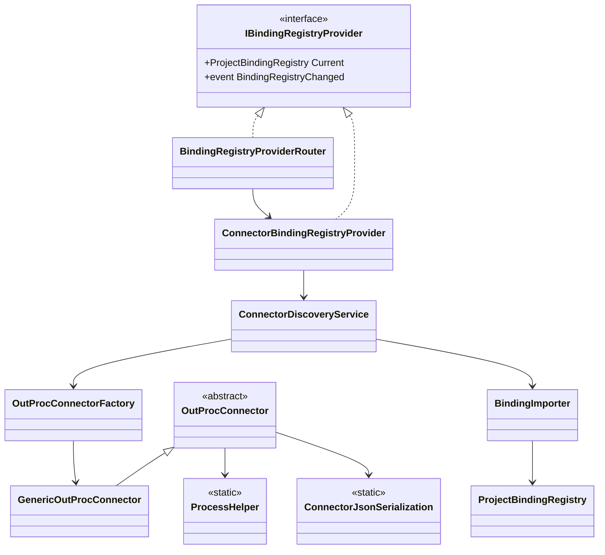
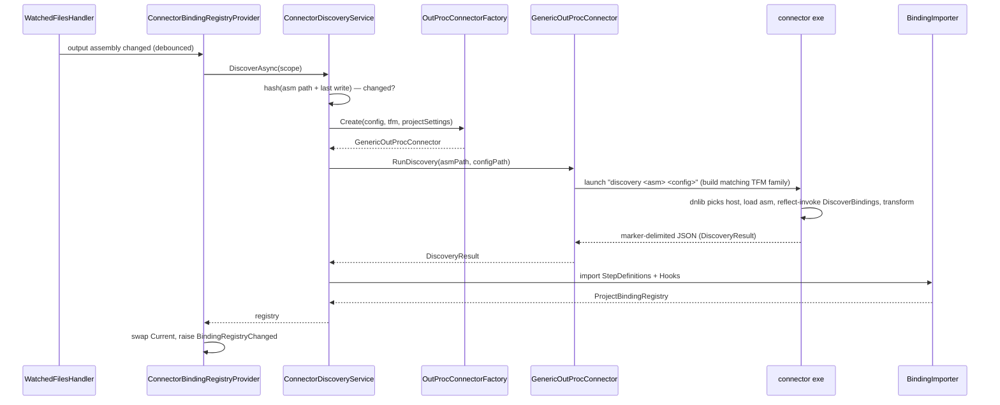
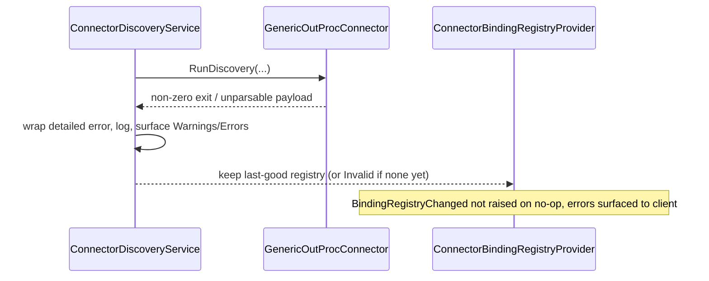

# Connector-Based Binding Discovery — Design

> **Status:** Draft · **Scope:** the binding-discovery source for the LSP server, implemented by
> porting the **Reqnroll.VisualStudio generic connector**. This is an **alternative** to
> [Reflection-Based-Binding-Discovery-Design.md](Reflection-Based-Binding-Discovery-Design.md)
> (the in-process Mono.Cecil approach). See [LSP-IDE-Support-Design.md](LSP-IDE-Support-Design.md)
> for the overall architecture.

## Table of contents

1. [Context & goals](#context--goals)
2. [Why the generic connector](#1-why-the-generic-connector)
3. [What already exists in IdeSupport](#2-what-already-exists-in-idesupport)
4. [Inputs & outputs](#3-inputs--outputs)
5. [Component catalog](#4-component-catalog)
6. [Class diagram](#5-class-diagram)
7. [Sequence diagrams](#6-sequence-diagrams)
8. [Wire protocol & serialization](#7-wire-protocol--serialization)
9. [Dual-host runtime model](#8-dual-host-runtime-model)
10. [Integration & lifecycle](#9-integration--lifecycle)
11. [Deployment](#10-deployment)
12. [Testing strategy](#11-testing-strategy)
13. [Open items](#12-open-items)

---

## Context & goals

The LSP server (`Reqnroll.IdeSupport.LSP.Server`) currently registers
`NullBindingRegistryProvider`
([NullBindingRegistryProvider.cs](../src/LSP/Reqnroll.IdeSupport.LSP.Server/Discovery/NullBindingRegistryProvider.cs)),
whose `Current` is always `ProjectBindingRegistry.Invalid`. Feature files therefore get no real
binding matches — diagnostics, go-to-definition, and step completion cannot work. We need a real
source of `ProjectBindingRegistry`.

This design brings over the **proven Reqnroll.VisualStudio "generic connector"**: an
out-of-process executable that loads the project's **built test assembly** and invokes
**Reqnroll's own** binding discovery
(`Reqnroll.Bindings.Provider.BindingProviderService.DiscoverBindings(Assembly, configJson)`) by
reflection, returning a `DiscoveryResult` as marker-delimited JSON on stdout.

### Key decisions

- **Process model = out-of-process child process.** Discovery runs Reqnroll's real binding
  pipeline against compiled output. Because it executes user/plugin code, it runs in a **separate
  process**, never inside the language server. This is *ground truth*: custom/derived attributes,
  Cucumber expressions, and plugin-mutated configuration are all resolved exactly as at test time
  (the trade-off the Cecil approach explicitly could not make).
- **Runtime scope = full dual-host.** The connector is multi-targeted and hosts both runtime
  families: modern-.NET test assemblies load via `AssemblyLoadContext`; `.NETFramework` test
  assemblies load into a dedicated `AppDomain` via a `MarshalByRefObject` bridge. The launcher
  picks the connector build whose runtime family matches the test assembly's TFM.
- **Porting strategy = copy into IdeSupport** under `Reqnroll.IdeSupport.LSP.Connector.*`
  namespaces — consistent with how `Connector.Models` was already brought over. No cross-solution
  references to the VS repository.
- **Serialization = System.Text.Json** replacing the VS Newtonsoft helper, preserving the
  `>>>>>>>>>>` / `<<<<<<<<<<` stdout marker protocol so the already-ported `BindingImporter`
  consumes the payload unchanged.
- **Scope trim = Reqnroll-generic only.** The SpecFlow/legacy/V1 connectors and version-fallback
  logic are dropped. The optional custom-connector-path escape hatch
  (`BindingDiscoveryConfiguration.ConnectorPath`) is kept.

---

## 1. Why the generic connector

The VS connector calls Reqnroll's own `BindingProviderService.DiscoverBindings` by reflection
inside the loaded test assembly's runtime. Compared with reading metadata via Mono.Cecil:

- **+ Complete & correct:** expressions hard-coded inside derived attribute constructors,
  Cucumber-expression compilation, `[StepArgumentTransformation]`, scope/tag resolution, and
  plugin-mutated configuration are all produced by the engine itself.
- **+ Proven:** this exact connector ships in the VS extension today; the consumer half is already
  ported and stable.
- **− Requires a build & a process launch per discovery**, and a connector build per runtime family
  (handled by the dual-host model and deployment layout).

## 2. What already exists in IdeSupport

The **consumer half** of the VS connector is already ported and consumes the exact same wire
format the connector emits:

- DTOs in
  [Connector.Models](../src/LSP/Reqnroll.IdeSupport.LSP.Connector/Reqnroll.IdeSupport.LSP.Connector.Models):
  `DiscoveryResult`, `StepDefinition`, `Hook`, `StepScope`, `ConnectorResult`, `TypeShortcuts`
  (netstandard2.0, signed, no package deps yet).
- [BindingImporter.cs](../src/LSP/Reqnroll.IdeSupport.LSP.Core/Discovery/BindingImporter.cs) in
  LSP.Core, which maps a `DiscoveryResult` into `ProjectBindingRegistry` — including the compact
  `#index` source-file/type-name lookups and the pipe-delimited `SourceLocation` format the
  connector's transformer emits.
- `ProjectBindingRegistry`, `ProjectStepDefinitionBinding`, `ProjectHookBinding`,
  `IBindingRegistryProvider`, and `DeveroomConfiguration` / `BindingDiscoveryConfiguration`.

**Missing pieces (this design):** the **producer** (the connector exe + dual-host assembly loading)
and the **launcher/orchestration** that runs it and feeds `BindingImporter`.

## 3. Inputs & outputs

**Connector CLI:** `discovery <test-assembly-path> [<configuration-file-path>] [--debug]`

**Connector output:** a `DiscoveryResult` serialized as marker-delimited JSON on stdout
([DiscoveryResult.cs](../src/LSP/Reqnroll.IdeSupport.LSP.Connector/Reqnroll.IdeSupport.LSP.Connector.Models/DiscoveryResult.cs)):

- `StepDefinition[] StepDefinitions`, `Hook[] Hooks`
- `Dictionary<string,string> SourceFiles`, `Dictionary<string,string> TypeNames` (`#index` lookups)
- `string[] GenericBindingErrors`
- base `ConnectorResult`: `ErrorMessage`/`IsFailed`, `Warnings`, `LogMessages`,
  `AnalyticsProperties`, `ConnectorType`, `ReqnrollVersion`

**Launcher inputs** (from `IProjectScope`): `OutputAssemblyPath`, `TargetFrameworkMoniker`, and the
resolved reqnroll config-file path. (`OutputAssemblyPath`/`TargetFrameworkMoniker` are currently
stubs — see [Open items](#12-open-items).)

## 4. Component catalog

### Producer — connector exe + hosting (new projects under `src/LSP/Reqnroll.IdeSupport.LSP.Connector/`)

| Project / Type | Kind | Responsibility |
|---|---|---|
| `Reqnroll.IdeSupport.LSP.Connector` (exe) | `OutputType=Exe`, multi-target `net462;net472;net481;net6.0;net7.0;net8.0;net9.0;net10.0`, asm name `reqnroll-ide-connector` | The connector. Refs `Connector.Models`, `dnlib`, `Microsoft.Extensions.DependencyModel`. `#if NETFRAMEWORK` guards the netFx host + bridge reference. |
| `Program` / `Runner` | classes | Entry point + dispatcher. Parse `ConnectorOptions`; only the `discovery` command is supported; emit marker-wrapped JSON; exit codes Succeed=0/ArgumentError=3/GenericError=4. |
| `ConnectorOptions` / `DiscoveryOptions` | classes | CLI parsing; `--debug` → `Debugger.Launch()`. |
| `DiscoveryExecutor` | class | Orchestrates: create the test-assembly context, run the binding provider, transform → `DiscoveryResult`. |
| `IBindingProvider` / `DefaultBindingProvider` | interface + class | Reflection-invokes `Reqnroll.Bindings.Provider.BindingProviderService.DiscoverBindings(Assembly, configJson)` inside the host and deserializes the engine's `BindingData`. |
| `DiscoveryResultTransformer` | class | `BindingData` → `DiscoveryResult`: compact type-name/source-file IDs, type shortcuts, `#fileId|line|col|endLine|endCol` source locations, error partitioning. |
| `ITestAssemblyContext(Factory)` / `TestAssemblyContextFactory` | interfaces + class | dnlib reads `TargetFrameworkAttribute` to choose the host; throws `PlatformNotSupportedException` on cross-family mismatch. |
| `NetCoreTestAssemblyContext` + `TestAssemblyLoadContext` + resolvers | classes | Modern-.NET host (see §8). |
| `NetFxTestAssemblyContext` | class | `.NETFramework` host (AppDomain + bridge, see §8). |
| `Reqnroll.IdeSupport.LSP.Connector.NetFx.Interfaces` (netstandard2.0) | project | `INetFxAssemblyProxy`. |
| `Reqnroll.IdeSupport.LSP.Connector.NetFx.Bridge` (net462;net472;net481) | project | `NetFxAssemblyProxy : MarshalByRefObject, INetFxAssemblyProxy`. |

### Shared serializer

| Type | Location | Responsibility |
|---|---|---|
| `ConnectorJsonSerialization` | `Connector.Models` (so both sides share one copy) | STJ-based `MarkResult` / `StripResult` / `DeserializeObjectWithMarker<T>`; camelCase, `WhenWritingDefault`, `UnsafeRelaxedJsonEscaping`, case-insensitive read. Adds `System.Text.Json` package to Connector.Models. |

### Launcher + orchestration (in `LSP.Server`, `Discovery/Connectors/` + `Discovery/`)

| Type | Kind | Responsibility |
|---|---|---|
| `ProcessHelper` | static | `RunProcess(workingDir, exe, args, timeout, encoding)` — redirected stdout/stderr, hidden, default 2-min timeout. Ported verbatim. |
| `OutProcConnector` | abstract | `RunDiscovery(asm, config)`: build `["discovery", asm, config, ("--debug")]`, run, deserialize via `ConnectorJsonSerialization`, detailed error wrapping on non-zero exit / bad payload. |
| `GenericOutProcConnector` | class : `OutProcConnector` | `GetConnectorPath`: map `TargetFrameworkMoniker` → per-TFM build dir; netfx → `.exe`, modern → `dotnet exec <dir>/reqnroll-ide-connector.dll`. SpecFlow branches dropped. |
| `OutProcConnectorFactory` | class | Creates the generic connector, or a custom one when `BindingDiscovery.ConnectorPath` is set. |
| `ConnectorDiscoveryService` | class | Per-scope orchestration: resolve inputs → run connector → surface `Warnings`/`ErrorMessage` → `BindingImporter` → build `ProjectBindingRegistry`. Hash (assembly path + last-write) short-circuits unchanged rebuilds; last-good retained on failure. |
| `ConnectorBindingRegistryProvider` | class : `IBindingRegistryProvider`, `IDisposable` | Holds `Current`; `RefreshAsync()` debounces, cancels in-flight runs, swaps atomically, raises `BindingRegistryChanged`. One per `LspProjectScope`. |
| `BindingRegistryProviderRouter` | class : `IBindingRegistryProvider` | DI singleton that routes to the active scope's provider via `ILspWorkspaceScopeManager`. |

## 5. Class diagram

## 6. Sequence diagrams

### 6.1 Discovery on build-output change

### 6.2 Connector failure (resilience)

## 7. Wire protocol & serialization

- The connector wraps the JSON payload between `>>>>>>>>>>` and `<<<<<<<<<<` on stdout; `LogMessages`
  and diagnostics may surround it. `ConnectorJsonSerialization.StripResult` extracts the payload
  between the first start marker and the last end marker, then deserializes.
- STJ options match the VS Newtonsoft behavior: `PropertyNamingPolicy = CamelCase`,
  `DefaultIgnoreCondition = WhenWritingDefault`, `Encoder = UnsafeRelaxedJsonEscaping`,
  `WriteIndented = true`; read side is case-insensitive to tolerate engine-provided casing.
- `AnalyticsProperties` (`Dictionary<string,object>`) serializes fine on the write side; on read it
  is telemetry-only, so values may remain `JsonElement` (or a tolerant converter is added).
- The compact encodings (`#fileId|line|col|...` and type shortcuts / `#typeId`) are produced by
  `DiscoveryResultTransformer` and decoded by the existing `BindingImporter` — **no change** to the
  importer or DTOs.

## 8. Dual-host runtime model

`TestAssemblyContextFactory` uses **dnlib** to read the test assembly's
`System.Runtime.Versioning.TargetFrameworkAttribute` without loading it, then dispatches:

- **Modern .NET (`NetCoreTestAssemblyContext`):** loads the assembly into a custom
  `TestAssemblyLoadContext : AssemblyLoadContext`. Dependency resolution uses
  `DependencyContext.Load` (`.deps.json`) plus a resolver chain: app-base dir,
  reference-assembly path, package resolvers, ASP.NET Core shared framework, and a NuGet-cache
  resolver with TFM fallback (down to `netstandard2.0`). RID-specific assets are probed from the
  RID graph. The binding-discovery method is invoked directly (no marshaling).
- **.NET Framework (`NetFxTestAssemblyContext`):** creates a dedicated `AppDomain`
  (ApplicationBase = output dir, ConfigurationFile = `<asm>.config`) and a cross-domain
  `NetFxAssemblyProxy : MarshalByRefObject, INetFxAssemblyProxy`. The bridge dll is copied into the
  test assembly's output dir before `AppDomain.CreateDomain`. The proxy handles
  `AppDomain.AssemblyResolve` (skip BCL/GAC; probe app-base + subdirs; probe NuGet cache in
  TFM-preference order), `Assembly.LoadFrom`s the test assembly, reflection-invokes the Reqnroll
  discovery method, and returns only serializable strings. `InitializeLifetimeService() => null`
  keeps the proxy alive; the AppDomain is unloaded on dispose.

The launcher (`GenericOutProcConnector`) selects the connector **build** that matches the test
assembly's runtime family/version, so there is no in-connector cross-family fallback.

## 9. Integration & lifecycle

- **DI** ([Program.cs:58](../src/LSP/Reqnroll.IdeSupport.LSP.Server/Program.cs)): drop the
  `NullBindingRegistryProvider` singleton. Register `BindingRegistryProviderRouter` as the
  `IBindingRegistryProvider` singleton; it resolves the per-scope
  `ConnectorBindingRegistryProvider` (stored in `LspProjectScope.Properties`) via
  `ILspWorkspaceScopeManager`. Register `ConnectorDiscoveryService`, `OutProcConnectorFactory`,
  `ProcessHelper` as singletons. Create/store the per-scope provider on workspace open.
- **Trigger**
  ([WatchedFilesHandler.cs](../src/LSP/Reqnroll.IdeSupport.LSP.Server/Handlers/ProtocolHandlers/WatchedFilesHandler.cs)):
  extend `GetRegistrationOptions` (currently `**/reqnroll.json` only) to also watch the build
  output (`**/bin/**/*.dll`, or the specific `OutputAssemblyPath` once known). Output change →
  `provider.RefreshAsync()` (debounced); `reqnroll.json` change → reload config (existing) **and**
  refresh.
- **Resilience:** discovery failure retains the last-good registry; errors are surfaced (logger /
  error list) without tearing down `Current`.

## 10. Deployment

The connector builds must ship next to the server exe (server is `SelfContained` `win-x64`,
[csproj](../src/LSP/Reqnroll.IdeSupport.LSP.Server/Reqnroll.IdeSupport.LSP.Server.csproj)). Mirror
the VS `Connectors/DeploymentAssets.props` model: a build/publish target copies each connector TFM
output into `Connectors/Reqnroll-Generic-<tfm>/` beside the server output;
`GenericOutProcConnector.GetConnectorsFolder()` resolves that `Connectors/` folder relative to the
server exe. Add the three new projects to
[Reqnroll.IdeSupport.slnx](../Reqnroll.IdeSupport.slnx) under `/LSP/`.

## 11. Testing strategy

Stack matches `LSP.Core.Tests` / `LSP.Server.Tests`: **xUnit**, **AwesomeAssertions**,
**NSubstitute**, **ApprovalTests**, **Xunit.SkippableFact**.

| Scenario | Technique |
|---|---|
| Connector end-to-end (modern .NET) | New `tests/LSP/...Connector.Tests`: build a small Reqnroll fixture assembly; run the connector `discovery <asm>`; assert the stdout payload round-trips through `ConnectorJsonSerialization` into a `DiscoveryResult` with expected step/hook counts and `#index` source locations. |
| Connector end-to-end (.NET Framework) | `SkippableFact` (Windows-gated, requires netfx build + `net48x` fixture): assert the AppDomain+bridge host loads the assembly, returns bindings, and unloads. |
| Connector-build selection | `GenericOutProcConnector.GetConnectorPath` picks the right build per TFM (netfx `.exe` vs `dotnet exec .dll`). |
| Launcher error handling | `OutProcConnector` wraps non-zero exit / unparsable payload into a failed `DiscoveryResult` (NSubstitute over `ProcessHelper`). |
| Importer round-trip | Feed a captured `DiscoveryResult` JSON through STJ + `BindingImporter`; assert `ProjectBindingRegistry.MatchStep` resolves sample feature steps (ApprovalTests snapshot). |
| Provider behavior | Fake `ConnectorDiscoveryService` with controllable delay/exception: assert `BindingRegistryChanged` on swap, debounce coalesces triggers, in-flight cancelled on new trigger, last-good retained on failure. |
| End-to-end | With `OutputAssemblyPath`/`TFM` populated for a fixture workspace, open it, touch the output dll, assert `BindingRegistryChanged` fires and `Current` has real bindings. |

## 12. Open items

- **Prerequisite:** populate `LspProjectScope.OutputAssemblyPath` and `TargetFrameworkMoniker`
  (currently `string.Empty` —
  [LspProjectScope.cs:36](../src/LSP/Reqnroll.IdeSupport.LSP.Server/Workspace/LspProjectScope.cs)).
  The launcher cannot run without them (MSBuild evaluation / workspace heuristic).
- Multi-root workspace handling of per-scope providers (refine with `LspWorkspaceScopeManager`).
- Cross-platform: netfx host is Windows-only; modern host is cross-platform. The server is
  currently `win-x64` self-contained.
- IPC stays child-process stdin/stdout (matches VS); no change.
