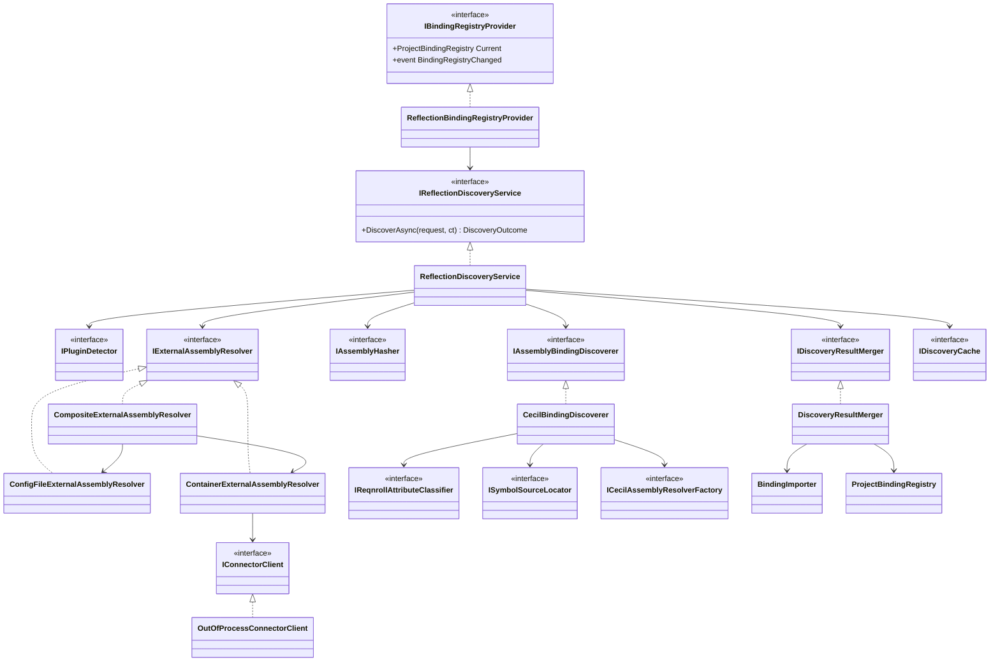
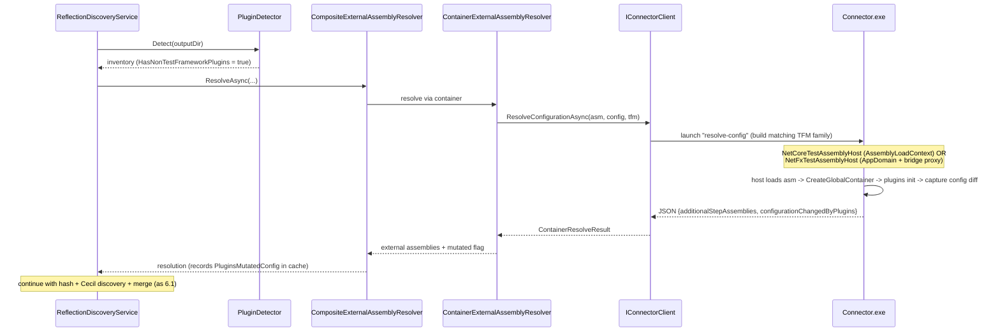

# Reflection-Based Binding Discovery — Design

> **Status:** Draft · **Scope:** the "Reflection Discovery" component of the LSP server
> (design-doc §3 and §7). This document details the service that builds a
> `ProjectBindingRegistry` from a project's **compiled** assemblies. See
> [LSP-IDE-Support-Design.md](LSP-IDE-Support-Design.md) for the overall architecture.

## Table of contents

1. [Overview](#1-overview)
2. [Relationship to the design doc](#2-relationship-to-the-design-doc)
3. [Inputs & outputs](#3-inputs--outputs)
4. [Component catalog](#4-component-catalog)
5. [Class diagram](#5-class-diagram)
6. [Sequence diagrams](#6-sequence-diagrams)
7. [Decision logic](#7-decision-logic-algorithm-steps-14)
8. [Mono.Cecil discovery details & limitations](#8-monocecil-discovery-details--known-limitations)
9. [Integration & lifecycle](#9-integration--lifecycle)
10. [Testing strategy](#10-testing-strategy)
11. [Open items](#11-open-items-outside-core-design)

---

## Context & goals

The LSP server (`Reqnroll.IdeSupport.LSP.Server`) currently registers a
`NullBindingRegistryProvider` stub, so feature files get no real binding matches — diagnostics,
go-to-definition, and step completion cannot work. The design doc calls for two binding
sources feeding a shared `ProjectBindingRegistry`: **Roslyn Discovery** (in-process,
source-level) and **Reflection Discovery** (post-build, scans the compiled assemblies). This
document designs Reflection Discovery.

The service implements the following algorithm:

1. Detect whether the project output folder contains Reqnroll plugins *other than* the
   test-framework integration plugin.
2. If there are none → use the external-assembly list from `reqnroll.json`.
3. If there are other plugins → let Reqnroll build a global container so plugins load and run
   their init routines (which may mutate the configuration's external-assembly list).
4. Record whether the plugins actually mutated the config; if not, future rebuilds can skip
   the container startup and reuse the `reqnroll.json` list.
5. Hash each external assembly's stable content; skip re-discovery when unchanged.
6. For each assembly (test assembly + external assemblies), run binding discovery, cache the
   per-assembly result, and merge.
7. Binding discovery uses **Mono.Cecil** to find methods carrying a Reqnroll binding
   attribute (or a custom attribute derived from one).

### Key decisions

- **Process model = Hybrid.** Orchestration, the Cecil metadata scan, hashing, caching, and
  the `IBindingRegistryProvider` implementation run **in-process** in `LSP.Server`. The *only*
  step that executes user/plugin code — the Reqnroll global-container startup used to resolve
  the effective external-assembly list — is delegated to the **out-of-process**
  `Reqnroll.IdeSupport.LSP.Connector` exe. Rationale: Mono.Cecil only *reads* metadata (no code
  execution, works for any TFM), so the fast path needs no child process, and arbitrary plugin
  code never runs inside the language server.
- **.NET Framework container path = full dual-host (in scope).** The Connector is
  multi-targeted and hosts both runtime families, mirroring the proven VS connector model:
  modern-.NET test assemblies are loaded via `AssemblyLoadContext`; `.NETFramework` test
  assemblies are loaded into a dedicated `AppDomain` through a bridge proxy
  (`MarshalByRefObject`). The Server launches the Connector build whose runtime family matches
  the test assembly's TFM. Cecil binding discovery is unaffected (metadata-only).
- **Cache scope = in-memory for the LSP session.** Hashes, per-assembly results, and the
  "plugins-mutated-config" flag live in memory; an `IDiscoveryCache` interface is the extension
  point for later on-disk persistence.

---

## 1. Overview

Reflection-Based Discovery produces a `ProjectBindingRegistry` from a project's **compiled**
output: the test assembly plus any external (additional) step assemblies. It runs after a
build is detected and feeds the registry that the Binding Match Service and diagnostics
consume. It is the post-build, "ground-truth" counterpart to in-process Roslyn discovery.

Two distinct mechanisms, deliberately separated by a safety boundary:

- **Metadata scan (in-process, Mono.Cecil):** reads attributes/methods without executing any
  user code. Works for every target framework. This is where *binding discovery* happens.
- **Plugin/config resolution (out-of-process, Connector exe):** the only place user/plugin
  code executes. Used *only* to discover the effective external-assembly list when
  non-test-framework plugins are present and may have mutated configuration.

## 2. Relationship to the design doc

Design-doc §7 framed a single out-of-process "Binding Connector" that returns a full
`DiscoveryResult` by delegating to Reqnroll's own discovery. This design refines that:

- Binding discovery is done **in-process with Mono.Cecil** (explicit requirement), not by
  delegating to `Reqnroll.Bindings.Provider.BindingProviderService`.
- The out-of-process connector is reduced to a **plugin/config resolver** that starts a global
  container and returns the effective `AdditionalStepAssemblies` + a "config changed" flag — a
  small JSON payload, not a full discovery result.
- The merge strategy with Roslyn discovery (doc §7) is unchanged: a reflection run replaces the
  whole registry; Roslyn replaces per-file entries.

## 3. Inputs & outputs

**Input — `ReflectionDiscoveryRequest`** (record):

- `string TestAssemblyPath`
- `string OutputDirectory`
- `string TargetFrameworkMoniker`
- `DeveroomConfiguration Configuration` (carries reqnroll.json-derived external assemblies + config file path)
- `string ProjectId` (cache key — project full path)

**Output — `DiscoveryOutcome`** (record):

- `ProjectBindingRegistry Registry`
- `bool UsedContainer`
- `bool PluginsMutatedConfig`
- `ImmutableArray<string> Warnings`, `ImmutableArray<string> Errors`

The `Registry` is what `IBindingRegistryProvider.Current` exposes.

## 4. Component catalog

All types are in `Reqnroll.IdeSupport.LSP.Server.Discovery.Reflection` unless noted. `LSP.Server`
gains a `Mono.Cecil` package reference; `LSP.Core` is left Cecil-free (only the DTOs and
`BindingImporter` are reused from Core).

| Type | Kind | Responsibility |
|---|---|---|
| `ReflectionBindingRegistryProvider` | class : `IBindingRegistryProvider`, `IDisposable` | Holds `Current`; on a debounced build/output-change trigger calls `IReflectionDiscoveryService`, swaps the registry atomically, raises `BindingRegistryChanged`. Cancels in-flight runs; retains last-good registry on failure (doc §9). One per project scope. |
| `IReflectionDiscoveryService` / `ReflectionDiscoveryService` | interface + class | Orchestrator implementing the 7-step algorithm. Pure async coordination over the collaborators below. |
| `IPluginDetector` / `PluginDetector` | interface + class | Enumerates `*.ReqnrollPlugin.dll` in the output dir; classifies each as test-framework-integration vs. other via `KnownReqnrollAttributes` (and optional Cecil confirmation of `[assembly: RuntimePlugin]`). Returns `PluginInventory`. |
| `IExternalAssemblyResolver` | interface | `Task<ExternalAssemblyResolution> ResolveAsync(request, inventory, priorState, ct)`. |
| `CompositeExternalAssemblyResolver` | class : `IExternalAssemblyResolver` | **Encodes algorithm steps 1–4.** Chooses the config-file path or the container path based on plugin inventory, prior `PluginsMutatedConfig` flag, config-file change, and TFM. |
| `ConfigFileExternalAssemblyResolver` | class : `IExternalAssemblyResolver` | Reads reqnroll.json additional step assemblies from `DeveroomConfiguration`; resolves names → paths in the output dir. |
| `ContainerExternalAssemblyResolver` | class : `IExternalAssemblyResolver` | Calls `IConnectorClient`; diffs the container result against the config-file list to set `ConfigurationMutatedByPlugins`. |
| `IConnectorClient` / `OutOfProcessConnectorClient` | interface + class | Selects the Connector build matching the test assembly's runtime family (modern-.NET vs `.NETFramework`, detected from the TFM / Cecil `TargetFrameworkAttribute`), launches it (`resolve-config <asm> <config> <tfm>`), parses marker-delimited JSON → `ContainerResolveResult { AdditionalStepAssemblies, ConfigurationChangedByPlugins, Errors }`. |
| `IAssemblyHasher` / `Sha256AssemblyHasher` | interface + class | Stable content hash (SHA-256 of file bytes; MVID noted as alternative). Cache key per assembly; combined → `ProjectBindingRegistry.ProjectHash`. |
| `IAssemblyBindingDiscoverer` / `CecilBindingDiscoverer` | interface + class | Cecil walk of one assembly → `AssemblyDiscoveryResult` (raw step/hook bindings + per-method source locations). |
| `IReqnrollAttributeClassifier` / `ReqnrollAttributeClassifier` | interface + class | Given a Cecil `CustomAttribute`, climbs the resolved base-type chain to classify it (`StepDefinition`/`Hook`/`StepArgumentTransformation`/`Binding`/`Scope`/none) and extracts attribute data (expression, step type(s), hook type, order, scope tags). Name-based fallback when `Resolve()` fails. |
| `ISymbolSourceLocator` / `CecilSymbolSourceLocator` | interface + class | Reads `MethodDefinition.DebugInformation.SequencePoints` (PDB) → `SourceLocation`; handles async state-machine methods; null when no symbols. |
| `ICecilAssemblyResolverFactory` | interface + class | Builds a Mono.Cecil `IAssemblyResolver` probing the output dir, NuGet cache, and shared frameworks (mirrors VS connector resolvers) so attribute base types resolve. |
| `IDiscoveryResultMerger` / `DiscoveryResultMerger` | interface + class | Merges per-assembly `AssemblyDiscoveryResult`s into one `DiscoveryResult` DTO with deduped, keyed `SourceFiles`/`TypeNames`; then uses `BindingImporter` to produce bindings and builds `ProjectBindingRegistry(steps, hooks, projectHash)`. |
| `IDiscoveryCache` / `InMemoryDiscoveryCache` | interface + class | Stores `ProjectDiscoveryState` per `ProjectId`. Extension point for on-disk persistence. |
| `KnownReqnrollAttributes` | static | Single source of truth: binding base-attribute full names (`Reqnroll.StepDefinitionBaseAttribute`, `Reqnroll.HookAttribute`, `Reqnroll.StepArgumentTransformationAttribute`, `Reqnroll.BindingAttribute`, `Reqnroll.ScopeAttribute`), concrete attribute names, and test-framework plugin assembly names (`Reqnroll.{xUnit,xUnit3,NUnit,MSTest,TUnit}.ReqnrollPlugin`). |

**Connector exe** (`Reqnroll.IdeSupport.LSP.Connector`, references Reqnroll; **multi-targeted**
to both `net4x` and modern-.NET, plus a `.NETFramework` bridge assembly):

- `ConfigResolverCommand` — orchestrates: pick a host via `ITestAssemblyHostFactory`, build the
  global container in that host, capture `ReqnrollConfiguration.AdditionalStepAssemblies`
  before/after plugin events, emit `ContainerResolveResult` as marker-delimited JSON on stdout.
- `ITestAssemblyHostFactory` / `ITestAssemblyHost` — abstraction over the two hosting models;
  `IContainerBootstrapper.ResolveAdditionalStepAssemblies()` runs inside the host and mirrors
  Reqnroll's `BindingDiscoveryService` / `ContainerBuilder.CreateGlobalContainer`.
  - `NetCoreTestAssemblyHost` — loads the test assembly via a custom `AssemblyLoadContext` with
    an assembly resolver chain (output dir + NuGet cache + shared frameworks), runs the
    bootstrapper in-process (within the isolated connector process).
  - `NetFxTestAssemblyHost` — creates a dedicated `AppDomain` (ApplicationBase = output dir,
    ConfigurationFile = `<asm>.config`) and a bridge `MarshalByRefObject` proxy
    (`NetFxContainerBridge` in a separate bridge assembly) that loads the assembly and runs the
    bootstrapper across the AppDomain boundary, returning only serializable strings. Unloads the
    AppDomain on dispose. Mirrors the VS connector's `NetFxTestAssemblyContext` /
    `NetFxAssemblyProxy`.

**Supporting records:** `PluginInventory`, `PluginAssembly`, `ExternalAssemblyResolution`,
`AssemblyDiscoveryResult`, `ContainerResolveResult`, `ProjectDiscoveryState` (`ConfigFileHash`,
`Plugins`, `PluginsMutatedConfig?`, `ResolvedExternalAssemblies`,
`PerAssembly: Dictionary<path,(hash,AssemblyDiscoveryResult)>`), `CachedAssemblyResult`.

## 5. Class diagram



## 6. Sequence diagrams

### 6.1 Cold discovery, no extra plugins

```mermaid
sequenceDiagram
    participant WF as WatchedFilesHandler
    participant P as ReflectionBindingRegistryProvider
    participant S as ReflectionDiscoveryService
    participant PD as PluginDetector
    participant ER as CompositeExternalAssemblyResolver
    participant H as AssemblyHasher
    participant CD as CecilBindingDiscoverer
    participant M as DiscoveryResultMerger
    WF->>P: output assembly changed (debounced)
    P->>S: DiscoverAsync(request)
    S->>PD: Detect(outputDir)
    PD-->>S: inventory (no non-framework plugins)
    S->>ER: ResolveAsync(request, inventory, priorState)
    ER-->>S: external assemblies from reqnroll.json (no container)
    loop test asm + each external asm
        S->>H: ComputeHash(asm)
        S->>CD: Discover(asm)  %% cache miss
        CD-->>S: AssemblyDiscoveryResult
    end
    S->>M: Merge(results)
    M-->>S: ProjectBindingRegistry
    S-->>P: DiscoveryOutcome
    P->>P: swap Current; raise BindingRegistryChanged
```

### 6.2 Cold discovery with a non-framework plugin



### 6.3 Warm rerun (cache hits + skip container)

```mermaid
sequenceDiagram
    participant S as ReflectionDiscoveryService
    participant C as DiscoveryCache
    participant PD as PluginDetector
    participant ER as CompositeExternalAssemblyResolver
    participant H as AssemblyHasher
    participant CD as CecilBindingDiscoverer
    S->>C: get ProjectDiscoveryState
    S->>PD: Detect(outputDir)
    PD-->>S: inventory (plugins present, unchanged)
    S->>ER: ResolveAsync(..., priorState)
    Note over ER: plugins present BUT priorState.PluginsMutatedConfig == false AND config unchanged
    ER-->>S: reqnroll.json list (container SKIPPED)
    loop each assembly
        S->>H: ComputeHash(asm)
        alt hash unchanged
            S->>C: reuse cached AssemblyDiscoveryResult
        else changed
            S->>CD: Discover(asm)
        end
    end
    Note over S: merge only if any input changed; else keep current registry
```

### 6.4 Connector failure (resilience, doc §9)

```mermaid
sequenceDiagram
    participant S as ReflectionDiscoveryService
    participant CC as IConnectorClient
    participant P as ReflectionBindingRegistryProvider
    S->>CC: ResolveConfigurationAsync(...)
    CC-->>S: throws / non-zero exit
    S->>S: log warning; fall back to reqnroll.json list
    S-->>P: DiscoveryOutcome (Errors populated, registry still built from Cecil)
    Note over P: if discovery throws entirely, retain last-good Current; surface warning
```

## 7. Decision logic (algorithm steps 1–4)

Implemented in `CompositeExternalAssemblyResolver`:

```
if (!inventory.HasNonTestFrameworkPlugins)        -> ConfigFile resolver       (step 2)
else if (priorState?.PluginsMutatedConfig == false
         && !configFileChanged
         && pluginSetUnchanged)                    -> ConfigFile resolver (skip container, step 4)
else                                               -> Container resolver        (step 3)
                                                      then record PluginsMutatedConfig
```

The container resolver works for both runtime families: `OutOfProcessConnectorClient` launches
the Connector build matching the test assembly's TFM (modern-.NET vs `.NETFramework`), so there
is no TFM-based fallback branch.

## 8. Mono.Cecil discovery details & known limitations

- Read with `ReaderParameters { ReadSymbols = true, AssemblyResolver = <factory> }`; fall back
  to `ReadSymbols = false` if no PDB (source locations become null; navigation then relies on
  Roslyn discovery).
- For each `MethodDefinition`, inspect `CustomAttributes`; for each, `Resolve()` the attribute
  type and climb `BaseType` comparing full names against `KnownReqnrollAttributes`. This catches
  **custom attributes derived from** the Reqnroll base attributes.
- **Limitation (called out explicitly):** Cecil sees attribute arguments *at the use site*.
  `[Given("...")]` exposes its expression (a ctor arg) — fine. A custom attribute that hard-codes
  its expression inside its own constructor (e.g. a parameterless `[MyLoginStep]` deriving from
  `GivenAttribute`) does **not** expose that expression in usage metadata, so its
  `SourceExpression` is unavailable to the Cecil path. The container/reflection path would see
  it. Such bindings are emitted with a null expression and a warning; this is the accepted
  trade-off of the explicit Cecil requirement.
- `StepArgumentTransformation` bindings are discovered but the current `ProjectBindingRegistry`
  only stores steps + hooks; transformations are captured for future registry support (noted,
  not wired).
- Param types and source locations are encoded into the existing DTO format (`TypeShortcuts`,
  `key|line|col|line|col`) so `BindingImporter` consumes them unchanged.

## 9. Integration & lifecycle

- **DI (Program.cs):** replace the `NullBindingRegistryProvider` registration; register the
  engine collaborators as singletons. Because discovery is per-project but the existing
  `IBindingRegistryProvider` is a single registration, create one
  `ReflectionBindingRegistryProvider` per `LspProjectScope` (stored in `scope.Properties`) with a
  thin scope-routing adapter for the DI singleton. (Multi-root handling — refine with
  `LspWorkspaceScopeManager`.)
- **Trigger:** `WatchedFilesHandler` watches `LspProjectScope.OutputAssemblyPath`; change →
  `provider.RefreshAsync()` with debounce (absorb post-build file churn) and cancellation of
  in-flight runs. Config-file changes invalidate the container decision.
- **Prerequisite:** `LspProjectScope.OutputAssemblyPath` / `TargetFrameworkMoniker` are currently
  stubs and must be populated (MSBuild/heuristic) before this service is useful — tracked as an
  Open Item, not part of this design's core.

## 10. Testing strategy

Stack (matches `LSP.Core.Tests`): **xUnit**, **AwesomeAssertions**, **NSubstitute**,
**System.IO.Abstractions.TestingHelpers**, **Microsoft.CodeAnalysis.CSharp** (compile fixture
assemblies in-memory with PDBs), **ApprovalTests**, **Xunit.SkippableFact**. Tests live in
`tests/LSP/Reqnroll.IdeSupport.LSP.Server.Tests` (+ a Specs project for end-to-end).

| Scenario | Technique |
|---|---|
| Cecil finds `[Given]/[When]/[Then]/[StepDefinition]`, all hook types, `[StepArgumentTransformation]`, `[Scope]`, async methods, parameterized methods (table/docstring/typed) | Compile fixture source to a temp dll+PDB via Roslyn `CSharpCompilation`; run `CecilBindingDiscoverer`; assert emitted DTOs. ApprovalTests snapshot for the full DTO set. |
| Custom attribute derived from `GivenAttribute`/`HookAttribute` is recognized | Fixture with a derived attribute; assert classification. Cover the documented null-expression limitation as an explicit assertion. |
| Unresolvable attribute type → name-based fallback; no PDB → null source locations | Fixture compiled without symbols / with a referenced-but-unresolvable attribute; assert graceful degradation. |
| `PluginDetector` classifies framework vs. other plugins | `MockFileSystem` with `*.ReqnrollPlugin.dll` names; one real-ish dll with `[assembly: RuntimePlugin]` read via Cecil; assert `PluginInventory`. |
| `AssemblyHasher` stability | Same bytes → same hash; mutated byte → different. Note deterministic-build behavior. |
| `CompositeExternalAssemblyResolver` decision matrix (steps 1–4) | Parameterized `[Theory]` over (plugins?, priorMutatedFlag, configChanged?, tfm) with **NSubstitute** mocks for config + container resolvers; assert which path is taken and that `IConnectorClient` is/isn't called. |
| Warm-cache skipping | Orchestrator with NSubstitute collaborators; assert `CecilBindingDiscoverer` called only for changed assemblies and `IConnectorClient` not called when `PluginsMutatedConfig==false` — via received-call counts. |
| `ReflectionBindingRegistryProvider` behavior | Fake `IReflectionDiscoveryService` with controllable delay/exception; assert `BindingRegistryChanged` raised on swap, debounce coalesces rapid triggers, in-flight cancelled on new trigger, last-good registry retained on failure. |
| Connector exe container resolution (modern .NET) | **Integration** (`SkippableFact`, skipped if exe absent): real Connector against a built modern-.NET fixture whose plugin mutates `AdditionalStepAssemblies`; assert `ConfigurationChangedByPlugins==true` and the added assembly returned. No-plugin fixture asserts the opposite. |
| Connector exe container resolution (.NET Framework dual-host) | **Integration** (`SkippableFact`, requires the netfx Connector build + a `.NETFramework` fixture, Windows-gated): assert the `AppDomain`+bridge host loads the assembly, runs plugin init, returns the mutated `AdditionalStepAssemblies`, and the AppDomain is unloaded. `OutOfProcessConnectorClient` test asserts it selects the netfx build for a `.NETFramework` TFM and the modern build otherwise. |
| End-to-end | Specs project: build a fixture solution (test asm + external binding asm + custom plugin), run full `DiscoverAsync`, assert resulting `ProjectBindingRegistry` matches expected steps/hooks and that sample feature-file steps match via `MatchStep`. |

## 11. Open items (outside core design)

- Populate `LspProjectScope.OutputAssemblyPath` / `TargetFrameworkMoniker`.
- IPC mechanism final choice (doc Q15) — default stdin/stdout child process.
- On-disk cache persistence across LSP sessions (`IDiscoveryCache` extension point).
- Extend `ProjectBindingRegistry` to carry step-argument transformations.
