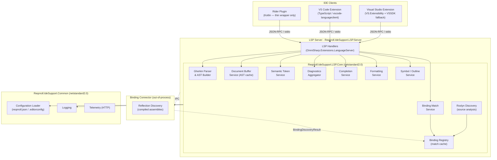

# Reqnroll LSP-Based IDE Support — Architecture & Implementation Reference

> **Status:** Draft for team review  
> **Audience:** Core team contributors

**Related documents**

| Document | Contents |
|----------|----------|
| [Overview](LSP-IDE-Support-Overview.md) | Scope, goals, high-level architecture, roadmap (F-number → feature name index), release strategy |
| [Feature Designs](LSP-IDE-Support-Feature-Designs.md) | Per-feature design, sequence diagrams, as-built notes (Appendix A / B) |
| [Open Questions & Risk Register](LSP-IDE-Support-Open-Questions.md) | Active open questions, risk register |

---

## Table of Contents

1. [LSP Concepts Primer](#1-lsp-concepts-primer)
2. [Where This Implementation Diverges from Standard LSP](#2-where-this-implementation-diverges-from-standard-lsp)
3. [Module Architecture](#3-module-architecture)
4. [Repository Structure](#4-repository-structure)
5. [LSP Server Design](#5-lsp-server-design)
6. [IDE Clients](#6-ide-clients)
7. [Binding Connector](#7-binding-connector)
8. [Testing Strategy](#8-testing-strategy)
9. [Cross-Cutting Concerns](#9-cross-cutting-concerns)
    - [Performance Requirements](#performance-requirements)
    - [Telemetry](#telemetry)
    - [Configuration](#configuration)
    - [Security](#security)
    - [CI/CD Pipeline](#cicd-pipeline)
    - [Versioning and Compatibility](#versioning-and-compatibility)
    - [LSP Message Tracing](#lsp-message-tracing)
    - [Error Handling and Resilience](#error-handling-and-resilience)
    - [End-User Troubleshooting and Logging](#end-user-troubleshooting-and-logging)
    - [Server Lifecycle](#server-lifecycle)
10. [Alternatives Considered](#10-alternatives-considered)
11. [Non-Feature Engineering Tasks](#11-non-feature-engineering-tasks)

---

## 1. LSP Concepts Primer

LSP (Language Server Protocol) decouples language intelligence from the editor. A **language server** runs as a separate process and communicates with any compliant **IDE client** over JSON-RPC 2.0. The same server binary serves all three IDEs in this project. What follows is the minimum background needed to read the rest of this document; the authoritative reference is the [LSP 3.17 specification](https://microsoft.github.io/language-server-protocol/specifications/lsp/3.17/specification/).

**Initialize / initialized handshake.** The client sends `initialize`, advertising its capabilities (what message types it understands, which optional features it supports). The server responds with its own capabilities. This negotiation determines the active feature set for the session — the server must not send messages for capabilities the client did not advertise. Once the client receives the response it sends `initialized` (a notification) to signal readiness; the server may then begin pushing workspace-wide notifications.

**Requests vs. notifications.** A *request* (`textDocument/completion`, `textDocument/definition`, …) expects a response. A *notification* (`textDocument/didChange`, `textDocument/publishDiagnostics`, …) does not. Handlers must never send a response to a notification. OmniSharp enforces this distinction through separate base classes.

**Document sync.** The client sends `textDocument/didOpen`, `textDocument/didChange`, and `textDocument/didClose` to keep the server's view of open files current. `didChange` may carry either the full new text or an incremental delta (depending on the `TextDocumentSyncKind` the server declared). This server declares `Incremental` but re-parses the full file on every change — see [§5 Document Scope](#document-scope) for the rationale.

**Push vs. pull.** Server-to-client data flows in one of two patterns:
- *Push* — the server sends proactively when its internal state changes (e.g. `textDocument/publishDiagnostics` after a binding registry update). The client cannot predict when this arrives.
- *Pull* — the client requests on demand (e.g. `textDocument/semanticTokens/full` when it wants to repaint). The server responds only when asked.

Most LSP capabilities use pull. This implementation adds a push path for Visual Studio semantic tokens (see [§2](#2-where-this-implementation-diverges-from-standard-lsp)).

**Semantic tokens.** The server encodes all document color information as a flat array of 5-integer tuples: `[deltaLine, deltaStartChar, length, tokenTypeIndex, tokenModifiersBitmask]`. Positions are *delta-encoded* relative to the previous token (not absolute). The `tokenTypeIndex` is an index into a `legend` the server declares in the `initialize` response. The legend is the contract between server and clients — reordering or removing entries is a breaking change.

**Static vs. dynamic capability registration.** A capability can be declared *statically* in the `initialize` response (the client knows about it immediately) or registered *dynamically* at runtime via `client/registerCapability` (useful when registration depends on workspace content). Dynamic registration is more flexible but not all clients handle it reliably for all capabilities; Visual Studio is a known case where static registration is required for semantic tokens.

**Custom notifications and requests.** LSP allows non-standard methods; by convention they are namespaced (e.g. `reqnroll/projectLoaded`). Clients that do not recognise a custom notification silently ignore it — this is how the `reqnroll/*` project-system notifications degrade gracefully on clients that do not yet consume them.

**Authoritative sources:**
- [LSP 3.17 specification](https://microsoft.github.io/language-server-protocol/specifications/lsp/3.17/specification/)
- [LSP overview — Microsoft Learn](https://learn.microsoft.com/en-us/visualstudio/extensibility/language-server-protocol)
- [OmniSharp.Extensions.LanguageServer (GitHub)](https://github.com/OmniSharp/csharp-language-server-protocol)

---

## 2. Where This Implementation Diverges from Standard LSP

Several aspects of this implementation deviate from what a textbook LSP server does. Each deviation is driven by a concrete constraint — IDE quirk, project-system limitation, or performance requirement. This section collects them in one place so a new contributor is not surprised to find the code doing something unusual.

### Semantic token delivery for Visual Studio: server push + client classifier

A standard LSP client *pulls* semantic tokens by sending `textDocument/semanticTokens/full` to the server and rendering the response. Visual Studio breaks this in two independent ways (both confirmed empirically — see R1/R1a in the [Risk Register](LSP-IDE-Support-Open-Questions.md#risk-register)):

1. VS's built-in semantic-token colorizer maps token-type names through a fixed internal `switch` that recognises only standard LSP types and a small set of C++/Roslyn/Razor names. Every unrecognised name — including all `reqnroll.*` names — falls through to plain `"text"`. Registering same-named `ClassificationTypeDefinition` entries in the MEF registry is **not** consulted; the mapping is hardcoded.
2. VS pulls `semanticTokens/full` lazily and inconsistently via its own tagger lifecycle; in practice it sometimes never requests tokens for an open document.

The workaround is a **server-push + client-classifier** path that bypasses VS's native token pull entirely. When launched with `--client visualstudio`, the server pushes encoded tokens to the VS client via a custom `reqnroll/semanticTokens` notification every time step binding matches change [ `MatchCacheChangedNotification`]. The VS extension captures this notification, decodes the token data, and caches it in a process-wide `SemanticTokenClassificationStore`. A classic MEF `IClassifierProvider` / `GherkinSemanticClassifier` then reads those cached tokens and emits `ClassificationSpan`s using the existing `DeveroomClassifications` entries — the same classification names the existing VS extension uses, so users see no change in behavior of coloring (compared to the existing extension). VS Code and Rider are unaffected and use the standard pull flow.

The `--client` flag is the only place where the server behaves differently per IDE at the protocol level; the rest of the server is client-agnostic.

Full detail is in [F1 · Client-side token-type mapping](LSP-IDE-Support-Feature-Designs.md#client-side-token-type-mapping).

### Sync-first, async-rest internal pipeline

A typical LSP server dispatches an incoming message, calls services sequentially, and returns a response. This server uses a **sync-first, async-rest** model driven by the observation that the first state change (parsing the document and computing the match set) must complete *before* the handler can respond to the current request (e.g. `semanticTokens/full` needs the cached tags immediately), but all downstream effects (pushing diagnostics, refreshing semantic tokens for other open files) are independent and can be deferred.

The protocol handler therefore performs the initial synchronous write to the Document Buffer and Binding Match Service, then publishes a `MatchCacheChangedNotification` via MediatR and returns. Downstream internal handlers pick up the notification asynchronously. This prevents the response round-trip from being blocked by the diagnostics pipeline, which may need to re-parse several open feature files.

The trade-off is that the call graph is less linear: a `textDocument/didChange` triggers work across multiple handlers in sequence. The sequence diagrams in [Appendix A](LSP-IDE-Support-Feature-Designs.md) document each chain explicitly. See also [Internal Event Architecture](#internal-event-architecture) in §5.

### Per-IDE capability registration via `--client` flag

OmniSharp's handler base classes (e.g. `SemanticTokenHandlerBase`) register capabilities dynamically by default. Visual Studio requires static registration for semantic tokens and certain other capabilities — it cannot handle `client/registerCapability` reliably for these.

Rather than encoding per-IDE logic inside each handler class, the server accepts a `--client <ide>` flag at startup and uses it to decide, once during `initialize`, whether to register each capability statically or dynamically. This keeps all IDE-specific registration logic in one place (the startup path) while leaving handler implementations client-agnostic.

### Custom `reqnroll/*` notifications for project-system information

LSP has no vocabulary for IDE project systems. The protocol knows about *workspace folders* and *files*, but not about which `.csproj` owns a file, what its output assembly path is, or which package references it declares. All of that is information the binding discovery pipeline needs.

Three custom client→server notifications bridge the gap: `reqnroll/projectLoaded` (build properties), `reqnroll/projectFiles` (file membership), and `reqnroll/projectUnloaded`. Each is optional — a client that cannot produce it omits it and the server degrades gracefully (folder-prefix routing, no membership index). This optionality is deliberate: the three IDE project systems have very different capabilities and timing, so forcing a single synchronous production path would either slow down the fast path (VS) or be impossible (VS Code has no MSBuild project system at all).

Full protocol details are in [§5 Client ↔ Server Custom Notifications](#client--server-custom-notifications).

### Project membership index — replacing folder-prefix inference

A standard LSP server associates a file with a workspace by checking whether its URI falls under a workspace folder. This works for flat, non-overlapping layouts. It fails for MSBuild projects because:

- A project can **link** files that live physically outside its folder (`<Compile Include="..\Other\X.cs" Link="…">`). The linked file's URI falls under a *different* project's folder, so prefix matching assigns it to the wrong project.
- A project can **exclude** files that live inside its folder (`<Compile Remove>`, false `Condition`). Prefix matching re-admits them silently.
- One physical file can belong to **zero, one, or several** projects simultaneously — a genuine many-to-many relation that a single prefix lookup cannot express.

The consequence is not cosmetic. A linked binding `.cs` routed to the wrong project injects bindings into the wrong registry; a linked feature file silently disappears from the **closed-file workspace scan** (the startup pass where the server indexes all `.feature` and `.cs` files that belong to a project but are not currently open in the editor); an excluded-but-opened file can inject phantom bindings into a registry that a subsequent build will wipe. For F15 (Find Unused Step Definitions), a false "unused" result invites deletion of live code.

The solution is an explicit `path → {projects}` index populated by the `reqnroll/projectFiles` notification. Folder-prefix containment is retained only as a read-only fallback for files no project claims. All registry writes, the closed-file scan, and the usages/unused accounting are gated on index membership rather than on the filesystem. The full reproduction, root-cause analysis, and design resolution are in [Feature Designs — Infrastructure](LSP-IDE-Support-Feature-Designs.md#infrastructure-linked-files-and-project-membership); the index design and its invariants are in [§5 Workspace Model](#workspace-model) below.

---

## 3. Module Architecture



### Transport

All three IDE clients communicate with the server over **stdio**. The server is launched as a child process by the IDE extension and exchanges JSON-RPC messages over its standard input/output streams.

### Parsing, Discovery, and Matching Pipeline

Three distinct components form the core of the server's intelligence. Each has its own caching layer and independent update lifecycle:

**1 · Gherkin Parser & Document Buffer**

On `textDocument/didOpen` and `textDocument/didChange`, the sync handler invokes `DeveroomTagParser`, which runs the Gherkin parser and step-binding match in a **single combined AST walk**. The output is a `DeveroomTag[]` tree that encodes both structural classification (keywords, tags, descriptions, doc strings, data tables, parse errors) and step match results (`DefinedStep`, `UndefinedStep`, `StepParameter`, `ScenarioOutlinePlaceholder`). This tag tree is stored in the Document Buffer keyed by URI. A `FeatureBindingMatchSet` is derived from the match-result tags and stored separately in the Binding Match Service.

All subsequent requests for a document (semantic tokens, outline, folding, diagnostics) read from the cached tag tree; they do not re-parse.

> **Note**: Although `textDocument/didChange` may carry only the incremental text delta, `DeveroomTagParser` always re-parses the entire file. Because Gherkin AST nodes carry absolute location information, inserting or deleting a line shifts the location of every subsequent node; partial re-parse is not practical.

**2 · Binding Registry**

Binding information enters the registry from two sources:

- **Roslyn Discovery** (in-process, in LSP.Core): when a `.cs` file changes, Roslyn re-analyzes the changed file and replaces its bindings in the registry. No build is required; feedback is immediate.
- **Reflection Discovery** (out-of-process Connector): when a build is detected (see [Q9](LSP-IDE-Support-Open-Questions.md) for per-IDE detection reliability), the Connector scans the compiled assembly and replaces the full registry.

**3 · Binding Match Service**

The Binding Match Service holds the `FeatureBindingMatchSet` cache derived from the tag tree (see above). Because matching is fused into the parse pass rather than being a separate stage, the cache is not updated independently of the Document Buffer — both are written together by the sync handler on every `didOpen` / `didChange`.

When the **Binding Registry** changes (C# file save or post-build reflection scan), the server cannot rely on the tag tree already encoding the new match results. `BindingRegistryChangedHandler` therefore re-runs `DeveroomTagParser` for each open feature file against the updated registry, atomically replacing both the tag tree in the Document Buffer and the match set in the Binding Match Service. Any change to the match cache triggers the Diagnostics Aggregator to recompute and push diagnostics for affected files.

---

## 4. Repository Structure

```
Reqnroll.IdeSupport/
├── src/
│   ├── Reqnroll.IdeSupport.Common/             # Shared infrastructure (netstandard2.0)
│   │   ├── Configuration/                      # reqnroll.json, .editorconfig loaders
│   │   ├── Logging/                            # Cross-platform logging abstractions
│   │   ├── ProjectSystem/                      # IDE-agnostic file/project abstractions
│   │   └── Telemetry/                          # HTTP-based telemetry (cross-platform)
│   │
│   ├── Reqnroll.IdeSupport.LSP.Core/           # Protocol-agnostic LSP logic (netstandard2.0)
│   │   ├── Parsing/                            # DeveroomGherkinParser, AST builder
│   │   ├── Discovery/                          # RoslynDiscovery, BindingRegistry
│   │   ├── Matching/                           # BindingMatchService, match cache
│   │   └── Editor/                             # SemanticTokenService, FormattingService, etc.
│   │
│   ├── Reqnroll.IdeSupport.LSP.Server/         # OmniSharp LSP host (net9+, exe)
│   │   ├── Handlers/
│   │   │   ├── Protocol/                       # OmniSharp handler classes (LSP messages)
│   │   │   └── Internal/                       # MediatR notification handlers (internal events)
│   │   ├── Workspace/                          # WorkspaceScopeManager, ProjectScope
│   │   └── Program.cs
│   │
│   ├── Reqnroll.IdeSupport.LSP.Connector.Models/  # DTOs for reflection discovery results
│   ├── Reqnroll.IdeSupport.LSP.Connector/         # Reflection-based binding discovery (exe)
│   │
│   └── clients/
│       ├── visualStudio
│       |   ├── Reqnroll.IdeSupport.VisualStudio.Extension/     # VSIX (net481)
│       │   |   ├── LanguageClient/                 # ReqnrollLanguageClient (VS.Extensibility)
│       │   |   ├── Inspection/                     # LspInterceptingPipe (debug tracing)
│       │   |   └── LSPServer/                      # Embedded server exe
│       |   ├── Reqnroll.IdeSupport.VisualStudio.VSSDKIntegration/  # VSSDK fallback helpers
│       |   └── Reqnroll.IdeSupport.VisualStudio.Wizards*/           # New Project/Item wizards
│       ├── vscode/                             # TypeScript VS Code extension
│       └── rider/                              # Kotlin Rider plugin (thin wrapper)
│
└── tests/
    ├── Reqnroll.IdeSupport.LSP.Core.Tests/         # Unit tests for LSP.Core services
    ├── Reqnroll.IdeSupport.LSP.Server.Tests/        # Unit tests for LSP handlers
    ├── Reqnroll.IdeSupport.LSP.Server.Specs/        # Integration specs (simulates IDE client)
    ├── Reqnroll.IdeSupport.VisualStudio.Tests/      # Unit tests for VS extension
    ├── Reqnroll.IdeSupport.VisualStudio.Specs/      # Integration specs for VS extension
    └── Reqnroll.IdeSupport.Specs/                   # End-to-end BDD specs (Reqnroll)
```

> **Convention**: projects named `*.Tests` are unit tests; projects named `*.Specs` are integration/BDD tests. Client-side unit and integration tests should be considered for each IDE client as the clients mature (see [Q8](LSP-IDE-Support-Open-Questions.md)).

---

## 5. LSP Server Design

The server is a self-contained executable built on `OmniSharp.Extensions.LanguageServer`. It is embedded in each IDE extension package and launched as a child process on extension activation.

> **As-built note (Visual Studio)**: "extension activation" is literal for VS — see [§6.2](#62-visual-studio) for how `LspServerConnectionService` moves process launch off the `.feature`-file-open path onto extension load.

### Capability Registration

OmniSharp supports both static (declared in `initialize` response) and dynamic (via `client/registerCapability`) registration. Visual Studio has known issues with dynamic registration for some capabilities (see per-feature notes).

The server accepts a `--client <ide>` command-line flag at startup (e.g., `--client visualstudio`) so that it can choose static vs. dynamic registration for each capability based on the consuming client, without requiring any client-side override logic.

> **OmniSharp implementation note**: OmniSharp's handler base classes (e.g., `SemanticTokenHandlerBase`) use dynamic registration by default. For capabilities requiring static registration, we will either build alternate base classes or patch the underlying OmniSharp registration — this is a known implementation risk for Phase 1.

### Document Scope

The server registers interest in both `*.feature` files and `*.cs` files. It does not act as a general-purpose C# language server; its interest in `*.cs` files is limited to:

- Receiving `textDocument/didOpen` / `didChange` to trigger Roslyn-based binding re-discovery
- Providing `textDocument/references` and `reqnroll/findStepUsages` (step usages, from a C# binding method — see [F14](LSP-IDE-Support-Feature-Designs.md#f14--find-step-definition-usages))
- Providing `textDocument/codeLens` (usage counts on binding attributes)

> **As-built note**: `.cs` interest for binding re-discovery is implemented (see [F2 · Implementation status](LSP-IDE-Support-Feature-Designs.md#f2--binding-discovery)). A single OmniSharp text-document sync handler (`TextDocumentSyncHandler`) registers a document selector covering **both** `**/*.feature` and `**/*.cs` and routes by file extension, rather than a separate `CsSyncHandler` — this avoids OmniSharp's ambiguity when two `TextDocumentSyncHandlerBase` implementations claim overlapping documents. `.cs` files are deliberately **not** stored in the Gherkin document buffer.

### Client ↔ Server Custom Notifications

Beyond the standard LSP surface, each IDE glue layer sends a small set of Reqnroll-specific notifications that carry project-system information LSP itself has no vocabulary for. These are produced by the client/glue (which has access to the IDE's project model) and consumed by the `LspWorkspaceScopeManager`.

| Method | Direction | Purpose |
|---|---|---|
| `reqnroll/projectLoaded` | Client → Server | A Reqnroll project was opened, or its **build properties** changed (rebuild, configuration switch). Carries `workspaceFolder`, `projectFile`, `projectFolder`, `outputAssemblyPath`, `targetFrameworkMoniker`, and resolved `packageReferences`. Cheap to produce; sent early so binding discovery can start as soon as the output path is known. |
| `reqnroll/projectFiles` | Client → Server | The project's **file membership** (feature files + binding source files, on-disk paths, including links). Separate from `projectLoaded` because membership has a different change cadence and, in some IDEs, a different (slower, async) production path. See [Project membership](#project-membership-the-path--projects-index) below and [Q17](LSP-IDE-Support-Open-Questions.md). |
| `reqnroll/projectUnloaded` | Client → Server | A project was removed from the solution/workspace. Carries `projectFile`. |

> **Why `projectFiles` is a separate notification, not fields on `projectLoaded`.** The decision is driven by concrete differences between the three IDE project systems — VS Code cannot produce the manifest as a cheap byproduct of project load at all (it has no MSBuild project system); VS's authoritative item enumeration (CPS / MSBuild evaluation) is a slower, async path than the EnvDTE property reads that power `projectLoaded` today; and Rider can produce it readily but its built-in LSP client's custom-notification transport is not yet proven. An optional, snapshot-plus-delta message decouples fast-path discovery from membership, matches each project system's change events, and degrades gracefully per client. The full rationale is recorded under [Q17](LSP-IDE-Support-Open-Questions.md).

### Workspace Model

Each opened workspace folder maps to an `LspWorkspaceScope` containing one or more `LspProjectScope` instances. Project detection reads `*.csproj` files to discover `reqnroll.json` configuration and output assembly paths for the Binding Connector.

**Multi-root configuration divergence**: In a workspace with multiple root folders (e.g., a monorepo with separate application and test projects), each root may carry a different `reqnroll.json`. The `LspWorkspaceScope` maintains a separate `LspProjectScope` — and thus a separate Binding Registry — per project. Feature files are resolved against the registry of the project(s) that own them, using the authoritative membership index described next. A naive fallback to a merged view of all registries is not realistic for production use.

#### Project membership: the `path → {projects}` index

A file's owning project is **not** inferred from on-disk folder containment. MSBuild allows a project to **link** files that live outside its folder — `<Compile Include="..\Other\X.cs" Link="…">`, `<None Include="…" Link="…">`, the `ReqnrollUseIntermediateOutputPathForCodeBehind = true` pattern — and to **exclude** files that live inside it (`<Compile Remove>`, `<None Remove>`, or a false `Condition`). A single physical file may therefore belong to **zero, one, or several** projects. This is a genuine many-to-many relation that folder-prefix matching cannot express (see [Q17](LSP-IDE-Support-Open-Questions.md) for the analysis and the corpus reproduction that motivated this design).

The server maintains an explicit, authoritative index mapping each file's on-disk path to the **set** of projects that include it, keyed within each project by `(projectFile, targetFrameworkMoniker)` so that per-TFM conditional membership lands on the correct registry. The index is populated by the **`reqnroll/projectFiles`** client→server notification (see below); folder-prefix containment survives only as a clearly-degraded, read-only last resort for files that **no** project claims, and it must never write into a registry or into usages/unused accounting.

Two invariants follow, and both are required for correctness:

1. **Membership is conferred exclusively by the index.** Neither folder containment nor a file being open in the editor may grant a file ownership in any project. The closed-file workspace scan is driven by the index, not by a folder glob — otherwise an *excluded* file physically inside a project folder would be silently re-admitted.
2. **Open-state never confers membership or accounting.** A file the user opens that no project owns receives only registry-independent features (semantic tokens, parse-error diagnostics, folding, formatting, document symbols). Binding-dependent features (unmatched-step diagnostics, step↔binding navigation, binding completion, usages/unused) are suppressed for it — and an opened-but-unowned `.cs` must **not** inject phantom bindings into any registry via the Roslyn live path. Were this not enforced, merely opening an excluded feature file could flip a binding from "unused" to "used" in F15 (Find Unused Step Definitions).

#### The `reqnroll/projectFiles` notification

Each IDE glue layer enumerates a project's feature files and binding source files — resolved to their **on-disk** paths, including linked files — and sends them to the server. This is a **separate** notification from [`reqnroll/projectLoaded`](#client--server-custom-notifications), deliberately decoupled because the two carry information of different cadence and availability (the rationale, including how each IDE's project system constrains the choice, is recorded under [Q17](LSP-IDE-Support-Open-Questions.md)):

| Property | Value |
|---|---|
| Method | `reqnroll/projectFiles` (client → server notification) |
| Key | `projectFile` + `targetFrameworkMoniker` (matches the `reqnroll/projectLoaded` keying) |
| Payload | `{ projectFile, targetFrameworkMoniker, kind: "baseline" \| "delta", files: [{ path, role: "feature" \| "binding", added? }] }` |
| Baseline | A `kind: "baseline"` message carries the project's complete current membership and is the **authoritative snapshot**. Receiving it flips every previously-absent file under that project from *pending* to *excluded*. |
| Delta | A `kind: "delta"` message carries incremental add/remove entries, matching the fine-grained item-change events the VS and Rider project systems surface. |
| Optional | A client that cannot reliably produce the manifest simply omits the notification; that project then falls back to folder-prefix routing. This makes the message safe to adopt per-client (notably for Rider's less-proven built-in LSP transport). |

**Pending vs. excluded.** Because both "deliberately excluded" and "not yet reported" manifest as *absence from the index*, the server treats absence as **pending** (unknown — defer binding-dependent features rather than declaring the file unowned) until the project's first `baseline` arrives, and as **excluded** thereafter. The glue layer must therefore re-send membership not only on project load and rebuild but on **`.csproj` change**, so that re-including a file in the editor restores its ownership.

**Gherkin dialect resolution**: Dialect is resolved at two levels:

1. **Per-project default**: read from `reqnroll.json` (`language` property; default `en`).
2. **Per-file override**: a `# language: <code>` comment on the first line of a `.feature` file overrides the project default for that file. This is standard Gherkin syntax and must take precedence.

The Document Buffer stores the effective dialect alongside each file's AST. The Semantic Token Service and Completion Service always use the per-file effective dialect.

### Debounce, Cancellation, and Request Priority

**Debounce policy**: `textDocument/didChange` events arrive on every keystroke. Rather than immediately triggering the full parse-and-match pipeline on each event, the server applies a configurable debounce window (default: **200 ms**) before publishing `FeatureFileChangedNotification`. This prevents the binding match pipeline from thrashing during rapid typing and avoids unnecessary `publishDiagnostics` pushes mid-word.

**Cancellation**: All protocol handlers that produce responses (semantic tokens, completions, definition) accept a `CancellationToken`. If a superseding request arrives before the previous one completes, the client may send `$/cancelRequest`; OmniSharp propagates this as a cancelled token. Handlers must not leave the Document Buffer or Binding Registry in an inconsistent state if cancelled mid-flight — the previous value must remain valid until the new value is atomically committed.

**Request priority**: Interactive responses take priority over background pushes.

| Priority | Request type | Reason |
|---|---|---|
| Highest | `textDocument/completion` | A delayed completion popup is immediately visible to the user |
| High | `textDocument/definition`, `textDocument/references` | Triggered by deliberate user action |
| Medium | `textDocument/semanticTokens/full` | Coloring lag is noticeable but tolerable for <200 ms |
| Low | `textDocument/publishDiagnostics` | Can be deferred until after interactive responses are served |

### Internal Event Architecture

Protocol handlers (in `Handlers/Protocol/`) are the OmniSharp-based classes that directly handle incoming LSP messages. Rather than orchestrating service calls inline, they publish typed **MediatR notifications** that trigger further processing asynchronously.

Internal handlers (in `Handlers/Internal/`) subscribe to these notifications and perform the actual work, each publishing further notifications in turn. This yields an event-driven pipeline with no single orchestrating manager:

The pipeline uses a **sync-first, async-rest** model. The Protocol Handler directly performs the first state-changing step (parsing and storing in the Document Buffer), because the tag tree is needed synchronously to respond to the current LSP request (e.g., `semanticTokens/full` must return the cached tags immediately). All downstream effects — diagnostics — are then dispatched asynchronously via MediatR:

```
LSP Client message
  → Protocol Handler (OmniSharp base class)
      → [sync] Parses document + matches steps, stores DeveroomTag[] + MatchSet in DocBuffer/BindingMatchService
      → publishes MatchCacheChangedNotification (async, via MediatR)
          → Internal Handler C (aggregates diagnostics)
              → pushes textDocument/publishDiagnostics
```

This means the Protocol Handler is responsible for the initial synchronous state write; MediatR orchestrates the background fan-out only.

> **As-built note**: parsing and binding matching are **not separate pipeline stages**. `DeveroomTagParser` performs both in a single AST walk (see [F1 · as-built note](LSP-IDE-Support-Feature-Designs.md#f1--gherkin-syntax-highlighting)), so the `ASTChangedNotification` → `BindingMatchInternalHandler` stage shown in the design-level description is collapsed into the sync handler itself. The `MatchCacheChangedNotification` is what actually fans out to diagnostics.

**`textDocument/codeAction` scope**: `FeatureCodeActionHandler` handles code actions on `.feature` files. Planned actions: "Define missing steps" (F6) and any future quick-fixes on Gherkin diagnostics. Code actions on `.cs` files (e.g., "Generate step definition from binding template") are feasible but deferred; they would be handled by a dedicated `.cs` code action handler. IDEs universally merge code actions from multiple registered language servers for the same file type — the Reqnroll server's actions will appear alongside those from the native C# server in the lightbulb menu without conflict.

**Key protocol handler classes** (one per LSP capability group):

> **As-built note**: the class names below are the design's idealized handler-per-capability names; several are currently implemented under consolidated names (e.g. the two sync rows below are both served by a single `TextDocumentSyncHandler`; semantic tokens by `SemanticTokensHandler`).

| Class | LSP messages handled |
|-------|---------------------|
| `FeatureSyncHandler` *(as-built: `TextDocumentSyncHandler`)* | `textDocument/didOpen`, `didChange`, `didClose` (`.feature`) |
| `CsSyncHandler` *(as-built: same `TextDocumentSyncHandler`, routed by `.cs` extension)* | `textDocument/didOpen`, `didChange` (`.cs`) |
| `WorkspaceFilesHandler` | `workspace/didChangeWatchedFiles` |
| `FeatureSemanticTokensHandler` | `textDocument/semanticTokens/full`, `/delta` |
| `FeatureDefinitionHandler` | `textDocument/definition` (from `.feature` cursors) |
| `FeatureCodeActionHandler` | `textDocument/codeAction` |
| `GherkinCompletionHandler` | `textDocument/completion`, `completionItem/resolve` |
| `FeatureDocumentSymbolHandler` | `textDocument/documentSymbol` |
| `FeatureFoldingRangeHandler` | `textDocument/foldingRange` |
| `GherkinFormattingHandler` | `textDocument/formatting`, `rangeFormatting`, `onTypeFormatting` |
| `ReqnrollCommandHandler` | `workspace/executeCommand` |
| `StepReferencesHandler` | `textDocument/references` (from `.cs` cursors; two-state) |
| `FindStepUsagesHandler` | `reqnroll/findStepUsages` (custom; three-state: isBinding false / 0 usages / locations) |
| `StepRenameHandler` | `textDocument/prepareRename`, `textDocument/rename` |
| `StepCodeLensHandler` | `textDocument/codeLens`, `codeLens/resolve` |

**Key internal MediatR notifications** and the handlers that consume them:

| Notification | Produced by | Consumed by |
|-------------|-------------|-------------|
| `FeatureFileChangedNotification` | `FeatureSyncHandler` | `GherkinParseInternalHandler` |
| `ASTChangedNotification` | `GherkinParseInternalHandler` | `BindingMatchInternalHandler` |
| `CsFileChangedNotification` | `CsSyncHandler` | `RoslynDiscoveryInternalHandler` |
| `BindingRegistryChangedNotification` | `RoslynDiscoveryInternalHandler`, `ReflectionDiscoveryInternalHandler` | `BindingMatchInternalHandler` |
| `MatchCacheChangedNotification` | `BindingMatchInternalHandler` | `DiagnosticsInternalHandler` |

> **As-built note (feature file parse + match path)**: the `FeatureFileChangedNotification` → `GherkinParseInternalHandler` → `ASTChangedNotification` → `BindingMatchInternalHandler` stages are collapsed in the implementation. The sync handler calls `GherkinDocumentTaggerService`, which invokes `DeveroomTagParser` to produce a `DeveroomTag[]` covering both structural classifications and step match results in one pass, then derives and stores a `FeatureBindingMatchSet`. The sync handler then publishes `MatchCacheChangedNotification` directly — skipping the intermediate `ASTChangedNotification` entirely. See [F1 · as-built note](LSP-IDE-Support-Feature-Designs.md#f1--gherkin-syntax-highlighting) for the full rationale.

> **As-built note (C# / Roslyn path)**: the implemented flow does not use a dedicated `CsFileChangedNotification` / `RoslynDiscoveryInternalHandler`. Instead, on a `.cs` `didOpen`/`didChange` the sync handler calls `ICSharpBindingDiscoveryService` directly; that service patches the owning project's `ConnectorBindingRegistryProvider` (which raises its `BindingRegistryChanged` event), and `BindingRegistryProviderRouter` publishes the existing `BindingRegistryChangedNotification`. From there the established re-match path runs (`BindingRegistryChangedHandler` → re-parse open feature files → `MatchCacheChangedNotification` → semantic-token refresh). The reflection (post-build) discovery raises the same `BindingRegistryChangedNotification`, so both discovery sources converge on one re-match path.

---

## 6. IDE Clients

### 6.1 VS Code

> **As-built** — this section reflects the implementation on `feat/vscode-extension-initial` (T0–T11).

A TypeScript extension under `src/VSCode/` using `vscode-languageclient` v10. Nearly all Gherkin intelligence lives in the LSP server; the extension is intentionally thin. Table cell decoration (T3) is deferred to a future iteration — it requires client-side VS Code decoration APIs that LSP semantic tokens cannot express.

#### Extension manifest (`package.json`)

| Property | Value | Notes |
|----------|-------|-------|
| Publisher / ID | `reqnroll.reqnroll-ide-support` | VS Code Marketplace ID |
| Activation events | `onLanguage:gherkin`, `onLanguage:plaintext` | Server starts when a `.feature` file is opened |
| Language registration | ID: `gherkin`, extensions: `.feature` | Associates `.feature` with the language server |
| Default formatter | Reqnroll extension | `editor.defaultFormatter` for `gherkin` language |
| `editor.formatOnType` | `true` (for `gherkin`) | Enables F12 table auto-formatting as user types |
| `reqnroll.trace.server` | `off` / `messages` / `verbose` | Controls LSP protocol trace level; `verbose` also writes to a log file |
| Main dependency | `vscode-languageclient` v10 | Standard VS Code LSP client library |
| Minimum VS Code | 1.96.0 | First version with full `vscode-languageclient` v10 compatibility |

#### Source components (as-built)

| File | Purpose |
|------|---------|
| `src/extension.ts` | Entry point: resolves server path, registers command stubs, creates output + trace channels, starts `LanguageClient`, wires `ProjectManager` and `StatusBarManager` |
| `src/projectManager.ts` | Watches `.csproj`/`.sln`/`.slnx` files; sends `reqnroll/projectLoaded` and `reqnroll/projectUnloaded` custom notifications; uses `msbuildEvaluator.ts` for MSBuild property evaluation (v2) |
| `src/msbuildEvaluator.ts` | Shells `dotnet msbuild -getProperty` to populate `OutputAssemblyPath`, `TargetFrameworkMoniker`, `RootNamespace`, and package references from `project.assets.json` |
| `src/statusBar.ts` | Status bar item (right-aligned) that reflects LSP server lifecycle state (`Starting` / `Running` / `Stopped`) via `client.onDidChangeState` |
| `src/lspInspectorLogger.ts` | Creates a `LogOutputChannel` that tees to a timestamped `reqnroll-vscode-inspector-YYYYMMdd-HHmmss.log` file when tracing is enabled; produces the same `{"isLSPMessage":true,...}` JSON format as the VS extension inspector |
| `syntaxes/gherkin.tmLanguage.json` | TextMate grammar — provides keyword/tag/comment colouring before LSP semantic tokens arrive |
| `language-configuration.json` | Comment configuration, bracket pairs, and indentation rules for the `gherkin` language |

#### Startup sequence

1. `activate()` registers command stubs and creates output/trace channels.
2. Server binary is resolved for the host platform/architecture (`win-x64`, `osx-x64`, `osx-arm64`, `linux-x64`). If the binary is missing a VS Code error notification is shown.
3. `LanguageClient` is constructed with `--ide vscode` flag and started via stdio.
4. `StatusBarManager` subscribes to `onDidChangeState` immediately so the status bar reflects the `Starting` → `Running` transition.
5. After `client.start()` resolves, `ProjectManager` is instantiated. It scans the workspace for `.csproj` files and sends `reqnroll/projectLoaded` notifications with MSBuild-evaluated properties (v2), falling back to empty fields if `dotnet` is unavailable.

#### Server path resolution (production vs. development)

| Mode | Strategy |
|------|----------|
| Production (packaged `.vsix`) | `{extensionDir}/server/<rid>/Reqnroll.IdeSupport.LSP.Server[.exe]` |
| Development (Extension Dev Host, F5) | Relative path from `src/VSCode` to server `bin/Release/net10.0/win-x64/publish/` |

The server is started with `--ide vscode` and communicates over stdio.

#### Project notification approach (v1/v2)

VS Code has no native MSBuild project system. The extension bridges this with a two-tier strategy:

- **v1 (folder-prefix fallback)**: for `.slnx` / `.sln` files, the extension adds the project to the known set but sends only the folder path — the server uses folder-prefix routing for file membership.
- **v2 (MSBuild evaluation)**: for `.csproj` files, `msbuildEvaluator.ts` shells `dotnet msbuild -getProperty` (with `DesignTimeBuild=true`) to extract `TargetFrameworkMoniker`, `OutputPath`, `AssemblyName`, `RootNamespace`, and `ProjectAssetsFile`. Package references are read from `project.assets.json`. This enables reflection-based binding discovery.

**Known limitation**: linked files (files that appear in multiple projects via MSBuild `Link`) are not supported. This is tracked as risk R4.

#### TextMate grammar (fallback colouring)

`syntaxes/gherkin.tmLanguage.json` covers all Gherkin keywords, tags, comments, doc strings, table delimiters, numeric literals, and placeholders via 10 repository entries. It provides colouring during the interval before the LSP server's first `textDocument/semanticTokens/full` response. Once semantic tokens are active the grammar has no visible effect.

#### LSP inspector logging

When `reqnroll.trace.server` is set to `messages` or `verbose`, the `lspInspectorLogger.ts` module creates a `TeeLogOutputChannel` that:
- Shows trace in the **Reqnroll LSP Trace** Output panel (via the standard `traceOutputChannel` mechanism)
- Writes each entry to a timestamped file:
  - Windows: `%LOCALAPPDATA%\Reqnroll\reqnroll-vscode-inspector-YYYYMMdd-HHmmss.log`
  - macOS: `~/Library/Logs/Reqnroll/reqnroll-vscode-inspector-YYYYMMdd-HHmmss.log`
  - Linux: `~/.local/share/Reqnroll/reqnroll-vscode-inspector-YYYYMMdd-HHmmss.log`

#### Packaging and distribution

- Built with `vsce` (VS Code Extension CLI) and packaged as a `.vsix`
- The LSP server self-contained binaries for all four RIDs are bundled under `server/<rid>/` inside the `.vsix`
- CI publishes all four RIDs in parallel (see `.github/workflows/build-vscode-extension.yml`); the `build-extension` job downloads all four artifacts and then runs `vsce package`
- Minimum VS Code version: **1.96.0**

### 6.2 Visual Studio

A hybrid extension using **VS.Extensibility** as the primary API, with **VSSDK** as a fallback for capabilities not yet exposed by VS.Extensibility.

| Component | API Used | Reason |
|-----------|----------|--------|
| LSP client (`ReqnrollLanguageClient`) | VS.Extensibility | First-class LSP support |
| Code Lens | VSSDK | Not yet available in VS.Extensibility |
| New Project / Item Wizards | VSSDK | Wizard interfaces not in VS.Extensibility |

The embedded `LSPServer.exe` is published to the VSIX under the `LSPServer/` subfolder and launched on extension activation with `--client visualstudio`.

**As-built note — eager server startup (`LspServerConnectionService`)**: `LanguageServerProvider.CreateServerConnectionAsync` is VS-invoked and lazy — VS only calls it once a document matching `ReqnrollLanguageClient`'s `DocumentFilter` (`.feature`) is opened/realized. Historically this meant process launch, pipe construction, and interceptor wiring all happened cold on the first `.feature`-file-open, on the critical path to the editor becoming usable.

`LspServerConnectionService` (`src/VisualStudio/Reqnroll.IdeSupport.VisualStudio.Extension/LspInterception/LspServerConnectionService.cs`) moves that work earlier without changing VS's own activation contract (VS.Extensibility gives no API to hand VS a pre-built connection ahead of its own call). The mechanism:

- Registered as a DI singleton (`ExtensionEntrypoint.InitializeServices`) and eagerly *resolved* in `ExtensionEntrypoint.OnInitializedAsync` — **not** merely constructor-injected into `ReqnrollLanguageClient`. An earlier version of this design relied on constructor injection alone, assuming VS.Extensibility constructs `ReqnrollLanguageClient` at extension load, independent of `.feature`-file activation. Three logged VS sessions (2026-07-02) disproved that: `ReqnrollLanguageClient` is only constructed when VS actually activates the `LanguageServerProvider` — i.e. on `.feature`-file open, same trigger as before this change — so constructor injection alone gave a ~20–40ms head start, not the multi-second one intended.
- `OnInitializedAsync` is `ExtensionCore`'s real "extension load" hook (confirmed by decompiling `Microsoft.VisualStudio.Extensibility.Framework.dll`): `CreateAsync` fires it exactly once, on the **first** service *any* part of the extension provides — not specifically the LSP client. In practice `StepCodeLensProvider` (activates as soon as a `.cs` file is opened) is that first service, and it fires 8–18 seconds before `ReqnrollLanguageClient` would in a "open a `.cs` file first, `.feature` file later" workflow — exactly the scenario this design targets. `ExtensionEntrypoint.OnInitializedAsync` calls `ServiceProvider.GetRequiredService<LspServerConnectionService>()`, which is what actually triggers eager construction; `ReqnrollLanguageClient`'s constructor parameter just retrieves the same already-started singleton later.
- The service's constructor kicks off process launch + pipe/interceptor construction immediately via `ThreadHelper.JoinableTaskFactory.RunAsync`, caching the resulting `JoinableTask<IDuplexPipe?>`.
- `CreateServerConnectionAsync` — whenever VS eventually calls it — just awaits `LspServerConnectionService.GetConnectionAsync()`, which returns the already-in-flight or already-completed task instead of starting the process cold.
- `VsProjectEventMonitor` and the resolved `IAnalyticsTransmitter` are still constructed at the pre-existing safe point (`OnServerInitializationResultAsync`, after VS's own `initialize`/`initialized` handshake completes) and stored on settable properties of the service (`ProjectMonitor`, `AnalyticsTransmitter`) so interceptors built during eager startup can reference them lazily.
- **Known limitation**: the service hands out the same cached pipe on every `GetConnectionAsync()` call. If VS activates the provider more than once in a session — the still-open multi-tab-restore duplicate-server race (see project memory `vs-package-duplicate-server-q23`) — the second caller gets the already-consumed pipe rather than a fresh process. Resolving that race is tracked separately and was out of scope for making startup eager.

**As-built note — proactive binding discovery via the preload side channel**: launching the server process earlier doesn't by itself make binding discovery happen earlier — the server only runs `reqnroll/projectLoaded`/`reqnroll/projectFiles` discovery once it *receives* those notifications, and OmniSharp's `LanguageServer` (`LspRequestRouter`) defers/queues **all** requests and notifications routed through its own JSON-RPC dispatcher until the client's real `initialize` handshake completes (confirmed by decompiling `OmniSharp.Extensions.LanguageServer.dll`: `_initializeComplete`/`ServerNotInitialized`, and the log string *"Tried to send request or notification before initialization was completed and will be sent later"*). Since VS only sends `initialize` when the `LanguageServerProvider` activates (`.feature`-file open), pushing project data any earlier over the normal LSP channel is a no-op until then — same timing as before eager startup.

To route around that gate, `Program.cs` uses `LanguageServer.PreInit(...)` instead of `LanguageServer.From(...)`. Unlike `From`, which blocks inside `Initialize()` awaiting the client's real `initialize` before returning, `PreInit` builds the DI container and constructs the `LanguageServer` object — `.Services` is populated and `ILspWorkspaceScopeManager` resolvable — **without** blocking on the handshake. `Main` starts `ProjectPreloadListener.RunAsync(...)` (`src/LSP/Reqnroll.IdeSupport.LSP.Server/Workspace/ProjectPreloadListener.cs`) against that DI-resolved scope manager, *then* calls `server.Initialize(...)` to perform the real handshake whenever it arrives; the listener is cancelled once `Initialize()` returns, since the side channel has no further purpose after that.

`ProjectPreloadListener` listens on a process-local named pipe (`reqnroll-preload-{pid}`) for `{"method":"reqnroll/projectLoaded"|"reqnroll/projectFiles","params":{...}}` lines and dispatches them **directly** to `ILspWorkspaceScopeManager.HandleProjectLoadedAsync`/`HandleProjectFilesAsync` — bypassing OmniSharp's JSON-RPC dispatcher (and its initialize gate) entirely, since it's a completely separate transport the extension controls end-to-end. `ILspWorkspaceScopeManager.HandleProjectLoadedAsync`'s own "auto-creating workspace scope for project notification" behavior confirms the workspace/project model was already designed to tolerate project notifications arriving before `initialize`'s workspace folders exist.

On the VS side, `LspServerConnectionService.StartAsync` fires `LspProjectPreloadPusher.PushAsync` (fire-and-forget, `src/VisualStudio/Reqnroll.IdeSupport.VisualStudio.Extension/LspNotifications/LspProjectPreloadPusher.cs`) right after `Process.Start`. It polls for the DTE solution to finish loading (frequently several seconds *after* `OnInitializedAsync` fires — the solution is often not yet open when the eager service starts), then reuses the same payload-building logic as the regular path (extracted into `VsProjectPayloadBuilder`, shared by both `VsProjectEventMonitor` and the preload pusher) to push a `projectLoaded` + `projectFiles` baseline for every solution project over the named pipe.

When the *real* `reqnroll/projectLoaded`/`projectFiles` notifications eventually arrive over the normal LSP channel (sent by `VsProjectEventMonitor` in `OnServerInitializationResultAsync`, unchanged), they land on an already-loaded project — `HandleProjectLoadedAsync`/`HandleProjectFilesAsync` treat a repeat baseline as an update, not a duplicate (see their doc comments), so this is a safe, idempotent race: whichever arrives first (preload pipe or real LSP channel) does the discovery work; the second is a cheap refresh.

**Project membership (`reqnroll/projectFiles`)**: The current `VsProjectEventMonitor` sources `reqnroll/projectLoaded` from **EnvDTE** (`Project.FullName`, output path, TFM, package references) — cheap synchronous property reads. Producing an *authoritative* membership manifest is a different, heavier path: EnvDTE `ProjectItems` is unreliable for SDK-style projects, glob-defaulted includes, `<Compile Remove>`, conditional items, and linked-file on-disk paths, so the manifest must instead come from **CPS** (`UnconfiguredProject` / `ConfiguredProject` project-subscription dataflow) or an MSBuild evaluation. That source is async and updates on its own schedule, which is why membership rides on the separate `reqnroll/projectFiles` notification rather than blocking `projectLoaded`. The monitor must also subscribe to **item add/remove and `.csproj`-change** events (not only build completion, as today) so it can emit `delta` updates and restore ownership when a file is re-included.

### 6.3 Rider

The Rider plugin is a **hybrid Kotlin/JVM + .NET** project built with a Gradle + MSBuild pipeline. The Kotlin layer handles the Rider frontend (LSP lifecycle, file type registration, and the Go to Definition PSI bridge); the .NET layer provides a ReSharper zone definition required by Rider's dependency injection system.

Rider's built-in LSP client (available since Rider 2023.3) handles most capabilities generically. However, the **Go to Definition PSI bridge is definitively required** — Rider's native LSP client cannot navigate from a `.feature` file step into a `.cs` file without custom Kotlin code. This was confirmed by the Thomas Heijtink PoC. See [Q1 — resolved](LSP-IDE-Support-Open-Questions.md).

#### Plugin manifest (`plugin.xml`)

Three IntelliJ Platform extension points are registered:

| Extension point | Implementation class | Purpose |
|----------------|---------------------|---------|
| `platform.lsp.serverSupportProvider` | `ReqnrollLspServerSupportProvider` | LSP server lifecycle management |
| `psi.implicitReferenceProvider` | `ReqnrollFeatureDefinitionReferenceProvider` | Go to Definition PSI bridge (F5, F17) |
| `fileType` | `ReqnrollFeatureFileType` | Registers `.feature` file type and language |

**Plugin dependencies declared:** `com.intellij.modules.lsp` (Rider's built-in LSP client) and `com.intellij.modules.platform`.

**Project membership (`reqnroll/projectFiles`)**: Rider's backend has a full, authoritative MSBuild project model (links, `Remove`, conditions, per-TFM membership) and fires fine-grained project-model-change events, so *producing* the manifest is straightforward. The open risk is **transport**: how freely the plugin can push a custom outbound notification through Rider's built-in LSP client is the same "needs testing" caveat that sits on [Q1/Q2](LSP-IDE-Support-Open-Questions.md). Because `reqnroll/projectFiles` is optional, Rider can adopt it incrementally — if the custom notification proves unreliable, the plugin omits it and those projects fall back to folder-prefix routing without affecting `projectLoaded`.

#### Kotlin source components

| Class | Purpose |
|-------|---------|
| `ReqnrollFeatureLanguage` | Singleton `Language` with ID `"ReqnrollFeature"` — the language anchor for all PSI and file type registrations |
| `ReqnrollFeatureFileType` | Singleton `LanguageFileType`; name: "Reqnroll Feature", extension: `.feature`, icon: generic text file |
| `ReqnrollLspServerSupportProvider` | Implements `LspServerSupportProvider`; called by Rider on file open; calls `serverStarter.ensureServerStarted()` for `.feature` and `.cs` files |
| `ReqnrollProjectWideLspServerDescriptor` | Configures the LSP server process: executable path, `--stdio` flag, UTF-8 charset, language ID mapping; sets `lspGoToDefinitionSupport = true` |
| `ReqnrollServerPathResolver` | Resolves server executable path using three strategies (see below) |
| `ReqnrollFeatureDefinitionReferenceProvider` | PSI bridge for Go to Definition (see below) |
| `ReqnrollLspLogger` | Debug logging to `{temp-dir}/gherkin-lsp.log` with timestamp prefix |
| `ReqnrollSemanticTokensColorSettings` | Registers a custom `TextAttributesKey` per `reqnroll.*` legend name (default colors mirroring `DeveroomClassifications`) and maps each via the LSP descriptor's `LspSemanticTokensSupport` — see [F1 · Client-side token-type mapping](LSP-IDE-Support-Feature-Designs.md#f1--gherkin-syntax-highlighting) |

#### Server path resolution

`ReqnrollServerPathResolver` tries three locations in priority order:

| Priority | Strategy | Path |
|----------|----------|------|
| 1 | Environment variable | `REQNROLL_GHERKIN_SERVER_PATH` env var (development override) |
| 2 | Packaged (production) | `{pluginRoot}/server/Reqnroll.IdeSupport.LSP.Server.exe` |
| 3 | Development fallback | Relative path from source root to build output |

The server is launched with `--stdio` transport and `--client rider`.

#### Go to Definition PSI bridge

Rider's built-in LSP client receives `textDocument/definition` responses but cannot use them to navigate into `.cs` files, which Rider manages via its own C# language model (ReSharper). The `ReqnrollFeatureDefinitionReferenceProvider` bridges this gap:

1. Registered as a `psi.implicitReferenceProvider` — Rider calls it when processing a definition request on any PSI element
2. Validates the element is in a `.feature` file and within document bounds
3. Queries `LspServerManager` to find the running Reqnroll LSP server instance
4. Sends `textDocument/definition` directly to the LSP server
5. Converts the `Location[]` / `LocationLink[]` response to Rider `NavigatableSymbol` objects wrapping `VirtualFile` + range
6. Returns these symbols to Rider, which uses them for its native navigation UI (jump-to-file, breadcrumbs, etc.)

This bridge is required for both **F5 (Go to Step Definition)** and **F17 (Hook Navigation)**.

#### Language ID mapping

`ReqnrollProjectWideLspServerDescriptor` routes files to the correct LSP language ID:

| File type | Language ID sent to server |
|-----------|--------------------------|
| `.feature` | `reqnroll.feature` |
| `.cs` | `csharp` |

#### .NET/ReSharper component

A thin .NET assembly (`Reqnroll.Plugin.Rider.dll`, targeting `net472`) provides a ReSharper **zone definition**:

```csharp
[ZoneDefinition]
public interface IReqnrollPluginRiderZone : IZone { }
```

This participates in Rider's component dependency injection system, enabling future ReSharper-aware components (inspections, quick-fixes inside `.cs` files) to be registered against the Reqnroll zone.

#### Build system

The plugin uses a Gradle + MSBuild hybrid:

| Gradle task | Tool | What it does |
|------------|------|-------------|
| `compileDotNet` | MSBuild (via vswhere / `dotnet msbuild`) | Compiles the .NET ReSharper assembly |
| `prepareSandbox` | Gradle | Copies .NET DLLs and LSP server exe into the IDE sandbox |
| `buildPlugin` | Gradle | Packages everything into a JetBrains Marketplace `.zip` |
| `publishPlugin` | Gradle | Pushes to `plugins.jetbrains.com` via Marketplace API |

The sandbox preparation step copies:
- `Reqnroll.Plugin.Rider.dll` / `.pdb` → plugin `dotFiles/` subfolder (consumed by Rider's ReSharper loader)
- LSP server executable directory → plugin `server/` subfolder

#### Packaging and distribution

- Published to the **JetBrains Marketplace** as a `.zip` plugin package
- Minimum Rider version: **2023.3** (first version with `com.intellij.modules.lsp`)
- Plugin descriptor declares `requiresRestart: true`
- SDK version must stay in sync between `gradle.properties` (`ProductVersion`) and `Plugin.props` (`SdkVersion`)

---

## 7. Binding Connector

The Binding Connector is an out-of-process executable responsible for **reflection-based** binding discovery — scanning compiled Reqnroll assemblies for step definition attributes and hook bindings. The LSP server launches the Connector when it detects that a project's output assembly has changed (via `workspace/didChangeWatchedFiles` on the output path), and communicates with it over IPC.

Roslyn-based (source-level) discovery runs **in-process** within the LSP server as part of `Reqnroll.IdeSupport.LSP.Core`. See the [Parsing, Discovery, and Matching Pipeline](#parsing-discovery-and-matching-pipeline) in §3.

```
In-process (LSP.Core)                Out-of-process
─────────────────────────            ─────────────────────────────
  Roslyn Discovery                     Binding Connector
  (source analysis)                    (Reflection Discovery)
  • No build required                  • Accurate after build
  • Immediate on .cs save              • Handles generated code /
  • Per-file granularity                 runtime-registered bindings
        │                                        │
        └──────────────────┬────────────────────┘
                           ▼
                   Binding Registry
                   (merge strategy)
```

**Merge strategy**: When a `.cs` source file changes, Roslyn-derived bindings for that file replace previous entries for that file. When the Connector returns results after a build, its output replaces the entire registry. This ensures the editor always reflects the latest source edits without waiting for a build, while also capturing anything only visible after compilation.

The Connector code is ported from `Reqnroll.VisualStudio.ReqnrollConnector.Generic` in the legacy VS extension — the team already understands its assembly-loading and discovery logic. One addition beyond the ported code: the Connector also ships .NET Framework TFM variants (net462/net472/net481) that use `AppDomain` isolation to analyze .NET Framework test projects, since the cross-platform LSP server cannot load a .NET Framework assembly into an `AssemblyLoadContext` directly. The LSP server selects the appropriate connector variant based on the target project's TFM.

> **Open question (Q15)**: The IPC mechanism between the LSP server and the Binding Connector has not been finalized. Three candidates are: (a) **stdin/stdout** — server launches Connector as a child process and communicates over its standard streams (simplest, no port conflict); (b) **local named pipe** — supports long-running Connector process that can be reused across builds; (c) **localhost TCP with a randomized port** — most flexible but adds port-management complexity. The choice also affects the security model (see §9 Security) and the Connector process lifecycle answer (Q4). See [Open Questions & Risk Register](LSP-IDE-Support-Open-Questions.md).

---

## 8. Testing Strategy

The test project naming convention is defined in §4. The following describes the testing philosophy and coverage expectations for each tier.

**Unit tests (`*.Tests`)**: Each service in `LSP.Core` is tested in isolation using mock implementations of its dependencies. The Gherkin parser, Semantic Token Service, Formatting Service, and Completion Service are the priority targets. Unit tests must not require a running LSP server or IDE instance.

**Server integration specs (`*.LSP.Server.Specs`)**: A simulated LSP client connects to a real server instance over stdio. Test scenarios are authored as Reqnroll `.feature` files — this is the "eating your own dog food" tier where the project's own specification format drives its own test suite. These specs exercise the full protocol pipeline and are the primary verification gate for each phase.

**VS integration specs (`*.VisualStudio.Specs`)**: Use the VS.Extensibility test host to drive the VS extension in-process. Coverage for VS-specific code paths: static registration, VSSDK Code Lens bridge, and wizard flows.

**End-to-end specs (`*.Specs`)**: Full round-trip tests against real IDE instances (VS, VS Code, Rider) using automation frameworks. Optional in early phases; mandatory before lifting the Preview designation.

**Per-phase coverage gates** (informing the [Phased Roadmap](LSP-IDE-Support-Overview.md#4-phased-roadmap)):

| Phase | Minimum gate |
|---|---|
| 1 | Server unit tests passing; F1 protocol integration spec green on all 3 IDEs in CI |
| 2 | All Phase 2 features covered by `LSP.Server.Specs`; Connector integration test |
| 3 | All Phase 3 features covered; VS integration specs for VSSDK paths |
| 4 | E2E suite passing; all open questions with "Needs testing" status resolved |

**Performance benchmarks**: Latency targets for interactive operations (semantic tokens, completion, definition, diagnostics) and background operations (Roslyn re-discovery, reflection discovery, workspace scan) must be verified against the thresholds defined in [§9 Performance Requirements](#performance-requirements). Benchmarks are established in Phase 1 and re-run as the feature set grows.

**Client-side testing**: VS Code extensions can be tested with `@vscode/test-electron`; Rider plugins with the IntelliJ Platform test framework. Defining and resourcing client-side integration tests is deferred until the respective clients reach Phase 3 maturity.

---

## 9. Cross-Cutting Concerns

### Performance Requirements

The following latency targets apply at **P95** (the 95th-percentile: 95% of requests complete within the stated time; the slowest 5% may exceed it) under typical workspace conditions (≤500 `.feature` files, ≤2,000 step binding patterns):

| Operation | Target |
|---|---|
| `textDocument/semanticTokens/full` | < 100 ms from last `didChange` event |
| `textDocument/completion` — keyword (F7) | < 50 ms |
| `textDocument/completion` — step (F8) | < 150 ms |
| `textDocument/definition` — cache hit (F5) | < 100 ms |
| `textDocument/publishDiagnostics` push | < 500 ms from end of debounce window |
| Roslyn binding re-discovery — single `.cs` file | < 2 s |
| Reflection binding discovery — post-build | < 10 s |
| Initial workspace scan — cold start | < 30 s |

> **Note**: These are design targets, not contractual SLAs. Benchmarks should be established in Phase 1 (against the F1 integration spec) and revisited as the feature set grows.

### Performance Verification

The latency targets above are only meaningful if there is a defined mechanism to confirm them. Two distinct shapes of target need different verification:

- **Interactive round-trips** (`semanticTokens/full`, `completion`, `definition`, `publishDiagnostics`) are phrased *"from last `didChange` event"* — i.e. measured **end-to-end at the protocol boundary**, including JSON-RPC serialization, transport, and the MediatR fan-out. Timing a service method in isolation undercounts them.
- **Batch / throughput operations** (Roslyn re-discovery, reflection discovery, cold-start scan) are coarse enough to confirm with wall-clock timing.

A second axis is *where* assertions run. The targets are **absolute** numbers on representative hardware, but shared CI runners are too noisy to assert absolute thresholds reliably — CI is suited to **relative regression** detection, not absolute pass/fail.

Several verification options were considered, organized as layers:

| Layer | Approach | Confirms | Decision |
|---|---|---|---|
| 1 | **Service-level micro-benchmarks** (BenchmarkDotNet over `LSP.Core` services: parser, matcher, completion) | Algorithmic/compute cost; regression detection | Considered; not adopted initially (compute cost is captured indirectly by Layer 2; revisit if a hot path needs isolation) |
| 2 | **End-to-end protocol benchmarks** — a real server driven by a simulated LSP client over its actual transport, against a pinned representative corpus, reporting per-operation percentiles | The interactive P95 targets *and* the batch targets (cold start, discovery) as phrased | **Will implement** |
| 3 | **CI regression tracking** — run a benchmark suite per-PR on a fixed runner, gate on regression % vs. a stored baseline | Prevents gradual perf creep | Considered; deferred (depends on Layer 2 harness existing first) |
| 4 | **Field instrumentation** — protocol handlers record their own durations and emit them via the existing logging path (and optionally as a telemetry metric), yielding real-world P95 from actual user workspaces | Real-world performance on real hardware/workspaces, where the "typical hardware" assumption is actually exercised | **Will implement** |

**Adopted approach: Layers 2 and 4.** Layer 2 provides reproducible confirmation of the design targets against a controlled workload; Layer 4 validates that those targets hold in the field, where synthetic corpora cannot. Layer 2 absolute thresholds are asserted on a designated reference machine (not shared CI runners). Layers 1 and 3 remain available to adopt later — Layer 3 in particular becomes cheap once the Layer 2 harness exists.

Layer 2 requires two artifacts that do not yet exist — a benchmarking harness and a pinned representative corpus matching the "typical workspace conditions" (≤500 `.feature` files, ≤2,000 binding patterns). Building these is tracked as non-feature engineering work — see [§11 Non-Feature Engineering Tasks](#11-non-feature-engineering-tasks) (T1, T2).

### Telemetry

Telemetry uses HTTP (matching the Reqnroll runtime approach) rather than the Application Insights SDK. The LSP specification also defines a `telemetry/event` notification (server → client) that allows the server to ask the IDE client to relay telemetry on its behalf. This introduces a third architecture option alongside direct HTTP from the server and direct HTTP from each IDE client. The choice between these approaches is an open question — see [Q11](LSP-IDE-Support-Open-Questions.md).

The following monitoring events from the existing `Reqnroll.VisualStudio` extension should be carried forward:

| Event | Trigger |
|-------|---------|
| `ExtensionInstalled` | First activation after installation |
| `ExtensionUpgraded` | First activation after version change |
| `ExtensionDaysOfUsage` | Daily active use heartbeat |
| `OpenProject` | Workspace project loaded (includes feature file count) |
| `OpenFeatureFile` | `.feature` file opened |
| `ReqnrollDiscovery` | Binding discovery completed (success/failure, step count) |
| `CommandGoToStepDefinition` | F5 invoked |
| `CommandGoToHook` | F17 invoked |
| `CommandDefineSteps` | F6 invoked (includes action taken, snippet count) |
| `CommandFindStepDefinitionUsages` | F14 invoked (usage count, cancelled?) |
| `CommandFindUnusedStepDefinitions` | F15 invoked (unused count, files scanned) |
| `CommandRenameStep` | F16 invoked |
| `CommandAutoFormatDocument` | F11 invoked |
| `CommandAutoFormatTable` | F12 invoked |
| `CommandCommentUncomment` | F13 invoked |
| `CommandAddFeatureFile` | New `.feature` item added |
| `ProjectTemplateWizardCompleted` | F19 wizard completed (framework selected) |
| `Error` | Unhandled exception (fatal / non-fatal) |
| `ParserParse` | Feature file parsed (duration, file size, dialect) — carry-forward from existing extension; confirm whether retained |
| `NotificationShown` | User-facing notification displayed (notification ID) |
| `NotificationDismissed` | User-facing notification dismissed |
| `LinkClicked` | External link opened from extension UI |

**Required data model enhancements** over the existing VS extension:

| Field | Rationale |
|-------|-----------|
| `IDEClient` (`visualstudio` / `vscode` / `rider`) | Derived from `--client` flag; enables per-IDE breakdown of all events |
| `DiscoveryType` (`roslyn` / `reflection`) | Added to `ReqnrollDiscovery` event; helps understand cache hit rates and build dependency |
| `ExtensionInstalled` / `ExtensionUpgraded` origin | These events fire before the LSP server starts; must be sent by the IDE client, not the server — reinforces the open question on telemetry origin (Q11) |

### Configuration

- `reqnroll.json` — test framework, binding discovery settings, Gherkin language/dialect
- `.editorconfig` — indentation, line endings (for formatting); Reqnroll reads `indent_size`, `indent_style`, and `end_of_line` for `.feature` files
- IDE workspace settings — server path overrides (for development/debugging); the `REQNROLL_GHERKIN_SERVER_PATH` environment variable (Rider) and equivalent settings in VS and VS Code serve the same purpose

### Security

**Code signing**
- The Visual Studio VSIX must be code-signed before publishing to the Visual Studio Marketplace. Signing is performed in CI using a certificate stored as a GitHub Actions secret.
- The VS Code `.vsix` is published via `vsce` with a verified publisher account; the VS Code Marketplace verifies publisher identity independently.
- The Rider plugin `.zip` is published via the JetBrains Marketplace API using an authenticated token stored as a CI secret.
- The bundled LSP server executable inherits signing from its containing package.

**IPC channel security**: The mechanism connecting the LSP server to the Binding Connector is an open question (see [Q15](LSP-IDE-Support-Open-Questions.md)). Whichever mechanism is chosen, the channel must be restricted to the local machine and accessible only to the process that launched the Connector. Unauthenticated remote access must not be possible.

**Telemetry and privacy**
- The `OpenProject` event must not transmit absolute file paths, project names, or any content that identifies the user's codebase. Only aggregate counts (feature file count, step definition count) are transmitted.
- The `Error` event must scrub exception messages for file paths and user-identifiable strings before transmission.
- Telemetry is opt-out, consistent with the existing `Reqnroll.VisualStudio` extension behavior. The opt-out preference is respected uniformly across all three IDE clients.
- A public telemetry data inventory (listing every event and its fields) should be published at project launch.

### CI/CD Pipeline

The project uses **GitHub Actions** as its CI platform, consistent with other Reqnroll repositories.

| Workflow | Trigger | What it does |
|---|---|---|
| `ci.yml` | Push / PR to `main` | Build server + all clients, run unit tests, run integration specs |
| `package.yml` | Tag `v*` | Build and package `.vsix` (VS), `.vsix` (VS Code), `.zip` (Rider) |
| `publish-vscode.yml` | Manual dispatch / tag | Publish to VS Code Marketplace via `vsce` |
| `publish-rider.yml` | Manual dispatch / tag | Publish to JetBrains Marketplace via Gradle `publishPlugin` |
| `publish-vs.yml` | Manual dispatch / tag | Publish to Visual Studio Marketplace |

**Build matrix**: The LSP server is built as a self-contained executable for `win-x64`, `linux-x64`, and `osx-arm64` in the `package` workflow. Each IDE extension bundles the platform-appropriate server binary. Testing the server in isolation on Linux in CI is a concrete benefit of the LSP separation from IDE-specific code.

**Phase verification gates**: Each phase milestone is tagged in git. The `package` workflow is not run for intermediate commits; it runs only on milestone tags, producing a set of co-versioned extension packages ready for internal testing before marketplace publication.

### Versioning and Compatibility

**Version numbering**: The LSP server and all three IDE client extensions share a single version number and are released together. This avoids client/server version skew — each IDE extension bundles only the server version it was tested against.

**LSP protocol capability negotiation**: The server declares its capabilities in the `initialize` response. If a client does not advertise support for a capability (e.g., an older IDE version that does not support `textDocument/semanticTokens`), the server must not send that capability's messages for that client session. OmniSharp's capability negotiation handles standard capabilities automatically.

**.NET version**: The server targets `net9` for Phase 1. The project will upgrade to the current .NET LTS version on a cadence aligned with Reqnroll's runtime library. IDE clients are unaffected — they launch the server binary and do not reference it as a library.

**`reqnroll.json` schema**: Breaking schema changes require a migration guide. The Configuration Loader must handle both old and new schemas gracefully during a transition period of at least one major version.

**Preview period**: No breaking-change-free API guarantee is made between Preview releases (pre-Phase 4). The Preview designation signals that the extension is suitable for daily use but that disruptive changes may occur. The designation is lifted when Phase 4 parity is achieved and the E2E test suite passes.

### LSP Message Tracing

An `LspInterceptingPipe` intercepts all JSON-RPC messages at the client side and writes them to a temp file compatible with the [lsp-inspector](https://github.com/lampeplf/lsp-viewer) tool. Available in all IDE clients during development; disabled in release builds. The trace file can be enabled via a workspace setting for advanced diagnostic captures.

### Error Handling and Resilience

**Server crash recovery**: The IDE extension detects LSP server process termination and attempts a restart. The VS.Extensibility `LanguageClient` and VS Code `LanguageClient` have built-in restart policies. A maximum of **3 restart attempts** per IDE session is recommended; after exhaustion, the extension surfaces a `window/showMessage` notification prompting the user to reload the workspace.

**Connector failure modes**: If the Binding Connector process fails (e.g., output assembly locked by the test runner, corrupt binary), the server:
1. Logs the error via `window/logMessage`
2. Retains the most recent valid registry state (Roslyn-derived bindings remain)
3. Surfaces a warning notification via `window/showMessage`
4. Does **not** clear the Binding Registry — the extension operates in degraded-but-functional mode until the next successful Connector run

**AST parse failure**: If the Gherkin parser throws on a document, the handler catches the exception, stores an empty AST with a single parse-error diagnostic covering the file, and returns an empty token list. The Document Buffer is never left in a partially-updated state.

**Cancellation safety**: All internal handlers that write to the Document Buffer or Binding Registry use an atomic store model — the new value is written in full or not at all. Partial writes that could leave inconsistent state are not permitted regardless of cancellation timing.

### End-User Troubleshooting and Logging

**Logging architecture**: The LSP server uses the standard .NET `ILogger` abstraction (registered in `Reqnroll.IdeSupport.Common`). At runtime, log entries flow from `ILogger` → `window/logMessage` notifications → each IDE client's `LanguageClient`, which routes them to the output channel. This design keeps logging infrastructure in one place (the server) and requires no logging code in the IDE client extensions. Whether to also support a file-sink option (writing to a local log file) for users without IDE access to the output channel is an open question — see [Q18](LSP-IDE-Support-Open-Questions.md).

Each IDE client exposes a dedicated output surface for runtime diagnostics:

| IDE | Surface | Channel name |
|---|---|---|
| VS Code | Output panel | `Reqnroll` |
| Visual Studio | Output Window pane | `Reqnroll` |
| Rider | Event Log / Services tool window | `Reqnroll` |

**Default log levels**: Release builds log `Warning` and above. Development builds log `Debug` and above (configurable via workspace settings or the server path override mechanism).

**`window/logMessage`**: The LSP server emits log messages for significant lifecycle events (server started, workspace loaded, discovery completed, errors). These are routed to the IDE output channel by each client's `LanguageClient` implementation.

**`window/showMessage`**: Used for user-facing alerts requiring immediate attention (e.g., server restart exhausted, Connector crash, missing .NET runtime). These appear as notification banners in each IDE.

**Issue reporting**: Users reporting bugs are directed to the GitHub issue tracker. The issue template requests attaching the Reqnroll output channel content. The `LspInterceptingPipe` trace file (see [LSP Message Tracing](#lsp-message-tracing)) can be enabled via a workspace setting for advanced diagnostic captures.

### Server Lifecycle

- The LSP server process is launched by the IDE extension on first `.feature` file open
- It is terminated when the IDE workspace is closed
- A single server instance serves all open workspace folders (multi-root support)
- If the server process terminates unexpectedly, the client restarts it up to 3 times per session before surfacing an error to the user (see [Error Handling and Resilience](#error-handling-and-resilience) above)

---

## 10. Alternatives Considered

This section records key architectural decisions and the alternatives that were evaluated but not chosen. It is intended to prevent revisiting settled decisions and to help new contributors understand *why* the architecture looks the way it does.

### 10.1 · LSP vs. IDE-Native Extension Per IDE

**Chosen**: A single LSP server shared across all three IDE clients.

**Alternative**: Three independent native extensions — one using VS.Extensibility, one using the VS Code extension API directly, and one using Rider's native plugin SDK — with all Gherkin intelligence implemented separately in each.

**Rationale for LSP**:
- Reqnroll intelligence (Gherkin parsing, binding discovery, step matching) is identical across all IDEs. Duplicating it three times would triple the maintenance burden for a small team.
- LSP is the industry standard for this class of tooling; contributors familiar with LSP can contribute to any client without IDE-specific expertise.
- The server can be integration-tested independently of any IDE via protocol simulation (`LSP.Server.Specs`). Native extensions cannot be tested this way.
- IDE-native APIs change with each IDE release; the LSP boundary insulates core logic from those churn cycles.

**Trade-offs accepted**:
- Some capabilities (Code Lens in VS, Go to Definition in Rider, Comment/Uncomment in all three) still require IDE-specific plugin code. The LSP boundary reduces but does not eliminate client work.
- The `--client` flag and static/dynamic registration complexity would not exist in a fully native approach.

---

### 10.2 · OmniSharp.Extensions.LanguageServer vs. Alternatives

**Chosen**: `OmniSharp.Extensions.LanguageServer` v0.19.9.

| Alternative | Why not chosen |
|---|---|
| `Microsoft.VisualStudio.LanguageServer.Protocol` | Low-level; no handler framework; requires writing all protocol dispatch manually |
| `StreamJsonRpc` alone | JSON-RPC only; no LSP semantics, capability negotiation, or handler base classes |
| Build from scratch | Not justified given OmniSharp's maturity and the community's existing familiarity with it |

**Risk acknowledged**: OmniSharp.Extensions.LanguageServer is a community library, not a Microsoft-owned product. If it becomes unmaintained, the migration path is to `Microsoft.VisualStudio.LanguageServer.Protocol` with a thin handler layer. This risk is accepted because `LSP.Core` business logic is insulated from the framework layer by the MediatR notification boundary — switching the framework would not require rewriting Gherkin parsing, binding discovery, or matching logic.

---

### 10.3 · MediatR vs. Direct Service Calls for Internal Events

**Chosen**: MediatR notifications for internal server event dispatch (see [Internal Event Architecture](#internal-event-architecture)).

**Alternative**: Direct method calls from Protocol Handlers to services (e.g., `FeatureSyncHandler` calls `GherkinParser.Parse()` directly, then `BindingMatchService.Reconcile()`, etc.).

**Rationale for MediatR**:
- New internal handlers can be added (e.g., a future `HookMatchInternalHandler`) without modifying existing protocol handlers.
- The diagnostics aggregation pattern — where multiple independent services contribute to a single `publishDiagnostics` push — requires a fan-in event model. Direct calls would create tight, hard-to-test coupling between the parse pipeline and the diagnostics pipeline.
- Unit tests can inject test notification handlers to verify pipeline behavior without standing up a full LSP server instance.

**Trade-off accepted**: MediatR adds indirection that makes the call graph harder to follow in a debugger. The sequence diagrams in the Feature Designs document the intended flow explicitly to compensate.

---

### 10.4 · Roslyn In-Process vs. Out-of-Process

**Chosen**: Roslyn Discovery runs **in-process** within `LSP.Core`; only Reflection Discovery runs out-of-process in the Binding Connector.

**Alternative**: Both Roslyn and Reflection Discovery run in the out-of-process Connector.

**Rationale for in-process Roslyn**:
- The primary value of Roslyn Discovery is **immediacy** — updating the binding registry as the user edits a `.cs` file, without waiting for a build. An out-of-process Roslyn would require serializing the full binding payload over IPC on every keystroke event, introducing latency that defeats the purpose.
- Running Roslyn in-process eliminates the IPC round-trip for the common case. Only the expensive post-build reflection scan goes out-of-process.

**Trade-off accepted**: `LSP.Core` carries a Roslyn dependency, increasing the server's startup footprint and assembly size. Roslyn is a stable, mature dependency in the .NET ecosystem; this is accepted.

---

## 11. Non-Feature Engineering Tasks

This section tracks engineering work that is **not** an end-user feature (F1–F20) but is required to support development, verification, or operation of the project. Unlike the Open Questions (which are decisions to be made), these are agreed work items awaiting scheduling.

| # | Task | Related to | Status |
|---|------|-----------|--------|
| T1 | **Performance benchmarking harness** — a console/test harness that launches a real LSP server, drives it through a simulated client over its actual transport, and reports per-operation latency percentiles against the §9 targets (Performance Verification, Layer 2). Asserts absolute thresholds on a designated reference machine. | [Performance Verification](#performance-verification) | Open |
| T2 | **Representative benchmark corpus** — a pinned, versioned set of `.feature` files and binding patterns matching the "typical workspace conditions" (≤500 feature files, ≤2,000 binding patterns), used as the controlled workload for T1. Includes a generator or curation script so the corpus is reproducible. | [Performance Verification](#performance-verification) | Open |
| T3 | **Field performance instrumentation** — wrap protocol handlers to record their own durations and emit them via the existing logging path (and optionally as a telemetry metric), for real-world P95 measurement (Performance Verification, Layer 4). | [Performance Verification](#performance-verification), [Telemetry](#telemetry) | Open |
| T4 | Retrofit Reqnroll.VisualStudio.Specs tests to new code | [Testing Strategy](#8-testing-strategy) | Open |
