# Reqnroll LSP-Based IDE Support — Design Document

> **Status:** Draft for team review  
> **Audience:** Core team decision-makers  
> **Related discussion:** [orgs/reqnroll/discussions/1077](https://github.com/orgs/reqnroll/discussions/1077)

---

## Table of Contents

1. [Overview](#1-overview)
2. [Goals and Non-Goals](#2-goals-and-non-goals)
3. [Module Architecture](#3-module-architecture)
4. [Repository Structure](#4-repository-structure)
5. [LSP Server](#5-lsp-server)
6. [IDE Clients](#6-ide-clients)
7. [Binding Connector](#7-binding-connector)
8. [Phased Roadmap](#8-phased-roadmap)
9. [Cross-Cutting Concerns](#9-cross-cutting-concerns)
    - [Performance Requirements](#performance-requirements)
    - [Telemetry](#telemetry)
    - [Configuration](#configuration)
    - [Testing Strategy](#testing-strategy)
    - [Security](#security)
    - [CI/CD Pipeline](#cicd-pipeline)
    - [Versioning and Compatibility](#versioning-and-compatibility)
    - [LSP Message Tracing](#lsp-message-tracing)
    - [Error Handling and Resilience](#error-handling-and-resilience)
    - [End-User Troubleshooting and Logging](#end-user-troubleshooting-and-logging)
    - [Server Lifecycle](#server-lifecycle)
    - [Release Strategy and Migration Plan](#release-strategy-and-migration-plan)
10. [Open Questions](#10-open-questions)
11. [Alternatives Considered](#11-alternatives-considered)
12. [Risk Register](#12-risk-register)
13. [Non-Feature Engineering Tasks](#13-non-feature-engineering-tasks)

**Appendices**

- [Appendix A · Feature Designs](#appendix-a--feature-designs)
   - [F1 · Gherkin Syntax Highlighting](#f1--gherkin-syntax-highlighting)
   - [F2 · Binding Discovery](#f2--binding-discovery)
   - [F3 · Gherkin File Diagnostics](#f3--gherkin-file-diagnostics)
   - [F4 · Gherkin Parse Error Display](#f4--gherkin-parse-error-display)
   - [F5 · Go to Step Definition](#f5--go-to-step-definition)
   - [F6 · Define Steps (Scaffolding)](#f6--define-steps-scaffolding)
   - [F7 · Keyword Completion](#f7--keyword-completion)
   - [F8 · Step Completion](#f8--step-completion)
   - [F9 · Document Outline](#f9--document-outline)
   - [F10 · Code Folding](#f10--code-folding)
   - [F11 · Document Auto-formatting](#f11--document-auto-formatting)
   - [F12 · Table Auto-formatting](#f12--table-auto-formatting)
   - [F13 · Comment / Uncomment](#f13--comment--uncomment)
   - [F14 · Find Step Definition Usages](#f14--find-step-definition-usages)
   - [F15 · Find Unused Step Definitions](#f15--find-unused-step-definitions)
   - [F16 · Step Rename Refactoring](#f16--step-rename-refactoring)
   - [F17 · Hook Navigation](#f17--hook-navigation)
   - [F18 · Code Lens (Step Usage Counts)](#f18--code-lens-step-usage-counts)
   - [F19 · New Project / Item Wizards](#f19--new-project--item-wizards)
   - [F20 · Installation & Upgrade Experience](#f20--installation--upgrade-experience)
- [Appendix B · Deferred / Future Features](#appendix-b--deferred--future-features)

---

## 1. Overview

Reqnroll currently provides Gherkin editing support via a monolithic Visual Studio extension built on the legacy VS SDK. This document describes an architecture for a new, LSP-based implementation that will:

- Share one LSP server across Visual Studio, VS Code, and JetBrains Rider
- Be test-driven from the start, reusing code and specifications from the existing VS extension where applicable
- Target Reqnroll only (not SpecFlow or other Cucumber implementations)
- Use the `OmniSharp.Extensions.LanguageServer` NuGet package as the LSP protocol library
- Prefer generic LSP capabilities; document explicitly where IDE-specific plugin code is unavoidable

Much of this document is derived from findings from the [`Reqnroll.Plugin.VisualStudio_Prototypes`](https://github.com/clrudolphi/Reqnroll.Plugin.VisualStudio_Prototypes) (by Chris Rudolphi) and [`Reqnroll.LSP.Plugin`](https://github.com/ThomasHeijtink/Reqnroll.Plugin) PoC (by Thomas Heijtink) repositories.

---

## 2. Goals and Non-Goals

### Goals

- Feature parity with the existing `Reqnroll.VisualStudio` extension
- Support for Visual Studio 2022/2026, VS Code, and JetBrains Rider from a single LSP server
- Test-driven development with clear per-phase verification gates
- Release as a "Preview" extension alongside the existing extension during transition

### Non-Goals

- VB.NET template support (dropped)
- F# binding support (step definitions written in F#)
- SpecFlow or plain Cucumber compatibility
- Migration of the existing Reqnroll.VisualStudio VSIX (it continues unchanged until the new one reaches parity)
- Validation of step binding attributes (aspirational, not in scope)
- Ambiguity diagnostics (aspirational)

---

## 3. Module Architecture

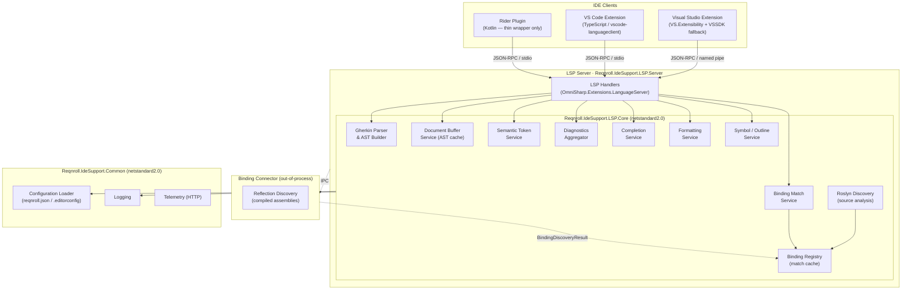

### Transport

| IDE | Transport |
|-----|-----------|
| VS Code | `stdio` |
| Visual Studio | Named pipe |
| Rider | `stdio` |

> **Open question (Q7)**: Is it worth the effort to standardize on a single transport across all clients? See [§10 Open Questions](#10-open-questions).

### Parsing, Discovery, and Matching Pipeline

Three distinct components form the core of the server's intelligence. Each has its own caching layer and independent update lifecycle:

**1 · Gherkin Parser & Document Buffer**

Feature files are parsed by the Gherkin parser on `textDocument/didOpen` and `textDocument/didChange`. The resulting AST is stored in the Document Buffer keyed by `(URI, version)`. All subsequent requests for a document (semantic tokens, outline, folding, etc.) retrieve the cached AST; they do not re-parse.

> **Note**: Although `textDocument/didChange` may carry only the incremental text delta, the Gherkin parser always re-parses the entire file. Because Gherkin AST nodes carry absolute location information, inserting or deleting a line shifts the location of every subsequent node; partial re-parse is not practical.

**2 · Binding Registry**

Binding information enters the registry from two sources:

- **Roslyn Discovery** (in-process, in LSP.Core): when a `.cs` file changes, Roslyn re-analyzes the changed file and replaces its bindings in the registry. No build is required; feedback is immediate.
- **Reflection Discovery** (out-of-process Connector): when a build is detected (see [Q9](#10-open-questions) for per-IDE detection reliability), the Connector scans the compiled assembly and replaces the full registry.

**3 · Binding Match Service**

When a feature file's AST changes, the Binding Match Service reconciles the affected region of the AST against the Binding Registry, caching match results keyed by `(featureURI, range)` and `(csURI, range)`. When the Binding Registry changes (from either source), the Binding Match Service invalidates and recomputes all cached feature-file mappings. Any change to the match cache triggers the Diagnostics Aggregator to recompute and push diagnostics for affected files.

---

## 4. Repository Structure

```
Reqnroll.IdeSupport/
├── src/
│   ├── Reqnroll.IdeSupport.Common/             # Shared infrastructure (netstandard2.0)
│   │   ├── Configuration/                      # reqnroll.json, .editorconfig loaders
│   │   ├── Logging/                            # Cross-platform logging abstractions
│   │   ├── ProjectSystem/                      # IDE-agnostic file/project abstractions
│   │   └── Telemetry/                          # HTTP-based telemetry (cross-platform)
│   │
│   ├── Reqnroll.IdeSupport.LSP.Core/           # Protocol-agnostic LSP logic (netstandard2.0)
│   │   ├── Parsing/                            # DeveroomGherkinParser, AST builder
│   │   ├── Discovery/                          # RoslynDiscovery, BindingRegistry
│   │   ├── Matching/                           # BindingMatchService, match cache
│   │   └── Editor/                             # SemanticTokenService, FormattingService, etc.
│   │
│   ├── Reqnroll.IdeSupport.LSP.Server/         # OmniSharp LSP host (net9+, exe)
│   │   ├── Handlers/
│   │   │   ├── Protocol/                       # OmniSharp handler classes (LSP messages)
│   │   │   └── Internal/                       # MediatR notification handlers (internal events)
│   │   ├── Workspace/                          # WorkspaceScopeManager, ProjectScope
│   │   └── Program.cs
│   │
│   ├── Reqnroll.IdeSupport.LSP.Connector.Models/  # DTOs for reflection discovery results
│   ├── Reqnroll.IdeSupport.LSP.Connector/         # Reflection-based binding discovery (exe)
│   │
│   └── clients/
│       ├── visualStudio
|       |   ├── Reqnroll.IdeSupport.VisualStudio.Extension/     # VSIX (net481)
│       │   |   ├── LanguageClient/                 # ReqnrollLanguageClient (VS.Extensibility)
│       │   |   ├── Inspection/                     # LspInterceptingPipe (debug tracing)
│       │   |   └── LSPServer/                      # Embedded server exe
│       |   ├── Reqnroll.IdeSupport.VisualStudio.VSSDKIntegration/  # VSSDK fallback helpers
│       |   └── Reqnroll.IdeSupport.VisualStudio.Wizards*/           # New Project/Item wizards
│       ├── vscode/                             # TypeScript VS Code extension
│       └── rider/                              # Kotlin Rider plugin (thin wrapper)
│
└── tests/
    ├── Reqnroll.IdeSupport.LSP.Core.Tests/         # Unit tests for LSP.Core services
    ├── Reqnroll.IdeSupport.LSP.Server.Tests/        # Unit tests for LSP handlers
    ├── Reqnroll.IdeSupport.LSP.Server.Specs/        # Integration specs (simulates IDE client)
    ├── Reqnroll.IdeSupport.VisualStudio.Tests/      # Unit tests for VS extension
    ├── Reqnroll.IdeSupport.VisualStudio.Specs/      # Integration specs for VS extension
    └── Reqnroll.IdeSupport.Specs/                   # End-to-end BDD specs (Reqnroll)
```

> **Convention**: projects named `*.Tests` are unit tests; projects named `*.Specs` are integration/BDD tests. Client-side unit and integration tests should be considered for each IDE client as the clients mature (see [Q8](#10-open-questions)).

### LSP Message Tracing

The Visual Studio extension (and available to other clients during development) includes an `LspInterceptingPipe` that intercepts all JSON-RPC messages at the client side and writes them to a temp file in a format compatible with the [lsp-inspector](https://github.com/microsoft/language-server-protocol-inspector) tool. This is disabled in release builds.

---

## 5. LSP Server

The server is a self-contained executable built on `OmniSharp.Extensions.LanguageServer`. It is embedded in each IDE extension package and launched as a child process on extension activation.

### Capability Registration

OmniSharp supports both static (declared in `initialize` response) and dynamic (via `client/registerCapability`) registration. Visual Studio has known issues with dynamic registration for some capabilities (see per-feature notes).

The server accepts a `--client <ide>` command-line flag at startup (e.g., `--client visualstudio`) so that it can choose static vs. dynamic registration for each capability based on the consuming client, without requiring any client-side override logic.

> **OmniSharp implementation note**: OmniSharp's handler base classes (e.g., `SemanticTokenHandlerBase`) use dynamic registration by default. For capabilities requiring static registration, we will either build alternate base classes or patch the underlying OmniSharp registration — this is a known implementation risk for Phase 1.

### Document Scope

The server registers interest in both `*.feature` files and `*.cs` files. It does not act as a general-purpose C# language server; its interest in `*.cs` files is limited to:

- Receiving `textDocument/didOpen` / `didChange` to trigger Roslyn-based binding re-discovery
- Providing `textDocument/references` (step usages, from a C# binding method)
- Providing `textDocument/codeLens` (usage counts on binding attributes)

> **As-built note**: `.cs` interest for binding re-discovery is implemented (see [F2 · Implementation status](#f2--binding-discovery)). A single OmniSharp text-document sync handler (`TextDocumentSyncHandler`) registers a document selector covering **both** `**/*.feature` and `**/*.cs` and routes by file extension, rather than a separate `CsSyncHandler` — this avoids OmniSharp's ambiguity when two `TextDocumentSyncHandlerBase` implementations claim overlapping documents. `.cs` files are deliberately **not** stored in the Gherkin document buffer.

### Workspace Model

Each opened workspace folder maps to an `LspWorkspaceScope` containing one or more `LspProjectScope` instances. Project detection reads `*.csproj` files to discover `reqnroll.json` configuration and output assembly paths for the Binding Connector.

**Multi-root configuration divergence**: In a workspace with multiple root folders (e.g., a monorepo with separate application and test projects), each root may carry a different `reqnroll.json`. The `LspWorkspaceScope` maintains a separate `LspProjectScope` — and thus a separate Binding Registry — per project. Feature files are resolved against the registry of the project that owns them. If a feature file's owning project cannot be determined unambiguously, the handling strategy is an open question — see [Q17](#10-open-questions). A naive fallback to a merged view of all registries is not realistic for production use.

**Gherkin dialect resolution**: Dialect is resolved at two levels:

1. **Per-project default**: read from `reqnroll.json` (`language` property; default `en`).
2. **Per-file override**: a `# language: <code>` comment on the first line of a `.feature` file overrides the project default for that file. This is standard Gherkin syntax and must take precedence.

The Document Buffer stores the effective dialect alongside each file's AST. The Semantic Token Service and Completion Service always use the per-file effective dialect.

### Debounce, Cancellation, and Request Priority

**Debounce policy**: `textDocument/didChange` events arrive on every keystroke. Rather than immediately triggering the full parse-and-match pipeline on each event, the server applies a configurable debounce window (default: **200 ms**) before publishing `FeatureFileChangedNotification`. This prevents the binding match pipeline from thrashing during rapid typing and avoids unnecessary `publishDiagnostics` pushes mid-word.

**Cancellation**: All protocol handlers that produce responses (semantic tokens, completions, definition) accept a `CancellationToken`. If a superseding request arrives before the previous one completes, the client may send `$/cancelRequest`; OmniSharp propagates this as a cancelled token. Handlers must not leave the Document Buffer or Binding Registry in an inconsistent state if cancelled mid-flight — the previous value must remain valid until the new value is atomically committed.

**Request priority**: Interactive responses take priority over background pushes.

| Priority | Request type | Reason |
|---|---|---|
| Highest | `textDocument/completion` | A delayed completion popup is immediately visible to the user |
| High | `textDocument/definition`, `textDocument/references` | Triggered by deliberate user action |
| Medium | `textDocument/semanticTokens/full` | Coloring lag is noticeable but tolerable for <200 ms |
| Low | `textDocument/publishDiagnostics` | Can be deferred until after interactive responses are served |

### Internal Event Architecture

Protocol handlers (in `Handlers/Protocol/`) are the OmniSharp-based classes that directly handle incoming LSP messages. Rather than orchestrating service calls inline, they publish typed **MediatR notifications** that trigger further processing asynchronously.

Internal handlers (in `Handlers/Internal/`) subscribe to these notifications and perform the actual work, each publishing further notifications in turn. This yields an event-driven pipeline with no single orchestrating manager:

The pipeline uses a **sync-first, async-rest** model. The Protocol Handler directly performs the first state-changing step (parsing and storing in the Document Buffer), because the tag tree is needed synchronously to respond to the current LSP request (e.g., `semanticTokens/full` must return the cached tags immediately). All downstream effects — diagnostics — are then dispatched asynchronously via MediatR:

```
LSP Client message
  → Protocol Handler (OmniSharp base class)
      → [sync] Parses document + matches steps, stores DeveroomTag[] + MatchSet in DocBuffer/BindingMatchService
      → publishes MatchCacheChangedNotification (async, via MediatR)
          → Internal Handler C (aggregates diagnostics)
              → pushes textDocument/publishDiagnostics
```

This means the Protocol Handler is responsible for the initial synchronous state write; MediatR orchestrates the background fan-out only.

> **As-built note**: parsing and binding matching are **not separate pipeline stages**. `DeveroomTagParser` performs both in a single AST walk (see [F1 · as-built note](#f1--gherkin-syntax-highlighting)), so the `ASTChangedNotification` → `BindingMatchInternalHandler` stage shown in the design-level description is collapsed into the sync handler itself. The `MatchCacheChangedNotification` is what actually fans out to diagnostics.
**`textDocument/codeAction` scope**: `FeatureCodeActionHandler` handles code actions on `.feature` files. Planned actions: "Define missing steps" (F6) and any future quick-fixes on Gherkin diagnostics. Code actions on `.cs` files (e.g., "Generate step definition from binding template") are feasible but deferred; they would be handled by a dedicated `.cs` code action handler. IDEs universally merge code actions from multiple registered language servers for the same file type — the Reqnroll server's actions will appear alongside those from the native C# server in the lightbulb menu without conflict.

**Key protocol handler classes** (one per LSP capability group):

> **As-built note**: the class names below are the design's idealized handler-per-capability names; several are currently implemented under consolidated names (e.g. the two sync rows below are both served by a single `TextDocumentSyncHandler`; semantic tokens by `SemanticTokensHandler`).

| Class | LSP messages handled |
|-------|---------------------|
| `FeatureSyncHandler` *(as-built: `TextDocumentSyncHandler`)* | `textDocument/didOpen`, `didChange`, `didClose` (`.feature`) |
| `CsSyncHandler` *(as-built: same `TextDocumentSyncHandler`, routed by `.cs` extension)* | `textDocument/didOpen`, `didChange` (`.cs`) |
| `WorkspaceFilesHandler` | `workspace/didChangeWatchedFiles` |
| `FeatureSemanticTokensHandler` | `textDocument/semanticTokens/full`, `/delta` |
| `FeatureDefinitionHandler` | `textDocument/definition` (from `.feature` cursors) |
| `FeatureCodeActionHandler` | `textDocument/codeAction` |
| `GherkinCompletionHandler` | `textDocument/completion`, `completionItem/resolve` |
| `FeatureDocumentSymbolHandler` | `textDocument/documentSymbol` |
| `FeatureFoldingRangeHandler` | `textDocument/foldingRange` |
| `GherkinFormattingHandler` | `textDocument/formatting`, `rangeFormatting`, `onTypeFormatting` |
| `ReqnrollCommandHandler` | `workspace/executeCommand` |
| `StepReferencesHandler` | `textDocument/references` (from `.cs` cursors) |
| `StepRenameHandler` | `textDocument/prepareRename`, `textDocument/rename` |
| `StepCodeLensHandler` | `textDocument/codeLens`, `codeLens/resolve` |

**Key internal MediatR notifications** and the handlers that consume them:

| Notification | Produced by | Consumed by |
|-------------|-------------|-------------|
| `FeatureFileChangedNotification` | `FeatureSyncHandler` | `GherkinParseInternalHandler` |
| `ASTChangedNotification` | `GherkinParseInternalHandler` | `BindingMatchInternalHandler` |
| `CsFileChangedNotification` | `CsSyncHandler` | `RoslynDiscoveryInternalHandler` |
| `BindingRegistryChangedNotification` | `RoslynDiscoveryInternalHandler`, `ReflectionDiscoveryInternalHandler` | `BindingMatchInternalHandler` |
| `MatchCacheChangedNotification` | `BindingMatchInternalHandler` | `DiagnosticsInternalHandler` |

> **As-built note (feature file parse + match path)**: the `FeatureFileChangedNotification` → `GherkinParseInternalHandler` → `ASTChangedNotification` → `BindingMatchInternalHandler` stages are collapsed in the implementation. The sync handler calls `GherkinDocumentTaggerService`, which invokes `DeveroomTagParser` to produce a `DeveroomTag[]` covering both structural classifications and step match results in one pass, then derives and stores a `FeatureBindingMatchSet`. The sync handler then publishes `MatchCacheChangedNotification` directly — skipping the intermediate `ASTChangedNotification` entirely. See [F1 · as-built note](#f1--gherkin-syntax-highlighting) for the full rationale.

> **As-built note (C# / Roslyn path)**: the implemented flow does not use a dedicated `CsFileChangedNotification` / `RoslynDiscoveryInternalHandler`. Instead, on a `.cs` `didOpen`/`didChange` the sync handler calls `ICSharpBindingDiscoveryService` directly; that service patches the owning project's `ConnectorBindingRegistryProvider` (which raises its `BindingRegistryChanged` event), and `BindingRegistryProviderRouter` publishes the existing `BindingRegistryChangedNotification`. From there the established re-match path runs (`BindingRegistryChangedHandler` → re-parse open feature files → `MatchCacheChangedNotification` → semantic-token refresh). The reflection (post-build) discovery raises the same `BindingRegistryChangedNotification`, so both discovery sources converge on one re-match path.

---

## 6. IDE Clients

### 6.1 VS Code

A TypeScript extension using `vscode-languageclient`. This is the thinnest of the three clients: nearly all Gherkin intelligence lives in the LSP server. The one exception is **table cell decoration**, which requires VS Code's editor decoration API because the LSP semantic token protocol cannot express the per-cell/per-pipe granularity needed (see [Table Decoration Service](#table-decoration-service) below).

#### Extension manifest (`package.json`)

| Property | Value | Notes |
|----------|-------|-------|
| Activation events | `onLanguage:gherkin`, `onLanguage:csharp` | Server starts when either file type is opened |
| Language registration | ID: `gherkin`, extensions: `.feature` | Associates file extension with language server |
| Default formatter | Reqnroll extension | Declared so VS Code routes Format Document to our server |
| `editor.formatOnType` | `true` (for `gherkin`) | Enables F12 table auto-formatting as user types |
| Main dependency | `vscode-languageclient` v9+ | Standard VS Code LSP client library |

#### Source components

| File | Purpose |
|------|---------|
| `extension.ts` | Entry point: `activate()` creates the output channel, instantiates `TableHighlightService`, resolves server path, configures `ServerOptions` (stdio) and `ClientOptions`, starts the `LanguageClient`; `deactivate()` stops it |
| `tableHighlightService.ts` | Client-side decoration service for Gherkin table cells (see below) |
| `package.json` (`semanticTokenScopes` / `configurationDefaults`) | Maps the custom `reqnroll.*` semantic token types from the server legend to TextMate scopes and default colors — see [F1 · Client-side token-type mapping](#f1--gherkin-syntax-highlighting) |

#### Table decoration service

The `TableHighlightService` applies three VS Code `TextEditorDecorationType` styles directly in the editor, beyond what semantic tokens express:

| Decoration | Colour | Applied to |
|------------|--------|-----------|
| `headerDecoration` | Purple `#8A2DA5`, bold | First row of each table (header row) |
| `cellDecoration` | Reddish `#C74A2F` | Data cell content in subsequent rows |
| `pipeDecoration` | Blue `#2F45FF` | `\|` pipe delimiter characters |

The service listens to `onDidChangeActiveTextEditor`, `onDidChangeVisibleTextEditors`, `onDidChangeTextDocument`, and `onDidOpenTextDocument`, re-applying decorations on each event. It implements `vscode.Disposable` for cleanup on extension deactivation.

#### Document selector

The LSP client registers interest in two document types:

```typescript
[
  { scheme: 'file', language: 'gherkin' },          // .feature files
  { scheme: 'file', language: 'csharp' }            // all .cs files
]
```

> **Note**: The Thomas Heijtink PoC restricts the C# selector to `pattern: '**/Steps/*.cs'`. For production use, the selector should cover all `.cs` files so that step definitions in any project subfolder are discovered by the Roslyn binding discovery pipeline.

#### Server path resolution

| Priority | Strategy |
|----------|----------|
| 1 | Packaged path: `{extensionDir}/server/Reqnroll.IdeSupport.LSP.Server` (production) |
| 2 | Development fallback: relative path from extension source root to build output |

The server is launched with `--client vscode` and communicates over stdio.

#### TextMate grammar (fallback coloring)

A minimal TextMate grammar (`.tmLanguage.json`) provides basic keyword coloring during the interval between extension activation and the LSP server's first `textDocument/semanticTokens/full` response. Once semantic tokens are active, the grammar has no visible effect. This grammar is not present in the PoC and should be added for the production extension.

#### Packaging and distribution

- Built with `vsce` (VS Code Extension CLI) and published to the **VS Code Marketplace** as a `.vsix`
- The LSP server executable is bundled inside the extension package under `server/`
- Minimum VS Code version: 1.90.0 (for `vscode-languageclient` v9 compatibility)

### 6.2 Visual Studio

A hybrid extension using **VS.Extensibility** as the primary API, with **VSSDK** as a fallback for capabilities not yet exposed by VS.Extensibility.

| Component | API Used | Reason |
|-----------|----------|--------|
| LSP client (`ReqnrollLanguageClient`) | VS.Extensibility | First-class LSP support |
| Code Lens | VSSDK | Not yet available in VS.Extensibility |
| New Project / Item Wizards | VSSDK | Wizard interfaces not in VS.Extensibility |

The embedded `LSPServer.exe` is published to the VSIX under the `LSPServer/` subfolder and launched on extension activation with `--client visualstudio`.

**Named pipe uniqueness**: If the user has multiple Visual Studio instances open simultaneously (e.g., two different solutions), each instance launches its own `Reqnroll.IdeSupport.LSP.Server` process. Named pipe identifiers must be unique per workspace to prevent the second instance from accidentally connecting to the first instance's server. The pipe name should include a workspace-unique component — for example, a hash of the solution file path — appended at server launch time.

### 6.3 Rider

The Rider plugin is a **hybrid Kotlin/JVM + .NET** project built with a Gradle + MSBuild pipeline. The Kotlin layer handles the Rider frontend (LSP lifecycle, file type registration, and the Go to Definition PSI bridge); the .NET layer provides a ReSharper zone definition required by Rider's dependency injection system.

Rider's built-in LSP client (available since Rider 2023.3) handles most capabilities generically. However, the **Go to Definition PSI bridge is definitively required** — Rider's native LSP client cannot navigate from a `.feature` file step into a `.cs` file without custom Kotlin code. This was confirmed by the Thomas Heijtink PoC. See [Q1 — resolved](#10-open-questions).

#### Plugin manifest (`plugin.xml`)

Three IntelliJ Platform extension points are registered:

| Extension point | Implementation class | Purpose |
|----------------|---------------------|---------|
| `platform.lsp.serverSupportProvider` | `ReqnrollLspServerSupportProvider` | LSP server lifecycle management |
| `psi.implicitReferenceProvider` | `ReqnrollFeatureDefinitionReferenceProvider` | Go to Definition PSI bridge (F5, F17) |
| `fileType` | `ReqnrollFeatureFileType` | Registers `.feature` file type and language |

**Plugin dependencies declared:** `com.intellij.modules.lsp` (Rider's built-in LSP client) and `com.intellij.modules.platform`.

#### Kotlin source components

| Class | Purpose |
|-------|---------|
| `ReqnrollFeatureLanguage` | Singleton `Language` with ID `"ReqnrollFeature"` — the language anchor for all PSI and file type registrations |
| `ReqnrollFeatureFileType` | Singleton `LanguageFileType`; name: "Reqnroll Feature", extension: `.feature`, icon: generic text file |
| `ReqnrollLspServerSupportProvider` | Implements `LspServerSupportProvider`; called by Rider on file open; calls `serverStarter.ensureServerStarted()` for `.feature` and `.cs` files |
| `ReqnrollProjectWideLspServerDescriptor` | Configures the LSP server process: executable path, `--stdio` flag, UTF-8 charset, language ID mapping; sets `lspGoToDefinitionSupport = true` |
| `ReqnrollServerPathResolver` | Resolves server executable path using three strategies (see below) |
| `ReqnrollFeatureDefinitionReferenceProvider` | PSI bridge for Go to Definition (see below) |
| `ReqnrollLspLogger` | Debug logging to `{temp-dir}/gherkin-lsp.log` with timestamp prefix |
| `ReqnrollSemanticTokensColorSettings` | Registers a custom `TextAttributesKey` per `reqnroll.*` legend name (default colors mirroring `DeveroomClassifications`) and maps each via the LSP descriptor's `LspSemanticTokensSupport` — see [F1 · Client-side token-type mapping](#f1--gherkin-syntax-highlighting) |

#### Server path resolution

`ReqnrollServerPathResolver` tries three locations in priority order:

| Priority | Strategy | Path |
|----------|----------|------|
| 1 | Environment variable | `REQNROLL_GHERKIN_SERVER_PATH` env var (development override) |
| 2 | Packaged (production) | `{pluginRoot}/server/Reqnroll.IdeSupport.LSP.Server.exe` |
| 3 | Development fallback | Relative path from source root to build output |

The server is launched with `--stdio` transport and `--client rider`.

#### Go to Definition PSI bridge

Rider's built-in LSP client receives `textDocument/definition` responses but cannot use them to navigate into `.cs` files, which Rider manages via its own C# language model (ReSharper). The `ReqnrollFeatureDefinitionReferenceProvider` bridges this gap:

1. Registered as a `psi.implicitReferenceProvider` — Rider calls it when processing a definition request on any PSI element
2. Validates the element is in a `.feature` file and within document bounds
3. Queries `LspServerManager` to find the running Reqnroll LSP server instance
4. Sends `textDocument/definition` directly to the LSP server
5. Converts the `Location[]` / `LocationLink[]` response to Rider `NavigatableSymbol` objects wrapping `VirtualFile` + range
6. Returns these symbols to Rider, which uses them for its native navigation UI (jump-to-file, breadcrumbs, etc.)

This bridge is required for both **F5 (Go to Step Definition)** and **F17 (Hook Navigation)**.

#### Language ID mapping

`ReqnrollProjectWideLspServerDescriptor` routes files to the correct LSP language ID:

| File type | Language ID sent to server |
|-----------|--------------------------|
| `.feature` | `reqnroll.feature` |
| `.cs` | `csharp` |

#### .NET/ReSharper component

A thin .NET assembly (`Reqnroll.Plugin.Rider.dll`, targeting `net472`) provides a ReSharper **zone definition**:

```csharp
[ZoneDefinition]
public interface IReqnrollPluginRiderZone : IZone { }
```

This participates in Rider's component dependency injection system, enabling future ReSharper-aware components (inspections, quick-fixes inside `.cs` files) to be registered against the Reqnroll zone.

#### Build system

The plugin uses a Gradle + MSBuild hybrid:

| Gradle task | Tool | What it does |
|------------|------|-------------|
| `compileDotNet` | MSBuild (via vswhere / `dotnet msbuild`) | Compiles the .NET ReSharper assembly |
| `prepareSandbox` | Gradle | Copies .NET DLLs and LSP server exe into the IDE sandbox |
| `buildPlugin` | Gradle | Packages everything into a JetBrains Marketplace `.zip` |
| `publishPlugin` | Gradle | Pushes to `plugins.jetbrains.com` via Marketplace API |

The sandbox preparation step copies:
- `Reqnroll.Plugin.Rider.dll` / `.pdb` → plugin `dotFiles/` subfolder (consumed by Rider's ReSharper loader)
- LSP server executable directory → plugin `server/` subfolder

#### Packaging and distribution

- Published to the **JetBrains Marketplace** as a `.zip` plugin package
- Minimum Rider version: **2023.3** (first version with `com.intellij.modules.lsp`)
- Plugin descriptor declares `requiresRestart: true`
- SDK version must stay in sync between `gradle.properties` (`ProductVersion`) and `Plugin.props` (`SdkVersion`)

---

## 7. Binding Connector

The Binding Connector is an out-of-process executable responsible for **reflection-based** binding discovery — scanning compiled Reqnroll assemblies for step definition attributes and hook bindings. The LSP server launches the Connector when it detects that a project's output assembly has changed (via `workspace/didChangeWatchedFiles` on the output path), and communicates with it over IPC.

Roslyn-based (source-level) discovery runs **in-process** within the LSP server as part of `Reqnroll.IdeSupport.LSP.Core`. See the [Parsing, Discovery, and Matching Pipeline](#parsing-discovery-and-matching-pipeline) in §3.

```
In-process (LSP.Core)                Out-of-process
─────────────────────────            ─────────────────────────────
  Roslyn Discovery                     Binding Connector
  (source analysis)                    (Reflection Discovery)
  • No build required                  • Accurate after build
  • Immediate on .cs save              • Handles generated code /
  • Per-file granularity                 runtime-registered bindings
        │                                        │
        └──────────────────┬────────────────────┘
                           ▼
                   Binding Registry
                   (merge strategy)
```

**Merge strategy**: When a `.cs` source file changes, Roslyn-derived bindings for that file replace previous entries for that file. When the Connector returns results after a build, its output replaces the entire registry. This ensures the editor always reflects the latest source edits without waiting for a build, while also capturing anything only visible after compilation.

> **Scope note**: The internal design of the Connector (assembly loading strategy, NuGet cache resolution) is a separate design concern. This document treats it as a component that accepts a project output path and returns a `BindingDiscoveryResult` over IPC.

> **Open question (Q15)**: The IPC mechanism between the LSP server and the Binding Connector has not been finalized. Three candidates are: (a) **stdin/stdout** — server launches Connector as a child process and communicates over its standard streams (simplest, no port conflict); (b) **local named pipe** — supports long-running Connector process that can be reused across builds; (c) **localhost TCP with a randomized port** — most flexible but adds port-management complexity. The choice also affects the security model (see §9 Security) and the Connector process lifecycle answer (Q4). See [§10 Open Questions](#10-open-questions).

---

## 8. Phased Roadmap

| Phase | Features | Verification Goal |
|-------|----------|------------------|
| **1 · Basic Syntax Coloring** | F1 (Semantic Tokens) | Architecture validated: LSP server startup, client wiring (all 3 IDEs), `--client` flag, static vs. dynamic registration, CI pipeline |
| **2 · Minimum Viable** | F2 (Binding Discovery), F3+F4 (Diagnostics), F5 (Go to Definition), F6 (Define Steps), F19 (Wizards) | Core value loop: developer can write feature files, get feedback on unmatched steps, navigate to or create bindings; VS wizard enables quick project setup |
| **3 · Editor Quality** | F7 (Keyword Completion), F9 (Outline), F10 (Folding), F11 (Formatting), F12 (Table Format), F13 (Comment/Uncomment), F17 (Hook Navigation), F20 (Install/Upgrade UX) | Extension is a credible replacement for daily use |
| **4 · Advanced Navigation** | F8 (Step Completion), F14 (Find Usages), F15 (Find Unused), F16 (Rename), F18 (Code Lens) | Feature parity with existing VS extension; Preview designation can be lifted |

---

## 9. Cross-Cutting Concerns

### Performance Requirements

The following latency targets apply at **P95** (the 95th-percentile: 95% of requests complete within the stated time; the slowest 5% may exceed it) under typical workspace conditions (≤500 `.feature` files, ≤2,000 step binding patterns):

| Operation | Target |
|---|---|
| `textDocument/semanticTokens/full` | < 100 ms from last `didChange` event |
| `textDocument/completion` — keyword (F7) | < 50 ms |
| `textDocument/completion` — step (F8) | < 150 ms |
| `textDocument/definition` — cache hit (F5) | < 100 ms |
| `textDocument/publishDiagnostics` push | < 500 ms from end of debounce window |
| Roslyn binding re-discovery — single `.cs` file | < 2 s |
| Reflection binding discovery — post-build | < 10 s |
| Initial workspace scan — cold start | < 30 s |

> **Note**: These are design targets, not contractual SLAs. Benchmarks should be established in Phase 1 (against the F1 integration spec) and revisited as the feature set grows.

### Performance Verification

The latency targets above are only meaningful if there is a defined mechanism to confirm them. Two distinct shapes of target need different verification:

- **Interactive round-trips** (`semanticTokens/full`, `completion`, `definition`, `publishDiagnostics`) are phrased *"from last `didChange` event"* — i.e. measured **end-to-end at the protocol boundary**, including JSON-RPC serialization, transport, and the MediatR fan-out. Timing a service method in isolation undercounts them.
- **Batch / throughput operations** (Roslyn re-discovery, reflection discovery, cold-start scan) are coarse enough to confirm with wall-clock timing.

A second axis is *where* assertions run. The targets are **absolute** numbers on representative hardware, but shared CI runners are too noisy to assert absolute thresholds reliably — CI is suited to **relative regression** detection, not absolute pass/fail.

Several verification options were considered, organized as layers:

| Layer | Approach | Confirms | Decision |
|---|---|---|---|
| 1 | **Service-level micro-benchmarks** (BenchmarkDotNet over `LSP.Core` services: parser, matcher, completion) | Algorithmic/compute cost; regression detection | Considered; not adopted initially (compute cost is captured indirectly by Layer 2; revisit if a hot path needs isolation) |
| 2 | **End-to-end protocol benchmarks** — a real server driven by a simulated LSP client over its actual transport, against a pinned representative corpus, reporting per-operation percentiles | The interactive P95 targets *and* the batch targets (cold start, discovery) as phrased | **Will implement** |
| 3 | **CI regression tracking** — run a benchmark suite per-PR on a fixed runner, gate on regression % vs. a stored baseline | Prevents gradual perf creep | Considered; deferred (depends on Layer 2 harness existing first) |
| 4 | **Field instrumentation** — protocol handlers record their own durations and emit them via the existing logging path (and optionally as a telemetry metric), yielding real-world P95 from actual user workspaces | Real-world performance on real hardware/workspaces, where the "typical hardware" assumption is actually exercised | **Will implement** |

**Adopted approach: Layers 2 and 4.** Layer 2 provides reproducible confirmation of the design targets against a controlled workload; Layer 4 validates that those targets hold in the field, where synthetic corpora cannot. Layer 2 absolute thresholds are asserted on a designated reference machine (not shared CI runners). Layers 1 and 3 remain available to adopt later — Layer 3 in particular becomes cheap once the Layer 2 harness exists.

Layer 2 requires two artifacts that do not yet exist — a benchmarking harness and a pinned representative corpus matching the §9 "typical workspace conditions" (≤500 `.feature` files, ≤2,000 binding patterns). Building these is tracked as non-feature engineering work — see [§13 Non-Feature Engineering Tasks](#13-non-feature-engineering-tasks) (T1, T2).

### Telemetry

Telemetry uses HTTP (matching the Reqnroll runtime approach) rather than the Application Insights SDK. The LSP specification also defines a `telemetry/event` notification (server → client) that allows the server to ask the IDE client to relay telemetry on its behalf. This introduces a third architecture option alongside direct HTTP from the server and direct HTTP from each IDE client. The choice between these approaches is an open question — see [Q11](#10-open-questions).

The following monitoring events from the existing `Reqnroll.VisualStudio` extension should be carried forward:

| Event | Trigger |
|-------|---------|
| `ExtensionInstalled` | First activation after installation |
| `ExtensionUpgraded` | First activation after version change |
| `ExtensionDaysOfUsage` | Daily active use heartbeat |
| `OpenProject` | Workspace project loaded (includes feature file count) |
| `OpenFeatureFile` | `.feature` file opened |
| `ReqnrollDiscovery` | Binding discovery completed (success/failure, step count) |
| `CommandGoToStepDefinition` | F5 invoked |
| `CommandGoToHook` | F17 invoked |
| `CommandDefineSteps` | F6 invoked (includes action taken, snippet count) |
| `CommandFindStepDefinitionUsages` | F14 invoked (usage count, cancelled?) |
| `CommandFindUnusedStepDefinitions` | F15 invoked (unused count, files scanned) |
| `CommandRenameStep` | F16 invoked |
| `CommandAutoFormatDocument` | F11 invoked |
| `CommandAutoFormatTable` | F12 invoked |
| `CommandCommentUncomment` | F13 invoked |
| `CommandAddFeatureFile` | New `.feature` item added |
| `ProjectTemplateWizardCompleted` | F19 wizard completed (framework selected) |
| `Error` | Unhandled exception (fatal / non-fatal) |
| `ParserParse` | Feature file parsed (duration, file size, dialect) — carry-forward from existing extension; confirm whether retained |
| `NotificationShown` | User-facing notification displayed (notification ID) |
| `NotificationDismissed` | User-facing notification dismissed |
| `LinkClicked` | External link opened from extension UI |

**Required data model enhancements** over the existing VS extension:

| Field | Rationale |
|-------|-----------|
| `IDEClient` (`visualstudio` / `vscode` / `rider`) | Derived from `--client` flag; enables per-IDE breakdown of all events |
| `DiscoveryType` (`roslyn` / `reflection`) | Added to `ReqnrollDiscovery` event; helps understand cache hit rates and build dependency |
| `ExtensionInstalled` / `ExtensionUpgraded` origin | These events fire before the LSP server starts; must be sent by the IDE client, not the server — reinforces the open question on telemetry origin (Q11) |

### Configuration

- `reqnroll.json` — test framework, binding discovery settings, Gherkin language/dialect
- `.editorconfig` — indentation, line endings (for formatting); Reqnroll reads `indent_size`, `indent_style`, and `end_of_line` for `.feature` files
- IDE workspace settings — server path overrides (for development/debugging); the `REQNROLL_GHERKIN_SERVER_PATH` environment variable (Rider) and equivalent settings in VS and VS Code serve the same purpose

### Testing Strategy

The test project naming convention is defined in §4. The following describes the testing philosophy and coverage expectations for each tier.

**Unit tests (`*.Tests`)**: Each service in `LSP.Core` is tested in isolation using mock implementations of its dependencies. The Gherkin parser, Semantic Token Service, Formatting Service, and Completion Service are the priority targets. Unit tests must not require a running LSP server or IDE instance.

**Server integration specs (`*.LSP.Server.Specs`)**: A simulated LSP client connects to a real server instance over stdio. Test scenarios are authored as Reqnroll `.feature` files — this is the "eating your own dog food" tier where the project's own specification format drives its own test suite. These specs exercise the full protocol pipeline and are the primary verification gate for each phase.

**VS integration specs (`*.VisualStudio.Specs`)**: Use the VS.Extensibility test host to drive the VS extension in-process. Coverage for VS-specific code paths: named pipe transport, static registration, VSSDK Code Lens bridge, and wizard flows.

**End-to-end specs (`*.Specs`)**: Full round-trip tests against real IDE instances (VS, VS Code, Rider) using automation frameworks. Optional in early phases; mandatory before lifting the Preview designation.

**Per-phase coverage gates** (informing §8 Phased Roadmap):

| Phase | Minimum gate |
|---|---|
| 1 | Server unit tests passing; F1 protocol integration spec green on all 3 IDEs in CI |
| 2 | All Phase 2 features covered by `LSP.Server.Specs`; Connector integration test |
| 3 | All Phase 3 features covered; VS integration specs for VSSDK paths |
| 4 | E2E suite passing; all open questions with "Needs testing" status resolved |

**Client-side testing**: VS Code extensions can be tested with `@vscode/test-electron`; Rider plugins with the IntelliJ Platform test framework. Defining and resourcing client-side integration tests is deferred until the respective clients reach Phase 3 maturity.

### Security

**Code signing**
- The Visual Studio VSIX must be code-signed before publishing to the Visual Studio Marketplace. Signing is performed in CI using a certificate stored as a GitHub Actions secret.
- The VS Code `.vsix` is published via `vsce` with a verified publisher account; the VS Code Marketplace verifies publisher identity independently.
- The Rider plugin `.zip` is published via the JetBrains Marketplace API using an authenticated token stored as a CI secret.
- The bundled LSP server executable inherits signing from its containing package.

**IPC channel security**: The mechanism connecting the LSP server to the Binding Connector is an open question (see [Q15](#10-open-questions)). Whichever mechanism is chosen, the channel must be restricted to the local machine and accessible only to the process that launched the Connector. Unauthenticated remote access must not be possible.

**Telemetry and privacy**
- The `OpenProject` event must not transmit absolute file paths, project names, or any content that identifies the user's codebase. Only aggregate counts (feature file count, step definition count) are transmitted.
- The `Error` event must scrub exception messages for file paths and user-identifiable strings before transmission.
- Telemetry is opt-out, consistent with the existing `Reqnroll.VisualStudio` extension behavior. The opt-out preference is respected uniformly across all three IDE clients.
- A public telemetry data inventory (listing every event and its fields) should be published at project launch.

### CI/CD Pipeline

The project uses **GitHub Actions** as its CI platform, consistent with other Reqnroll repositories.

| Workflow | Trigger | What it does |
|---|---|---|
| `ci.yml` | Push / PR to `main` | Build server + all clients, run unit tests, run integration specs |
| `package.yml` | Tag `v*` | Build and package `.vsix` (VS), `.vsix` (VS Code), `.zip` (Rider) |
| `publish-vscode.yml` | Manual dispatch / tag | Publish to VS Code Marketplace via `vsce` |
| `publish-rider.yml` | Manual dispatch / tag | Publish to JetBrains Marketplace via Gradle `publishPlugin` |
| `publish-vs.yml` | Manual dispatch / tag | Publish to Visual Studio Marketplace |

**Build matrix**: The LSP server is built as a self-contained executable for `win-x64`, `linux-x64`, and `osx-arm64` in the `package` workflow. Each IDE extension bundles the platform-appropriate server binary. Testing the server in isolation on Linux in CI is a concrete benefit of the LSP separation from IDE-specific code.

**Phase verification gates**: Each phase milestone is tagged in git. The `package` workflow is not run for intermediate commits; it runs only on milestone tags, producing a set of co-versioned extension packages ready for internal testing before marketplace publication.

### Versioning and Compatibility

**Version numbering**: The LSP server and all three IDE client extensions share a single version number and are released together. This avoids client/server version skew — each IDE extension bundles only the server version it was tested against.

**LSP protocol capability negotiation**: The server declares its capabilities in the `initialize` response. If a client does not advertise support for a capability (e.g., an older IDE version that does not support `textDocument/semanticTokens`), the server must not send that capability's messages for that client session. OmniSharp's capability negotiation handles standard capabilities automatically.

**.NET version**: The server targets `net9` for Phase 1. The project will upgrade to the current .NET LTS version on a cadence aligned with Reqnroll's runtime library. IDE clients are unaffected — they launch the server binary and do not reference it as a library.

**`reqnroll.json` schema**: Breaking schema changes require a migration guide. The Configuration Loader must handle both old and new schemas gracefully during a transition period of at least one major version.

**Preview period**: No breaking-change-free API guarantee is made between Preview releases (pre-Phase 4). The Preview designation signals that the extension is suitable for daily use but that disruptive changes may occur. The designation is lifted when Phase 4 parity is achieved and the E2E test suite passes.

### LSP Message Tracing

An `LspInterceptingPipe` intercepts all JSON-RPC messages at the client side and writes them to a temp file compatible with the [lsp-inspector](https://github.com/lampeplf/lsp-viewer) tool. Available in all IDE clients during development; disabled in release builds.

### Error Handling and Resilience

**Server crash recovery**: The IDE extension detects LSP server process termination and attempts a restart. The VS.Extensibility `LanguageClient` and VS Code `LanguageClient` have built-in restart policies. A maximum of **3 restart attempts** per IDE session is recommended; after exhaustion, the extension surfaces a `window/showMessage` notification prompting the user to reload the workspace.

**Connector failure modes**: If the Binding Connector process fails (e.g., output assembly locked by the test runner, corrupt binary), the server:
1. Logs the error via `window/logMessage`
2. Retains the most recent valid registry state (Roslyn-derived bindings remain)
3. Surfaces a warning notification via `window/showMessage`
4. Does **not** clear the Binding Registry — the extension operates in degraded-but-functional mode until the next successful Connector run

**AST parse failure**: If the Gherkin parser throws on a document, the handler catches the exception, stores an empty AST with a single parse-error diagnostic covering the file, and returns an empty token list. The Document Buffer is never left in a partially-updated state.

**Cancellation safety**: All internal handlers that write to the Document Buffer or Binding Registry use an atomic store model — the new value is written in full or not at all. Partial writes that could leave inconsistent state are not permitted regardless of cancellation timing.

### End-User Troubleshooting and Logging

**Logging architecture**: The LSP server uses the standard .NET `ILogger` abstraction (registered in `Reqnroll.IdeSupport.Common`). At runtime, log entries flow from `ILogger` → `window/logMessage` notifications → each IDE client's `LanguageClient`, which routes them to the output channel. This design keeps logging infrastructure in one place (the server) and requires no logging code in the IDE client extensions. Whether to also support a file-sink option (writing to a local log file) for users without IDE access to the output channel is an open question — see [Q18](#10-open-questions).

Each IDE client exposes a dedicated output surface for runtime diagnostics:
| IDE | Surface | Channel name |
|---|---|---|
| VS Code | Output panel | `Reqnroll` |
| Visual Studio | Output Window pane | `Reqnroll` |
| Rider | Event Log / Services tool window | `Reqnroll` |

**Default log levels**: Release builds log `Warning` and above. Development builds log `Debug` and above (configurable via workspace settings or the server path override mechanism).

**`window/logMessage`**: The LSP server emits log messages for significant lifecycle events (server started, workspace loaded, discovery completed, errors). These are routed to the IDE output channel by each client's `LanguageClient` implementation.

**`window/showMessage`**: Used for user-facing alerts requiring immediate attention (e.g., server restart exhausted, Connector crash, missing .NET runtime). These appear as notification banners in each IDE.

**Issue reporting**: Users reporting bugs are directed to the GitHub issue tracker. The issue template requests attaching the Reqnroll output channel content. The `LspInterceptingPipe` trace file (see §4) can be enabled via a workspace setting for advanced diagnostic captures.

### Server Lifecycle

- The LSP server process is launched by the IDE extension on first `.feature` file open
- It is terminated when the IDE workspace is closed
- A single server instance serves all open workspace folders (multi-root support)
- If the server process terminates unexpectedly, the client restarts it up to 3 times per session before surfacing an error to the user (see Error Handling and Resilience above)

### Release Strategy and Migration Plan

**Release naming**: Extensions follow the naming convention **"Reqnroll Extension for {IDE} (Preview)"**:
- Visual Studio Marketplace: **Reqnroll Extension for Visual Studio (Preview)**
- VS Code Marketplace: **Reqnroll Extension for VS Code (Preview)**
- JetBrains Marketplace: **Reqnroll Extension for Rider (Preview)**

Each uses a distinct marketplace identifier, coexisting with the existing `Reqnroll.VisualStudio` extension during transition. Users install both independently; there is no automatic migration.

**Coexistence**: The existing `Reqnroll.VisualStudio` extension continues unchanged throughout the Preview period. Both extensions can be installed simultaneously in Visual Studio without conflict (they use different GUIDs and do not share any in-process components).

**Transition trigger**: The Preview designation is lifted and the new extension is promoted as the recommended extension when:
- Phase 4 parity is achieved (all F1–F20 features passing)
- The E2E test suite passes against the supported IDE versions
- The new extension has been in Preview use by the core team for at least one release cycle

**Deprecation of the existing extension**: After promotion, `Reqnroll.VisualStudio` is marked deprecated in the Visual Studio Marketplace. A marketplace description update and a welcome notification in the existing extension direct users to install the new one. The existing extension continues to receive critical bug fixes for one additional release cycle, then enters maintenance-only mode.

**Settings compatibility**: Existing `reqnroll.json` files require no changes — the new extension reads the same configuration schema. Any workspace settings specific to the old extension (e.g., paths, feature flags) are not migrated automatically; users reconfigure via IDE workspace settings for the new extension.

**VS Code and Rider**: These IDEs have no prior Reqnroll extension to deprecate. The new extension is published as the initial Reqnroll extension for those IDEs from Phase 1 onward, under the Preview label.

---

## 10. Open Questions

| # | Question | Owner | Status |
|---|----------|-------|--------|
| Q1 | Does Rider's LSP client handle cross-language `textDocument/definition` into `.cs` files without a PSI bridge? (F5, F17) | — | **Resolved**: PSI bridge required. Confirmed by LSP.Plugin PoC (`ReqnrollFeatureDefinitionReferenceProvider`). See §6.3. |
| Q2 | Does Rider's formatter override `textDocument/formatting`? (F11, F12) | TBD | Needs testing |
| Q3 | What is the minimum supported Rider version for the built-in LSP client? | TBD | Research needed |
| Q4 | Should the Binding Connector be a separate long-running process per workspace, or launched per-request? | TBD | Open |
| Q5 | Per-file Gherkin language overrides via `# language: <code>` first-line header are now handled by the Document Buffer (see §5 Workspace Model). Should we also support a **per-directory** dialect override (e.g., a `reqnroll.json` subdirectory entry), or is per-file + per-project sufficient? | TBD | Open |
| Q6 | Is VS.Extensibility Code Lens support planned for a future VS version, which would remove the VSSDK dependency for F18? | TBD | Monitor VS roadmap |
| Q7 | Is it worth standardizing on a single LSP transport (e.g., stdio) across all three IDE clients, rather than using named pipe for Visual Studio? | TBD | Open |
| Q8 | Should the `Reqnroll.IdeSupport.Common` assemblies be referenced directly by IDE clients (enabling client-side telemetry and logging for installation/upgrade events) rather than having all telemetry flow through the LSP server? | TBD | Open |
| Q9 | How does the LSP server reliably detect that the solution has been rebuilt across all three IDEs? Watching the output assembly path via `workspace/didChangeWatchedFiles` is the current assumption. | TBD | Needs testing |
| Q10 | Should the VisualStudio.* projects be nested under the `clients/` folder alongside the VS Code and Rider clients, or remain in `src/`? | TBD | Open |
| Q11 | Which telemetry architecture should be used? Three options: (a) **Direct HTTP from LSP server** (via `Reqnroll.IdeSupport.Common`) — centralized, but misses pre-server events; (b) **Direct HTTP from each IDE client** — captures installation events, but requires telemetry code in three clients; (c) **LSP `telemetry/event` notification** (server → client) — server fires events, client relays to HTTP endpoint — best of both but requires all three clients to handle the notification. See §9 Telemetry. | TBD | Open |
| Q12 | Should we plan for debug support for feature files (breakpoints, step-into, etc.) in a future phase? | TBD | Open |
| Q13 | For F14, do the target IDEs reliably dispatch `textDocument/references` to the Reqnroll server vs. the C# server based on caret position (attribute vs. method body)? If not, what is the fallback UX? | TBD | Needs testing |
| Q14 | When finding candidate step matches for Step Completion - how sophiscated of a matching algorithm is required? | TBD | Open |
| Q15 | What IPC mechanism connects the LSP server to the out-of-process Binding Connector? Candidates: (a) stdin/stdout child process — simplest, no port conflict; (b) local named pipe — supports long-running Connector reused across builds; (c) localhost TCP with randomized port. Choice also affects Q4 (Connector lifecycle) and security posture (§9). | TBD | Open |
| Q16 | What degree of support should be provided for progress support notifications (`$/progress`, `window/workDoneProgress`)? Long-running operations (workspace scan, reflection discovery) are candidates. | TBD | Open |
| Q17 | How should the LSP server handle feature files that are **outside the workspace root** but referenced by a `.csproj` via `<ItemGroup>` entries (a supported Reqnroll pattern using `ReqnrollUseIntermediateOutputPathForCodeBehind = true`)? The server must be able to associate such files with the correct project registry. | TBD | Open |
| Q18 | Should the LSP server write to a **local log file** in addition to routing entries via `window/logMessage` to the IDE output channel? A file sink would help users who cannot easily access the IDE output panel. If yes, where should the log file be written and how should it be configured? | TBD | Open |
| Q19 | Should the server support **diagnostic pull** (`textDocument/diagnostic` request, LSP 3.17+) in addition to the current push model (`textDocument/publishDiagnostics`)? Pull allows IDEs to request diagnostics on demand rather than receiving them asynchronously. See F3. | TBD | Open |
| Q20 | For step-to-binding navigation (F5), should the server respond to `textDocument/definition` or `textDocument/implementation`? In LSP semantics, a step text is more analogous to an interface/specification (definition) while the binding method is the implementation. The correct choice affects how IDEs route the navigation command. | TBD | Open |
| Q21 | Should the server support `textDocument/documentLink` for step-to-binding navigation? This would render step lines as clickable hyperlinks when the user holds Ctrl and hovers — an alternative or complement to Go to Definition (F5) that requires no keystroke. | TBD | Open |

---

## 11. Alternatives Considered

This section records key architectural decisions and the alternatives that were evaluated but not chosen. It is intended to prevent revisiting settled decisions and to help new contributors understand *why* the architecture looks the way it does.

### 11.1 · LSP vs. IDE-Native Extension Per IDE

**Chosen**: A single LSP server shared across all three IDE clients.

**Alternative**: Three independent native extensions — one using VS.Extensibility, one using the VS Code extension API directly, and one using Rider's native plugin SDK — with all Gherkin intelligence implemented separately in each.

**Rationale for LSP**:
- Reqnroll intelligence (Gherkin parsing, binding discovery, step matching) is identical across all IDEs. Duplicating it three times would triple the maintenance burden for a small team.
- LSP is the industry standard for this class of tooling; contributors familiar with LSP can contribute to any client without IDE-specific expertise.
- The server can be integration-tested independently of any IDE via protocol simulation (`LSP.Server.Specs`). Native extensions cannot be tested this way.
- IDE-native APIs change with each IDE release; the LSP boundary insulates core logic from those churn cycles.

**Trade-offs accepted**:
- Some capabilities (Code Lens in VS, Go to Definition in Rider, Comment/Uncomment in all three) still require IDE-specific plugin code. The LSP boundary reduces but does not eliminate client work.
- The `--client` flag and static/dynamic registration complexity would not exist in a fully native approach.

---

### 11.2 · OmniSharp.Extensions.LanguageServer vs. Alternatives

**Chosen**: `OmniSharp.Extensions.LanguageServer` v0.19.9.

| Alternative | Why not chosen |
|---|---|
| `Microsoft.VisualStudio.LanguageServer.Protocol` | Low-level; no handler framework; requires writing all protocol dispatch manually |
| `StreamJsonRpc` alone | JSON-RPC only; no LSP semantics, capability negotiation, or handler base classes |
| Build from scratch | Not justified given OmniSharp's maturity and the community's existing familiarity with it |

**Risk acknowledged**: OmniSharp.Extensions.LanguageServer is a community library, not a Microsoft-owned product. If it becomes unmaintained, the migration path is to `Microsoft.VisualStudio.LanguageServer.Protocol` with a thin handler layer. This risk is accepted because `LSP.Core` business logic is insulated from the framework layer by the MediatR notification boundary — switching the framework would not require rewriting Gherkin parsing, binding discovery, or matching logic.

---

### 11.3 · MediatR vs. Direct Service Calls for Internal Events

**Chosen**: MediatR notifications for internal server event dispatch (see §5 Internal Event Architecture).

**Alternative**: Direct method calls from Protocol Handlers to services (e.g., `FeatureSyncHandler` calls `GherkinParser.Parse()` directly, then `BindingMatchService.Reconcile()`, etc.).

**Rationale for MediatR**:
- New internal handlers can be added (e.g., a future `HookMatchInternalHandler`) without modifying existing protocol handlers.
- The diagnostics aggregation pattern — where multiple independent services contribute to a single `publishDiagnostics` push — requires a fan-in event model. Direct calls would create tight, hard-to-test coupling between the parse pipeline and the diagnostics pipeline.
- Unit tests can inject test notification handlers to verify pipeline behavior without standing up a full LSP server instance.

**Trade-off accepted**: MediatR adds indirection that makes the call graph harder to follow in a debugger. The sequence diagrams in Appendix A document the intended flow explicitly to compensate.

---

### 11.4 · Roslyn In-Process vs. Out-of-Process

**Chosen**: Roslyn Discovery runs **in-process** within `LSP.Core`; only Reflection Discovery runs out-of-process in the Binding Connector.

**Alternative**: Both Roslyn and Reflection Discovery run in the out-of-process Connector.

**Rationale for in-process Roslyn**:
- The primary value of Roslyn Discovery is **immediacy** — updating the binding registry as the user edits a `.cs` file, without waiting for a build. An out-of-process Roslyn would require serializing the full binding payload over IPC on every keystroke event, introducing latency that defeats the purpose.
- Running Roslyn in-process eliminates the IPC round-trip for the common case. Only the expensive post-build reflection scan goes out-of-process.

**Trade-off accepted**: `LSP.Core` carries a Roslyn dependency, increasing the server's startup footprint and assembly size. Roslyn is a stable, mature dependency in the .NET ecosystem; this is accepted.

---

## 12. Risk Register

| # | Risk | Likelihood | Impact | Mitigation |
|---|---|---|---|---|
| R1 | OmniSharp dynamic→static registration for VS semantic tokens requires patching or custom base classes | High | Phase 1 blocker | Spike in Phase 1; custom base classes or OmniSharp patch designed before handler work begins |
| R1a | **(Confirmed)** VS's built-in LSP semantic-token colorizer maps token-type names via a fixed internal table and cannot resolve custom `reqnroll.*` names (they render as plain text); VS also pulls semantic tokens unreliably | High → Resolved | Custom colors absent / intermittent in VS | Resolved: the server **pushes** tokens to the VS client (`reqnroll/semanticTokens`, gated by `--ide visualstudio`) and the VS client drives its own `IClassifier` against `DeveroomClassifications` (see [F1 · Visual Studio](#f1--gherkin-syntax-highlighting)). VS Code / Rider are unaffected (they map legend names natively and pull normally). |
| R2 | F14 `textDocument/references` dispatch — IDEs may not reliably route to Reqnroll server vs. C# server based on caret position | Medium | Feature degraded to custom command | Fallback: `workspace/executeCommand`-based command; test in Phase 4 before committing to either approach |
| R3 | Rider formatter overrides LSP `textDocument/formatting` for `.feature` files (F11, F12) | Low–Medium | Formatting degraded on Rider | Testing gate in Phase 3 verification; workaround via Rider formatter configuration if confirmed |
| R4 | OmniSharp.Extensions.LanguageServer goes unmaintained | Low | Major dependency replacement | Fork or migrate to `Microsoft.VisualStudio.LanguageServer.Protocol`; `LSP.Core` is insulated from the framework layer (see §11.2) |
| R5 | VS.Extensibility does not expose Code Lens API before Phase 4 | High (already known) | VSSDK bridge required for F18 throughout Preview | VSSDK bridge designed and included in Phase 4 plan; monitor VS roadmap (Q6) |
| R6 | IPC mechanism for Binding Connector not yet decided (Q15) | High (open question) | Delays F2 implementation start | Resolve Q15 before Phase 2 begins; treat as Phase 2 pre-condition |
| R7 | Multiple Visual Studio instances open simultaneously → named pipe name collision | Medium | Silent failure for second VS instance | Pipe names include workspace-unique identifier (e.g., hash of solution path); designed in §6.2 |
| R8 | Reflection Discovery interrupted by test runner locking the output assembly | Medium | Build-triggered registry update silently fails | Graceful degradation: retain last valid registry, notify user via `window/showMessage` (see §9 Error Handling) |
| R9 | Gherkin dialect must be resolved before the first `textDocument/didOpen` is processed | Low | Wrong keyword tokens / completions for non-English projects | Config Loader runs as part of workspace initialization, before the first feature file handler fires |
| R10 | `Reqnroll.LSP.Plugin` PoC patterns diverge from production requirements as design matures | Low | Wasted or conflicting PoC reference | PoC is reference-only; this design document supersedes it wherever they conflict |

---

## 13. Non-Feature Engineering Tasks

This section tracks engineering work that is **not** an end-user feature (F1–F20) but is required to support development, verification, or operation of the project. Unlike the [Open Questions](#10-open-questions) (which are decisions to be made), these are agreed work items awaiting scheduling.

| # | Task | Related to | Status |
|---|------|-----------|--------|
| T1 | **Performance benchmarking harness** — a console/test harness that launches a real LSP server, drives it through a simulated client over its actual transport, and reports per-operation latency percentiles against the §9 targets (Performance Verification, Layer 2). Asserts absolute thresholds on a designated reference machine. | [§9 Performance Verification](#performance-verification) | Open |
| T2 | **Representative benchmark corpus** — a pinned, versioned set of `.feature` files and binding patterns matching the §9 "typical workspace conditions" (≤500 feature files, ≤2,000 binding patterns), used as the controlled workload for T1. Includes a generator or curation script so the corpus is reproducible. | [§9 Performance Verification](#performance-verification) | Open |
| T3 | **Field performance instrumentation** — wrap protocol handlers to record their own durations and emit them via the existing logging path (and optionally as a telemetry metric), for real-world P95 measurement (Performance Verification, Layer 4). | [§9 Performance Verification](#performance-verification), [§9 Telemetry](#telemetry) | Open |

---

## Appendix A · Feature Designs

### Notation

**IDE Support Matrix**

| Column | Meaning |
|--------|---------|
| ✅ Generic | Works via standard LSP — no IDE-specific code needed |
| ⚠️ Config | Minor IDE-side configuration required (e.g., static vs. dynamic registration override) |
| 🔧 Plugin | Custom IDE plugin code required |
| ❌ N/A | Feature is not applicable to this IDE |

**Sequence diagram conventions**

- Participant names shown in **bold** in tables are OmniSharp protocol handler classes (running in the LSP Server process)
- Internal MediatR notifications are shown with `-->>` (dashed arrow) and labelled `[internal]`

---

### F1 · Gherkin Syntax Highlighting

**Phase 1**

#### End-user experience

Keywords (`Feature:`, `Scenario:`, `Given`, `When`, `Then`, `And`, `But`), step text, bound step argument text, tags (`@tag`), doc strings, data table headers, data table cell content, and comments each render in distinct colors using the IDE's token-color theme. Colors update as the user types without requiring a save.

#### IDE support matrix

| VS Code | Visual Studio | Rider |
|---------|---------------|-------|
| ✅ Generic | ⚠️ Static registration required | ✅ Generic |

**Visual Studio note**: VS has unreliable support for dynamic registration of `textDocument/semanticTokens`. The server declares semantic token capabilities statically in the `initialize` response when launched with `--client visualstudio`. See the OmniSharp implementation note in [§5](#5-lsp-server).

#### LSP messages

| Direction | Method | Purpose |
|-----------|--------|---------|
| Client → Server | `textDocument/didOpen` | Send initial document content |
| Client → Server | `textDocument/didChange` | Send incremental edits |
| Client → Server | `textDocument/semanticTokens/full` | Request full token set |
| Client → Server | `textDocument/semanticTokens/delta` | Request incremental update |
| Server → Client | Response to above | `SemanticTokens` / `SemanticTokensDelta` |

**Gherkin dialect support**: The Semantic Token Service reads the active dialect from the project's `reqnroll.json` (default: `en`). Non-English keywords (e.g., German `Gegeben sei`, French `Soit`, Dutch `Stel`) are tokenized as `keyword` type identically to their English equivalents. The dialect must be resolved before the first `textDocument/semanticTokens/full` request is processed for a project.

**Semantic token types used** (custom Reqnroll token types):

Rather than emitting the generic LSP standard token types (`keyword`, `string`, `parameter`, …), the server declares a set of **custom semantic token types** whose names match the custom `ClassificationTypeDefinition` names already used by the existing `Reqnroll.VisualStudio` extension (`DeveroomClassifications`). This preserves an exact one-to-one correspondence between the LSP server's output and the classification concepts the existing extension's users already see, and lets each IDE map a Reqnroll-specific concept to a Reqnroll-specific color rather than overloading a host theme's generic scopes.

The server advertises these names in the `legend.tokenTypes` array of its `textDocument/semanticTokens` server capability (in the `initialize` response). The token type index emitted in each 5-tuple is an index into this legend. The legend is the contract between the server and every client; all three clients must map these same names.

| Custom token type (legend name) | `DeveroomClassifications` constant | Gherkin element |
|------------|------------|----------------|
| `reqnroll.keyword` | `Keyword` | `Feature:`, `Scenario:`, `Given`, `When`, `Then`, `And`, `But`, `Background:`, `Rule:`, `Examples:`, `Scenario Outline:` |
| `reqnroll.tag` | `Tag` | Tag (`@tag`) |
| `reqnroll.description` | `Description` | Free-text description lines under `Feature:` / `Scenario:` |
| `reqnroll.comment` | `Comment` | `#` line comments |
| `reqnroll.doc_string` | `DocString` | Doc string (`"""` / ` ``` `) content |
| `reqnroll.data_table` | `DataTable` | Data table cell content (non-header rows) |
| `reqnroll.data_table_header` | `DataTableHeader` | Data table header row content |
| `reqnroll.step_parameter` | `StepParameter` | Bound step argument values |
| `reqnroll.scenario_outline_placeholder` | `ScenarioOutlinePlaceholder` | Scenario Outline parameter placeholders `<param>` |
| `reqnroll.undefined_step` | `UndefinedStep` | Step text of a step with no matching binding (emitted once binding discovery — F2 — is available; in Phase 1 all step text is emitted without this type) |

> **Note**: `reqnroll.undefined_step` depends on binding match results from F2 and therefore only carries meaning from Phase 2 onward. Its name is reserved in the legend from Phase 1 so the legend does not change across phases (a stable legend simplifies client-side mapping and avoids re-registration).

> **Why custom names instead of standard LSP types**: The standard types force a lossy mapping (e.g., both tags and... data tables would collapse onto a host theme's generic `string`/`type` scopes, and there is no standard type that expresses "undefined step" or "scenario outline placeholder"). Custom names move the mapping decision to each client, where the existing color story can be reproduced faithfully. The trade-off is that a client that does **not** map these names gets no coloring at all for unmapped types (rather than a generic fallback); each client therefore ships a complete mapping (see below), and the VS Code client additionally ships a TextMate grammar fallback (see [§6.1](#61-vs-code)) for the activation gap.

#### Client-side token-type mapping

The LSP `legend` only names the token types; it is the responsibility of **each IDE client** to map each legend name to a concrete editor color / classification. The mapping is intentionally pushed to the client so each IDE can honor its own theming system and the user's customized colors.

**Visual Studio** — The VSSDK side of the new extension (`Reqnroll.IdeSupport.VisualStudio.VSSDKIntegration`) **re-uses the existing `DeveroomClassifications` class verbatim**, including its MEF exports (`ClassificationTypeDefinition`, `EditorFormatDefinition`/`ClassificationFormatDefinition`, and the `[Name(...)]` exports), so the custom classification types and their default formats (italic Description, the `#887DBA` Undefined Step foreground, etc.) are registered exactly as before.

> **Important — VS does not map custom LSP token types by name, and does not reliably pull them.** Two confirmed VS limitations break the naïve approach:
> 1. Visual Studio's built-in LSP semantic-token colorizer (`Microsoft.VisualStudio.LanguageServer.Client.SemanticTokensTaggerBase.ClassificationTypeNameForTokenType`) maps token-type names to classifications through a **fixed internal `switch`** that only recognizes the standard LSP token types (plus C++/Roslyn/Razor sets); every unrecognized name — including all `reqnroll.*` names — falls through to plain `"text"`. It never consults the classification registry by the raw legend name, so registering same-named classifications is **not sufficient** in VS (unlike VS Code / Rider).
> 2. VS only **pulls** `textDocument/semanticTokens/full` lazily and inconsistently (driven by its own tagger lifecycle); in practice it sometimes never requests tokens for an open document at all.
>
> Both were confirmed empirically (decompiling the shipped client; LSP trace logs) and are the R1/R1a risks in [§12](#12-risk-register).

To restore the custom colors reliably, VS uses a **server-push + client-classifier** path that does not depend on VS's native semantic-token pull or its token-type mapping:
- **Server push** — when launched with `--ide visualstudio`, the server's `SemanticTokensPushHandler` reacts to each `MatchCacheChangedNotification` by encoding the file's tokens and pushing them to the client via a custom `reqnroll/semanticTokens` notification (`{ uri, version, data[] }`). Every other client ignores this notification and uses the standard pull flow. (This is the one place the retained `--ide` flag changes server behaviour.)
- **Client capture** — a `SemanticTokensClassificationInterceptor` on the existing `LspInterceptingPipe` captures the `reqnroll/semanticTokens` notification (and the legend from the `initialize` response), decodes the 5-int data, and caches absolute tokens per file in a process-wide `SemanticTokenClassificationStore`. Messages pass through untouched.
- **Client classifier** — a classic MEF `IClassifierProvider` (`[ContentType("reqnroll-gherkin")]`) returns a `GherkinSemanticClassifier` that reads those cached tokens and emits `ClassificationSpan`s, resolving each token's legend name to the `DeveroomClassifications` classification of the **same name** via `IClassificationTypeRegistryService`.

The net effect is still **pixel-for-pixel continuity** (existing users keep their configured Reqnroll colors under Tools → Options → Fonts and Colors with no migration) and the server's token encoding stays shared with the other IDEs — only the *delivery* (push vs pull) and the *color mapping* (our classifier vs VS's native colorizer) are VS-specific. VS's native colorizer, if it does pull, produces harmless `"text"` tags for the same spans; the derived Reqnroll classifications take precedence. **Note:** structural coloring (keywords, tags, comments, descriptions, doc strings, tables, placeholders) is fully covered; `reqnroll.undefined_step` coloring depends on binding match results and therefore only appears once F2 discovery is active.

**VS Code** — The client maps each custom token type to a color in one of two ways:
- A `semanticTokenScopes` contribution in `package.json` that associates each `reqnroll.*` token type with one or more TextMate scopes, so existing color themes light them up automatically; and/or
- A `configurationDefaults` block setting `editor.semanticTokenColorCustomizations` to supply default Reqnroll colors (mirroring the `DeveroomClassifications` defaults) for themes that do not style the mapped scopes.

The token-type names registered here must match the server legend exactly. (Table cell/header per-pipe coloring is additionally refined by the client-side `TableHighlightService` decorations described in [§6.1](#61-vs-code); the `reqnroll.data_table*` token types provide the base coloring.)

**Rider / IntelliJ Platform** — Rider's built-in LSP client exposes a hook for translating LSP semantic token types into IntelliJ `TextAttributesKey`s. The Rider plugin registers a set of custom `TextAttributesKey`s (one per `reqnroll.*` legend name, with default colors mirroring `DeveroomClassifications`) and overrides the LSP server descriptor's semantic-tokens customization (e.g., `LspSemanticTokensSupport.getTextAttributesKey(tokenType, modifiers)`) to return the matching key for each legend name. Registering these keys against a Reqnroll color-settings page also lets users recolor them under Settings → Editor → Color Scheme. This is additional Kotlin code in the Rider client beyond the thin-wrapper baseline and should be added to the `plugin.xml` extension-point list in [§6.3](#63-rider).

> **Legend stability is a cross-client contract**: Adding, removing, or reordering legend entries is a breaking change for all three client mappings simultaneously. The legend is therefore versioned with the server/clients as a unit (see [Versioning and Compatibility](#versioning-and-compatibility)), and new token types are appended (never reordered) so older index assumptions remain valid.

#### Sequence diagram

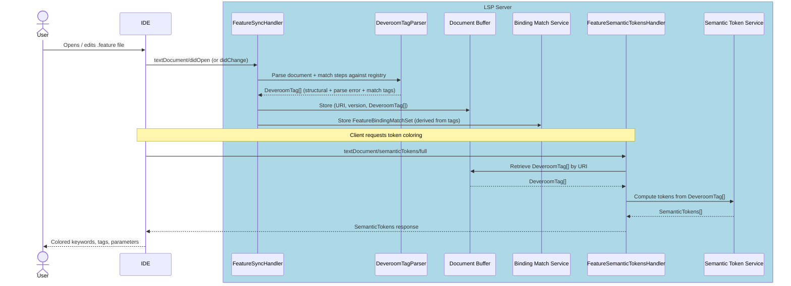

> **Note**: Although `textDocument/didChange` may carry only the incremental text delta, the Gherkin parser always re-parses the **entire file**. Gherkin AST nodes carry absolute line/column locations; inserting or deleting a line shifts the position of every subsequent node, making partial re-parse impractical.

> **As-built note**: the sync handler does not call a raw `GherkinParser` directly. Instead it invokes `DeveroomTagParser` (`GherkinDocumentTaggerService`), which wraps `DeveroomGherkinParser` (the Gherkin parse step) and in the **same AST walk** produces a `DeveroomTag[]` tree encoding all downstream-needed classification info: structural spans (keywords, tags, descriptions, comments, doc strings, data tables), parse error spans, and — when a binding registry is available — step match results (`DefinedStep`, `UndefinedStep`, `StepParameter`, `ScenarioOutlinePlaceholder`, hook references). The Document Buffer stores this tag tree rather than a raw AST; the `SemanticTokenService` reads the tag tree directly. A `FeatureBindingMatchSet` is derived from the tags and stored in the `BindingMatchService` for use by Go to Definition, diagnostics, and find-usages features.
>
> This combined-pass design avoids joining AST structural info with match results at render time, and mirrors the approach from the existing `Reqnroll.VisualStudio` extension.

---

### F2 · Binding Discovery

**Phase 2** — prerequisite for F3, F5, F6, F8, F14, F15, F16, F17, F18

#### End-user experience

This feature is infrastructure, not directly visible. The outcome is that the LSP server maintains an up-to-date registry of step binding patterns, their locations in C# files, and their parameter types. This registry drives all step-related features.

Discovery starts automatically when a workspace folder is opened. The registry is updated when a `.cs` step file is saved (via Roslyn, immediately) or when the project is built (via the Connector, after compilation).

#### IDE support matrix

| VS Code | Visual Studio | Rider |
|---------|---------------|-------|
| ✅ Generic | ✅ Generic | ✅ Generic |

Both discovery paths are managed by the LSP server, so no IDE-specific code is required.

#### LSP messages

| Direction | Method | Purpose |
|-----------|--------|---------|
| Client → Server | `textDocument/didOpen` / `didChange` (`.cs` files) | Trigger Roslyn re-discovery for changed file |
| Client → Server | `workspace/didChangeWatchedFiles` | Detect assembly changes (build complete) |
| Server (internal) | IPC to Connector | Launch reflection discovery, receive `BindingDiscoveryResult` |
| Server → Client | `textDocument/publishDiagnostics` | Push updated diagnostics after registry change |

> **Open question (Q9)**: How does the LSP server reliably detect that the solution has been rebuilt? Watching the output assembly path via `workspace/didChangeWatchedFiles` is the current assumption, but this needs verification per-IDE. See [§10](#10-open-questions).

#### Sequence diagram

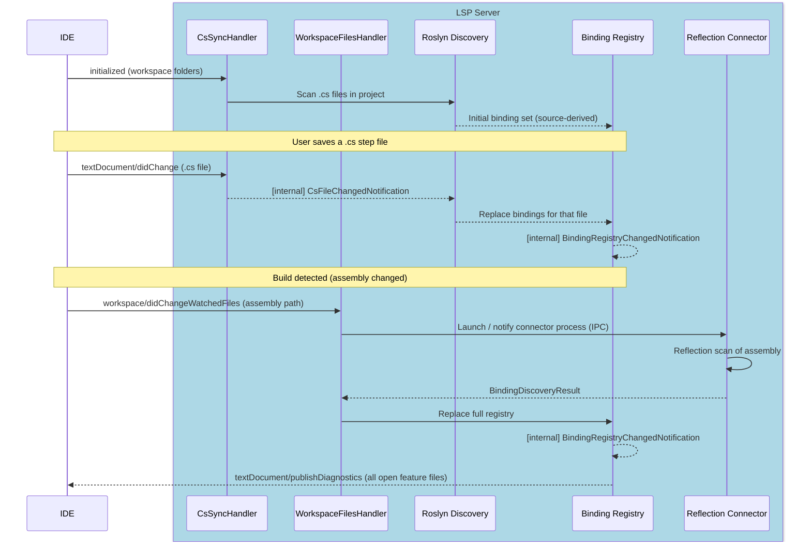

#### Implementation status

The Roslyn (source-level) path is **implemented**. The diagram above uses idealized component names; the as-built mapping is:

| Design element | As-built |
|---|---|
| `CsSyncHandler` receives `.cs` `didOpen`/`didChange` | `TextDocumentSyncHandler` (one sync handler for `.feature` + `.cs`, routed by extension) |
| Roslyn Discovery — scan / parse a `.cs` file | `StepDefinitionFileParser` (syntactic; discovers step definitions **and** hooks, with scopes) invoked via `ProjectBindingRegistry.ReplaceBindings(file)` |
| "Replace bindings for that file" | `ICSharpBindingDiscoveryService` → `ConnectorBindingRegistryProvider.ApplyRoslynFileUpdateAsync` (per-file replace layered on the current registry) |
| `BindingRegistryChangedNotification` | raised by the provider's `BindingRegistryChanged` event via `BindingRegistryProviderRouter`; consumed by `BindingRegistryChangedHandler`, which re-parses open feature files and refreshes semantic tokens |

**Merge / precedence**: the Roslyn patch is layered on top of the connector's current registry and intentionally does **not** advance the connector's last-good assembly hash. A real build (different assembly hash) therefore fully replaces the registry with the authoritative reflection result; with no rebuild, the connector run is a hash-match no-op and the source-level patch persists. This realizes the merge strategy described in [§7](#7-binding-connector).

**Behavioural nuance**: a step renders as *unbound* (a `reqnroll.undefined_step` token / "step definition not found" diagnostic) only once the owning project has a **valid** (non-`Invalid`) registry — i.e. after any discovery has completed, whether the startup reflection run **or** the first Roslyn `.cs` open. Against an `Invalid` registry (no discovery yet) the tag parser skips step matching, leaving steps unclassified rather than unbound.

The reflection (post-build) trigger shown in the lower half of the diagram is also implemented: `WatchedFilesHandler` registers `workspace/didChangeWatchedFiles` watchers for `**/bin/**/*.dll` (and `**/reqnroll.json`) and calls `ConnectorBindingRegistryProvider.TriggerRefresh()` for the project whose output path matches. An initial run is likewise triggered on `reqnroll/projectLoaded`. Whether each IDE reliably *delivers* those watched-file events on build remains [Q9](#10-open-questions).

#### Known limitations

**Custom-derived binding attributes are not discovered by Roslyn (source-level) discovery.** The in-process Roslyn parser (`StepDefinitionFileParser`) is intentionally *syntactic only* — it parses a single `.cs` file into a syntax tree with no `Compilation` or semantic model — and recognizes bindings by matching the attribute's simple name against the known Reqnroll attribute names (`Given`/`When`/`Then`/`StepDefinition` and the hook attributes, allowing for namespace qualification and the `Attribute` suffix). A user-defined attribute that *derives* from a Reqnroll binding attribute (e.g. `class GivenWebAttribute : GivenAttribute`) is therefore **not** detected by the immediate-on-save Roslyn path, because resolving the inheritance chain would require a semantic model with the project's references.

Such bindings are still discovered by the out-of-process reflection **Connector** after a build, since reflection inspects the actual attribute type hierarchy. The practical effect is that a step bound via a custom-derived attribute will appear unmatched (warning squiggle) until the next build, after which it resolves normally.

We are **not** addressing this at this time. Closing the gap would mean feeding the Roslyn parser a project `Compilation` (Reqnroll + project references) and walking `INamedTypeSymbol.BaseType`, which is a larger change to how `CSharpBindingDiscoveryService` obtains source — it currently parses each `.cs` file in isolation. The limitation is captured by a skipped test in `StepDefinitionFileParserTests`.

---

### F3 · Gherkin File Diagnostics

**Phase 2** — covers both missing step warnings and parse errors

> **Open question (Q19)**: Should the server also support diagnostic pull (`textDocument/diagnostic` request, LSP 3.17+) in addition to the push model described here? See [§10 Open Questions](#10-open-questions).

#### End-user experience

Two categories of diagnostic are displayed for `.feature` files:

- **Binding mismatches** (`DiagnosticSeverity.Warning`, yellow squiggle, `source: "reqnroll.binding"`): steps that have no matching binding are underlined. Hovering shows "Step definition not found."
- **Parse errors** (`DiagnosticSeverity.Error`, red squiggle, `source: "reqnroll.parser"`): structurally invalid Gherkin (e.g., missing `Feature:` header, invalid tag syntax) is underlined with a description.

Both categories are computed after every edit and pushed as a **single** `textDocument/publishDiagnostics` message. The LSP specification requires that one message delivers the complete diagnostic set for a URI; separate messages would clear previously delivered diagnostics of the other category. A `DiagnosticsAggregator` combines both sources before sending.

Diagnostics refresh after every `textDocument/didChange` and also whenever the Binding Registry changes (C# file save or build). On `textDocument/didClose`, an **empty** `textDocument/publishDiagnostics` is pushed for the closed URI to clear any squiggles the IDE retained.

> **Design rationale — color and squiggles are complementary, not redundant**: F1/F2 already color unbound steps (purple in Visual Studio). F3 diagnostics are still required because: (a) squiggles appear in the IDE Problems panel / Error List, enabling cross-file triage and keyboard navigation ("Next Warning") that color cannot provide; (b) color-only feedback is inaccessible to colorblind users. Using `Warning` rather than `Error` for binding mismatches distinguishes them visually from parse errors and accommodates step-first development workflows where a binding may not yet exist.

#### IDE support matrix

| VS Code | Visual Studio | Rider |
|---------|---------------|-------|
| ✅ Generic | ✅ Generic | ✅ Generic |

#### LSP messages

| Direction | Method | Purpose |
|-----------|--------|---------|
| Client → Server | `textDocument/didOpen` / `didChange` / `didSave` | Trigger diagnostic pipeline for this file |
| Server → Client | `textDocument/publishDiagnostics` | Push combined diagnostic set (one message per URI) |

#### Sequence diagram — feature file change

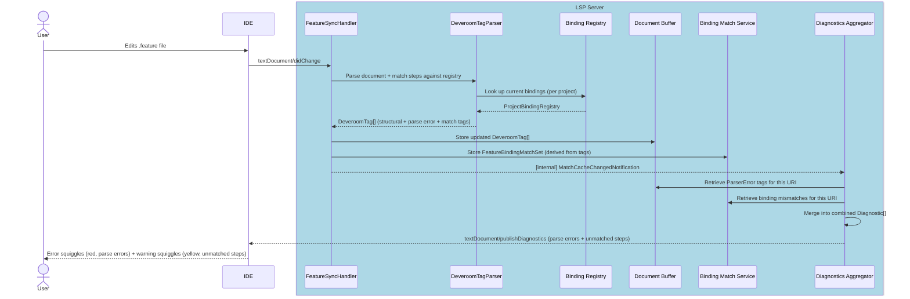

> **As-built note**: parsing and binding matching are **not separate pipeline stages**. `DeveroomTagParser` performs both in a single AST walk (see [F1 · as-built note](#f1--gherkin-syntax-highlighting)). Parse errors emerge as `DeveroomTag` items of type `ParserError` — not a separate `ParseErrors[]` — so the `DiagnosticsAggregator` retrieves them from the tag tree alongside `UndefinedStep` and `BindingError` tags. `MatchCacheChangedNotification` is published directly by the sync handler after storing the new tags and match set, skipping the intermediate `ASTChangedNotification` / `BindingMatchInternalHandler` stages.

#### Sequence diagram — binding registry change (C# file saved or build completed)

> **Diagnostic ownership note**: When the Binding Registry changes due to a `.cs` file edit or a build, the Reqnroll LSP server pushes updated `textDocument/publishDiagnostics` messages **only for `.feature` file URIs**. Diagnostics for `.cs` files (C# parse errors, type errors, etc.) are the exclusive domain of the native C# language server in each IDE; the Reqnroll LSP must not publish competing diagnostics for `.cs` URIs. Binding-level annotations on `.cs` files (e.g., unused step warnings) are delivered separately via Code Lens (F18) rather than diagnostics.

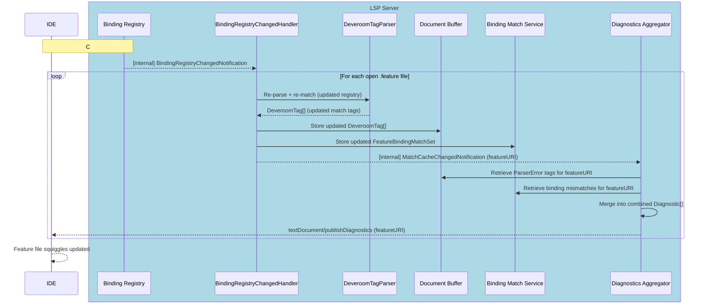

> **As-built note**: when the registry changes, `BindingRegistryChangedHandler` re-invokes `DeveroomTagParser` for each open feature file. Because `DeveroomTagParser` takes the snapshot text (not a cached AST) as input, the Gherkin text is re-parsed on every registry-change re-tag — a minor inefficiency versus a pure re-match on a cached AST. This is accepted because Gherkin parsing is fast and caching the intermediate `DeveroomGherkinDocument` separately from the tag tree would add complexity without a compelling user-visible benefit.

> **As-built note — implementation classes**: the "DA" participant in the sequence diagrams above covers two cooperating classes. `DiagnosticsAggregator` (`LSP.Core/Diagnostics/`) is a protocol-agnostic service that converts `ParserError` tags and `FeatureBindingMatchSet.Undefined` steps into `GherkinDiagnostic` records (no OmniSharp dependency). `DiagnosticsPublishHandler` (`LSP.Server/Handlers/InternalHandlers/`) is the `INotificationHandler<MatchCacheChangedNotification>` that retrieves tags and the match set, calls the aggregator, converts `GherkinDiagnostic.Range` to LSP `Position` values (same `ResolvePosition` algorithm as `SemanticTokenService`), and pushes via `ILanguageServerFacade.SendNotification("textDocument/publishDiagnostics", PublishDiagnosticsParams)` — the same pattern used by `SemanticTokensPushHandler`. `DiagnosticsPublishHandler` is auto-discovered by the `AddMediatR(typeof(Program))` scan; no explicit DI registration is needed. The `textDocument/didClose` empty-diagnostics push is handled inline in `TextDocumentSyncHandler.Handle(DidCloseTextDocumentParams)` rather than via a separate notification, since no fan-out is required.

---

### F4 · Gherkin Parse Error Display

**Phase 2** — implemented as part of the F3 diagnostics pipeline

#### End-user experience

Structural errors in `.feature` files (e.g., missing `Feature:` header, invalid tag syntax) are shown as red error squiggles with a description, distinct from the yellow warning squiggles of missing step bindings.

#### IDE support matrix

| VS Code | Visual Studio | Rider |
|---------|---------------|-------|
| ✅ Generic | ✅ Generic | ✅ Generic |

#### Implementation note

Parse errors are produced by `DeveroomTagParser` whenever a `.feature` file is parsed (`textDocument/didOpen` or `didChange`). Rather than a separate `ParseErrors[]` array, each parse error is stored as a `DeveroomTag` of type `ParserError` in the tag tree alongside structural and match tags. The `DiagnosticsAggregator` reads these `ParserError` tags from the Document Buffer and emits them as `DiagnosticSeverity.Error` items with `source: "reqnroll.parser"` to distinguish them from binding mismatch warnings. The complete combined `textDocument/publishDiagnostics` flow is described in [F3](#f3--gherkin-file-diagnostics).

---

### F5 · Go to Step Definition

**Phase 2**

#### End-user experience

Pressing **Go to Definition** (F12 / Ctrl+Click) on a step in a `.feature` file navigates to the matching `[Given]` / `[When]` / `[Then]` method in the C# binding class. If multiple bindings match (ambiguous), a picker is shown.

> **Open question (Q20)**: Should this feature use `textDocument/definition` or `textDocument/implementation`? In LSP semantics, a step text is closer to a specification (definition) while the binding method is its implementation. The correct choice affects how IDEs route the navigation gesture. See [§10 Open Questions](#10-open-questions).

> **Open question (Q21)**: Should the server also support `textDocument/documentLink`? This would annotate step lines as Ctrl+hover hyperlinks — a complementary navigation path that requires no keystroke. See [§10 Open Questions](#10-open-questions).

#### IDE support matrix

| VS Code | Visual Studio | Rider |
|---------|---------------|-------|
| ✅ Generic | ✅ Generic | 🔧 Plugin |

**Rider note**: Cross-language navigation from a `.feature` step into a `.cs` file requires the `ReqnrollFeatureDefinitionReferenceProvider` PSI bridge — Rider's native LSP client cannot perform this navigation without it. This was confirmed by the Thomas Heijtink PoC. See [§6.3](#63-rider) for implementation details.

#### LSP messages

| Direction | Method | Purpose |
|-----------|--------|---------|
| Client → Server | `textDocument/definition` | Request location of step definition |
| Server → Client | `Location` / `Location[]` response | C# file URI + range |

#### Sequence diagram

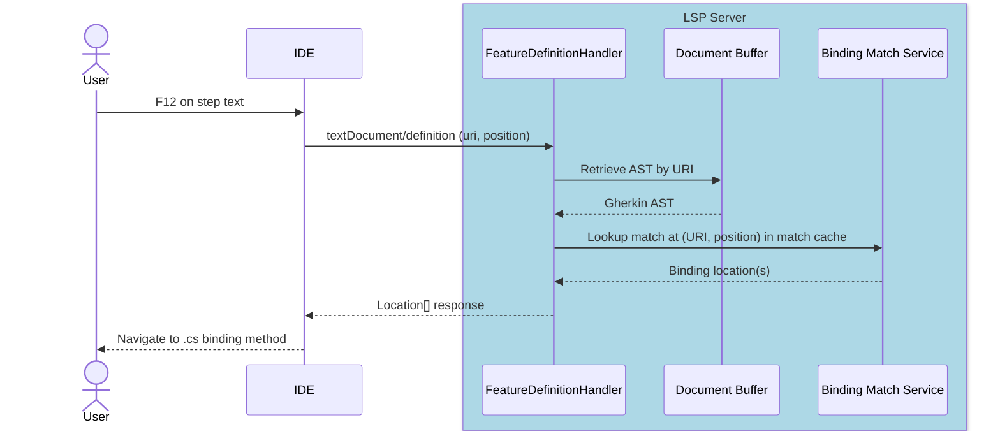

---

### F6 · Define Steps (Scaffolding)

**Phase 2**

#### End-user experience

When one or more steps have no matching binding, a code action "Define missing steps" appears (lightbulb / quick-fix). Activating it generates stub binding methods in a new or existing step definition file, with method signatures and parameter types inferred from the step text.

#### IDE support matrix

| VS Code | Visual Studio | Rider |
|---------|---------------|-------|
| ✅ Generic | ✅ Generic | ✅ Generic |

#### LSP messages

| Direction | Method | Purpose |
|-----------|--------|---------|
| Client → Server | `textDocument/codeAction` | Request available actions at cursor/selection |
| Server → Client | `CodeAction[]` response | List including "Define missing steps" |
| Client → Server | `codeAction/resolve` (optional) | Resolve edit lazily |
| Server → Client | `workspace/applyEdit` | Apply generated step file content |

> **Note**: When the client applies a `WorkspaceEdit` that creates or modifies a `.cs` file, the resulting `textDocument/didChange` triggers `CsSyncHandler`, which initiates Roslyn re-discovery and keeps the Binding Registry current.

#### Sequence diagram

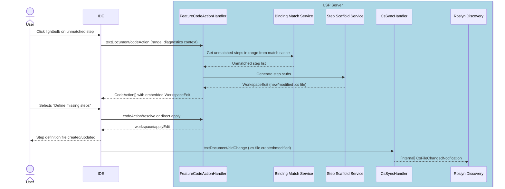

---

### F7 · Keyword Completion

**Phase 3**

#### End-user experience

Typing at the start of a line in a Gherkin scenario offers completions for keywords valid in the current context (`Given`, `When`, `Then`, `And`, `But`, `Scenario:`, `Feature:`, etc.). Completions are context-sensitive: `Examples:` only appears inside a Scenario Outline; `Background:` only at feature level.

> **Gherkin dialect note**: Completion items are sourced from the active Gherkin dialect configured in the project's `reqnroll.json`. If the project specifies `"language": "de"`, completions offer `Gegeben`, `Wenn`, `Dann` rather than `Given`, `When`, `Then`.

#### IDE support matrix

| VS Code | Visual Studio | Rider |
|---------|---------------|-------|
| ✅ Generic | ✅ Generic | ✅ Generic |

#### LSP messages

| Direction | Method | Purpose |
|-----------|--------|---------|
| Client → Server | `textDocument/completion` | Request completions at position |
| Server → Client | `CompletionList` response | Keyword completion items |
| Client → Server | `completionItem/resolve` | Resolve detail/documentation lazily |

#### Sequence diagram

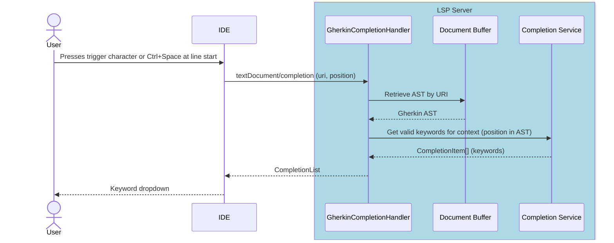

---

### F8 · Step Completion

**Phase 4**

#### End-user experience

When typing a step line after a keyword (`Given`, `When`, `Then`, etc.), the IDE offers completions matching existing step binding patterns. Completions include parameter placeholders styled appropriately and insert the full step text on selection. 
> **Open question (Q14)**: How sophisticated should the step matching be? Is Fuzzy matching needed?

#### IDE support matrix

| VS Code | Visual Studio | Rider |
|---------|---------------|-------|
| ✅ Generic | ✅ Generic | ✅ Generic |

#### LSP messages

Same as F7 (`textDocument/completion`) but triggered after a step keyword; completion items are derived from the Binding Registry rather than the keyword list.

#### Sequence diagram

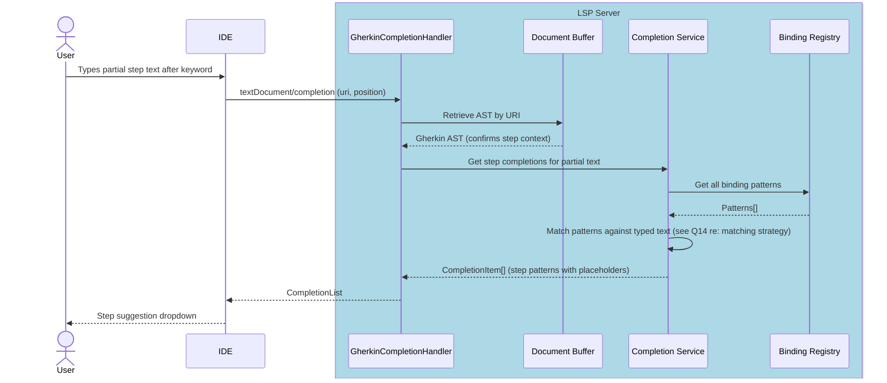

---

### F9 · Document Outline

**Phase 3**

#### End-user experience

The IDE's "Outline" or "Structure" panel shows the hierarchy of the feature file: Feature → Background / Rule → Scenario / Scenario Outline → Step. Clicking a node navigates to that location. Used for quick navigation in large feature files.

#### IDE support matrix

| VS Code | Visual Studio | Rider |
|---------|---------------|-------|
| ✅ Generic | ✅ Generic | ✅ Generic |

#### LSP messages

| Direction | Method | Purpose |
|-----------|--------|---------|
| Client → Server | `textDocument/documentSymbol` | Request symbol hierarchy |
| Server → Client | `DocumentSymbol[]` response | Nested symbol tree |

#### Sequence diagram

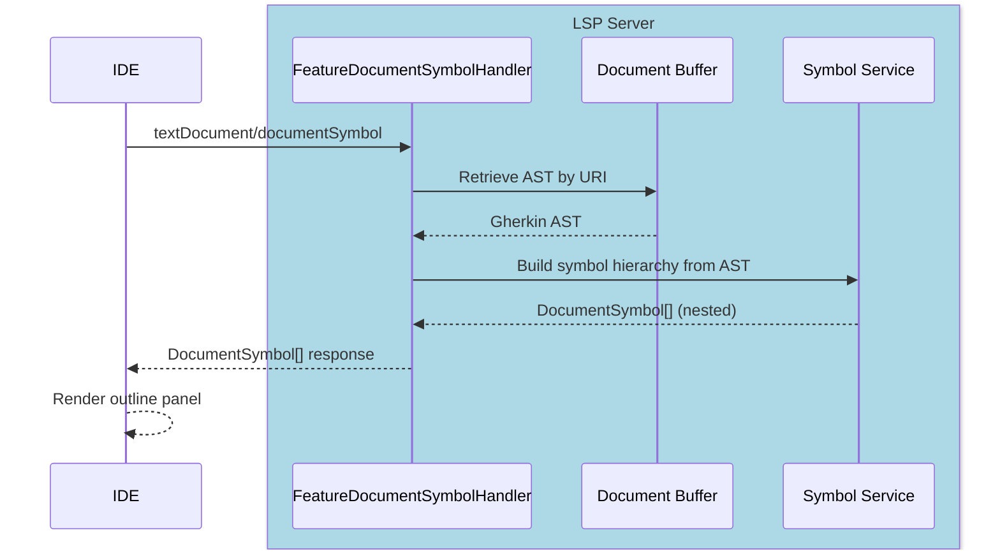

---

### F10 · Code Folding

**Phase 3**

#### End-user experience

Scenarios, Backgrounds, Rules, doc strings, and data tables can be collapsed in the editor gutter. Folding regions update as the document is edited.

#### IDE support matrix

| VS Code | Visual Studio | Rider |
|---------|---------------|-------|
| ✅ Generic | ✅ Generic | ✅ Generic |

#### LSP messages

| Direction | Method | Purpose |
|-----------|--------|---------|
| Client → Server | `textDocument/foldingRange` | Request foldable regions |
| Server → Client | `FoldingRange[]` response | Start/end line pairs |

#### Sequence diagram

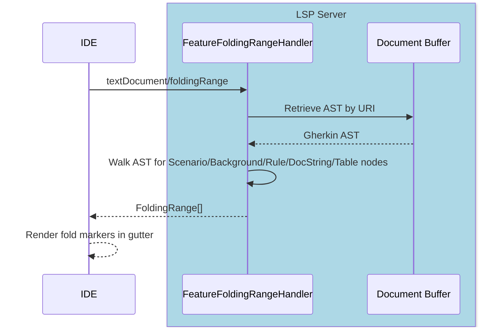

---

### F11 · Document Auto-formatting

**Phase 3**

#### End-user experience

**Format Document** (Shift+Alt+F or equivalent) re-indents the entire feature file: consistent indentation per nesting level, normalized spacing around keywords, blank lines between scenarios. Formatting rules are read from `.editorconfig` (indent size, line endings).

#### IDE support matrix

| VS Code | Visual Studio | Rider |
|---------|---------------|-------|
| ✅ Generic | ✅ Generic | ⚠️ Config |

**Rider note**: Rider has its own formatter framework and may partially handle formatting independently. Behavior should be tested to confirm `textDocument/formatting` takes priority.

#### LSP messages

| Direction | Method | Purpose |
|-----------|--------|---------|
| Client → Server | `textDocument/formatting` | Format whole document |
| Client → Server | `textDocument/rangeFormatting` | Format selection |
| Client → Server | `textDocument/onTypeFormatting` | Format as user types (e.g., on `\n`) |
| Server → Client | `TextEdit[]` response | Set of text edits |

> **Implementation note (Phase 3)**: For the initial release, the server may return a single `TextEdit` replacing the entire document content, rather than a minimal diff. This simplifies implementation at the cost of cursor position preservation; a minimal-diff implementation can follow.

#### Sequence diagram

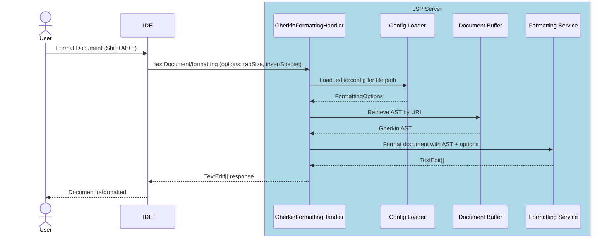

---

### F12 · Table Auto-formatting

**Phase 3**

#### End-user experience

When the user presses Tab or Enter inside a Gherkin data table (or Examples table), the columns are padded so pipes align. The table can also be aligned via Format Document (F11).

This is implemented as a subset of the formatting service, triggered by `textDocument/onTypeFormatting` on `|` and `\n` characters.

#### IDE support matrix

| VS Code | Visual Studio | Rider |
|---------|---------------|-------|
| ✅ Generic | ✅ Generic | ⚠️ Config |

**Rider note**: Same caveat as F11.

#### LSP messages

Same as F11. On-type trigger characters: `|`, `\n`.

#### Sequence diagram

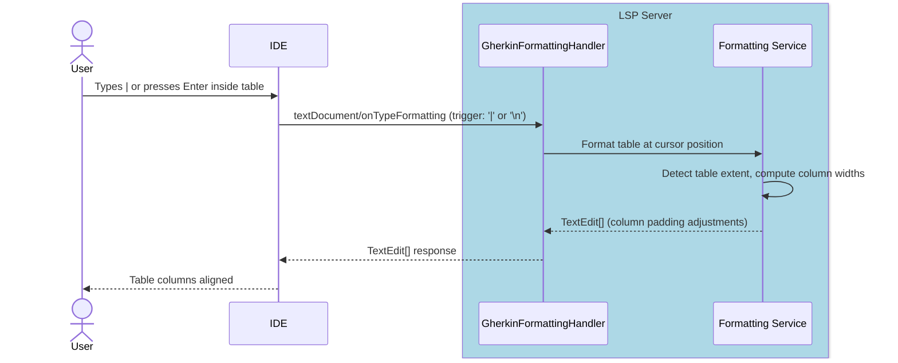

---

### F13 · Comment / Uncomment

**Phase 3**

#### End-user experience

A keyboard shortcut (Ctrl+/) toggles `#` comments on the selected line(s) in a `.feature` file.

LSP has no native comment/uncomment capability. This requires a custom command round-trip: the IDE client captures the keybinding and delegates to the server via `workspace/executeCommand`, which returns a `WorkspaceEdit`.

#### IDE support matrix

| VS Code | Visual Studio | Rider |
|---------|---------------|-------|
| 🔧 Plugin | 🔧 Plugin | 🔧 Plugin |

All three IDEs require a small amount of custom code to:
1. Intercept the comment keybinding and redirect it (preventing the IDE's default comment handler from firing for `.feature` files)
2. Send `workspace/executeCommand` with the current selection
3. Apply the returned `WorkspaceEdit`

#### LSP messages

| Direction | Method | Purpose |
|-----------|--------|---------|
| Client → Server | `workspace/executeCommand` (`reqnroll.toggleComment`) | Toggle comment on lines in range |
| Server → Client | `workspace/applyEdit` | Text insertions/deletions for `#` |

#### Sequence diagram

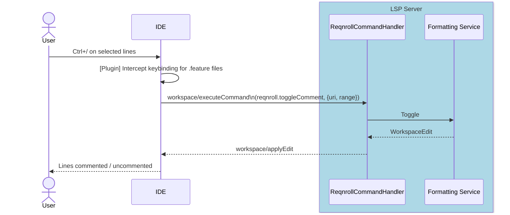

---

### F14 · Find Step Definition Usages

**Phase 4**

#### End-user experience

**Find All References** invoked on a C# step binding method (i.e., a method decorated with `[Given]`, `[When]`, or `[Then]`) finds all `.feature` file steps that match that binding and displays them in the IDE's references panel. This is the inverse of Go to Definition (F5).

#### IDE support matrix

| VS Code | Visual Studio | Rider |
|---------|---------------|-------|
| ⚠️ Config | ⚠️ Config | ⚠️ Config |

**Dispatch ambiguity note**: In a `.cs` file, both the native C# language server and the Reqnroll LSP server register for `textDocument/references`. The intent is that when the caret is positioned on a **binding attribute** (e.g., `[Given("step text")]`), the IDE dispatches the request to the Reqnroll server, returning matching `.feature` step locations. When the caret is on the **method signature or body**, the C# server handles it normally.

Whether IDEs reliably dispatch based on caret position within a file that has multiple registered servers is not guaranteed. If the dispatch is unreliable, the feature will be surfaced as a custom menu/context-menu command (requiring 🔧 Plugin work for each IDE) that explicitly invokes `workspace/executeCommand` rather than relying on `textDocument/references`.

#### LSP messages

| Direction | Method | Purpose |
|-----------|--------|---------|
| Client → Server | `textDocument/references` (at attribute position) | Find all `.feature` steps matching this binding |
| Server → Client | `Location[]` response | Step locations in `.feature` files |

#### Sequence diagram

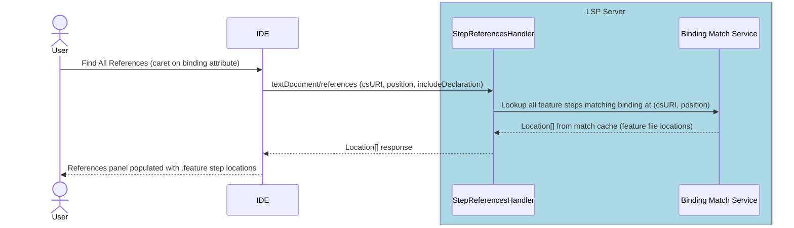

---

### F15 · Find Unused Step Definitions

**Phase 4**

#### End-user experience

A command "Find Unused Step Definitions" scans the Binding Registry against the match cache and reports any binding methods in C# that have zero matched steps across all `.feature` files in the workspace. Results appear in the IDE's output or search panel.

This is a workspace-wide operation; it is implemented as a custom command handled server-side.

#### IDE support matrix

| VS Code | Visual Studio | Rider |
|---------|---------------|-------|
| 🔧 Plugin | 🔧 Plugin | 🔧 Plugin |

All IDEs require a small custom command handler to invoke `workspace/executeCommand` and display the results. The analysis itself is in the server.

#### LSP messages

| Direction | Method | Purpose |
|-----------|--------|---------|
| Client → Server | `workspace/executeCommand` (`reqnroll.findUnusedStepDefinitions`) | Trigger analysis |
| Server → Client | `window/showDocument` or custom notification | Surface results to user |

#### Sequence diagram

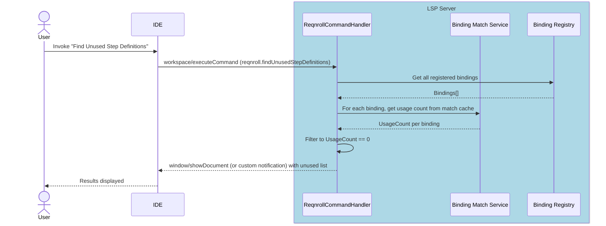

---

### F16 · Step Rename Refactoring

**Phase 4**

#### End-user experience

Renaming a step text (from either the `.feature` file step line or the C# `[Given("...")]` attribute string) updates all occurrences across the workspace: the attribute string in the binding class and every matching step in every `.feature` file.

#### IDE support matrix

| VS Code | Visual Studio | Rider |
|---------|---------------|-------|
| ✅ Generic | ✅ Generic | ✅ Generic |

#### LSP messages

| Direction | Method | Purpose |
|-----------|--------|---------|
| Client → Server | `textDocument/prepareRename` | Validate rename is possible at position |
| Client → Server | `textDocument/rename` | Execute rename with new text |
| Server → Client | `WorkspaceEdit` response | All edits across all files |

#### Sequence diagram

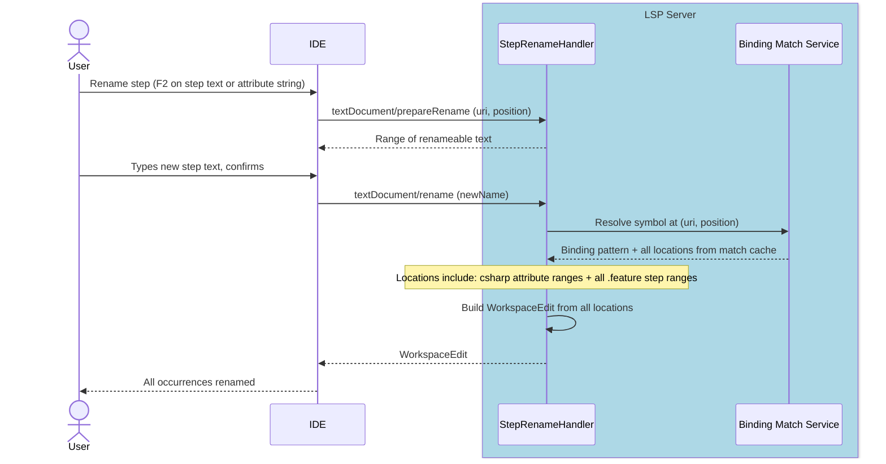

---

### F17 · Hook Navigation

**Phase 3**

#### End-user experience

**Go to Hooks** shows the list of hook bindings that are in scope at the current cursor position in a `.feature` file, filtered by the tags and `[Scope]` expressions that apply there:

- From the `Feature:` line: shows `[BeforeTestRun]` / `[AfterTestRun]` and `[BeforeFeature]` / `[AfterFeature]` hooks
- From a `Scenario:` or `Scenario Outline:` line: additionally shows `[BeforeScenario]` / `[AfterScenario]` hooks
- From a step line: additionally shows `[BeforeStep]` / `[AfterStep]` and `[BeforeStepBlock]` / `[AfterStepBlock]` hooks

All results are filtered by the tags in scope at the cursor position matched against the `tags:` and `Scope[]` expressions of each candidate hook binding. Selecting an entry navigates to the C# hook method.

#### IDE support matrix

| VS Code | Visual Studio | Rider |
|---------|---------------|-------|
| 🔧 Plugin | 🔧 Plugin | 🔧 Plugin |

"Go to Hooks" does not map onto any standard IDE command (unlike Go to Definition, which has a universal F12 keybinding). Each IDE client requires custom plugin code to expose the feature — as a context menu item, command palette entry, or CodeAction. The IDE plugin code invokes `textDocument/definition` at the relevant position; the server-side logic (resolving hooks by context and tag scope) is standard.

**Rider note**: Same PSI bridge requirement as F5 — `ReqnrollFeatureDefinitionReferenceProvider` handles hook navigation responses as well as step definition responses. See [§6.3](#63-rider).

#### LSP messages

| Direction | Method | Purpose |
|-----------|--------|---------|
| Client → Server | `textDocument/definition` (at keyword/tag position) | Request hook locations for context |
| Server → Client | `Location[]` response | C# hook method locations |

#### Sequence diagram

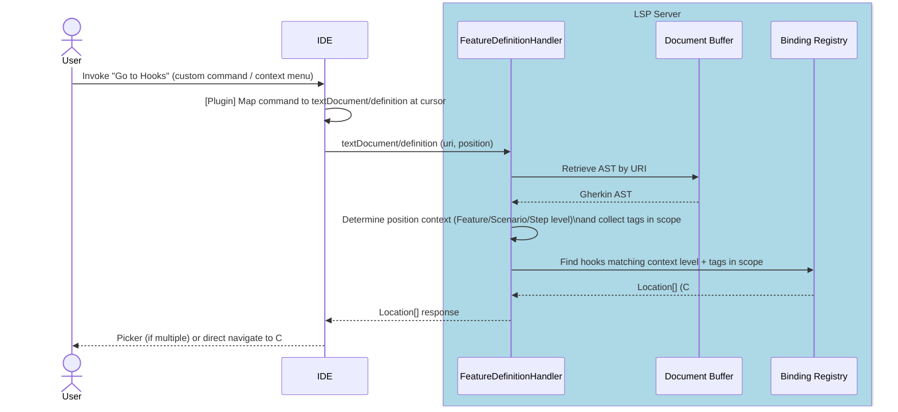

---

### F18 · Code Lens (Step Usage Counts)

**Phase 4**

#### End-user experience

C# step binding methods display an inline annotation above the method's binding attribute showing how many `.feature` steps currently match (e.g., "3 usages"). Clicking the annotation opens the references panel showing those step locations.

#### IDE support matrix

| VS Code | Visual Studio | Rider |
|---------|---------------|-------|
| ✅ Generic | 🔧 Plugin (VSSDK) | ⚠️ Config |

**Visual Studio note**: `textDocument/codeLens` is not supported by VS.Extensibility as of VS 17.x. The VSSDK plugin acts as a bridge: it sends the standard `textDocument/codeLens` request to the LSP server, receives the `CodeLens[]` response, and then relays the usage counts into the VSSDK `IVsCodeLensDataPointProvider` API so VS renders them natively. The LSP server requires no special awareness of this bridging. See [Q10](#10-open-questions) for the VS.Extensibility roadmap question.

**Rider note**: Code Lens via LSP is supported but requires verification of how project-wide refresh is triggered when the Binding Registry changes.

#### LSP messages

| Direction | Method | Purpose |
|-----------|--------|---------|
| Client → Server | `textDocument/codeLens` | Request code lens items for `.cs` document |
| Client → Server | `codeLens/resolve` | Resolve lens command detail lazily |
| Server → Client | `CodeLens[]` response | Count annotations with command link |

#### Sequence diagram

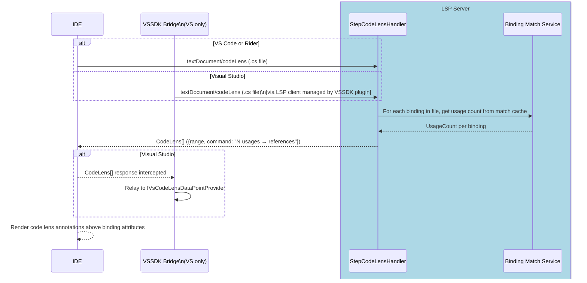

---

### F19 · New Project / Item Wizards

**Phase 2** (Visual Studio only; other IDEs: snippets / live templates)

#### End-user experience

"New Project" offers a Reqnroll project template with test framework selection (NUnit, xUnit, MSTest). "Add New Item" offers a blank `.feature` file template and a step definitions class template.

#### IDE support matrix

| VS Code | Visual Studio | Rider |
|---------|---------------|-------|
| ❌ N/A (snippets instead) | 🔧 Plugin (VSSDK) | ❌ N/A (live templates instead) |

VS Code ships a snippet for scaffolding a feature file. Rider uses Live Templates. Only Visual Studio requires a VSSDK Wizard implementation.

#### LSP messages

None — wizards are entirely IDE-side. No LSP involvement.

#### Notes

- Uses `IVsProjectWizard` / `IWizard` VSSDK interfaces
- Wizard UI is WPF; shared with the existing Reqnroll.VisualStudio extension where possible
- VS.Extensibility does not expose a wizard API; VSSDK is the only option here

---

### F20 · Installation & Upgrade Experience

**Phase 3**

#### End-user experience

When the extension is installed for the first time, the user is greeted with a **welcome experience** (e.g., a getting-started page linking to documentation, the marketplace listing, and a quick tour of features). When the extension is **upgraded** to a new version, the user is shown a **"What's New"** experience summarizing notable changes since their previous version. These experiences make the Preview extension's value discoverable and signal active maintenance — important during the transition period while the existing `Reqnroll.VisualStudio` extension is still available.

For Visual Studio, the existing extension's installation and upgrade UX (welcome / what's-new pages and any first-run setup) is **ported** rather than rebuilt — the existing WPF UI and the version-detection logic that distinguishes a fresh install from an upgrade are reused.

#### IDE support matrix

| VS Code | Visual Studio | Rider |
|---------|---------------|-------|
| ⚠️ Config (walkthrough / release notes) | 🔧 Plugin (ported from existing extension) | ⚠️ Config (plugin "What's New") |

- **Visual Studio**: Port the existing extension's welcome / what's-new experience and first-run/upgrade detection. WPF UI shared with the existing `Reqnroll.VisualStudio` extension where possible.
- **VS Code**: Use the native [Walkthroughs](https://code.visualstudio.com/api/references/contribution-points#contributes.walkthroughs) contribution point for the getting-started experience and the marketplace's built-in release-notes (`CHANGELOG.md`) surface for upgrades — no custom UI required.
- **Rider**: Use the IntelliJ Platform plugin "What's New" / change-notes mechanism declared in `plugin.xml`.

#### LSP messages

None directly — installation and upgrade UX is entirely IDE-side. However, the **first-activation** and **version-change** moments are the natural producers of the `ExtensionInstalled` and `ExtensionUpgraded` telemetry events (see [§9 Telemetry](#telemetry)). Because these events fire before or independently of the LSP server, the telemetry-architecture choice (Q11) and the client-reference question (Q8) directly affect how they are captured.

#### Notes

- Detecting install-vs-upgrade requires persisting the last-run version per IDE (e.g., extension storage / settings). The existing VS extension already implements this; reuse its approach.
- Each IDE client is responsible for its own install/upgrade UX; there is no shared cross-IDE implementation, though the telemetry event names are common.
- This feature is the primary in-product driver of the `ExtensionInstalled` / `ExtensionUpgraded` / `ExtensionDaysOfUsage` events listed in §9 Telemetry.

---

## Appendix B · Deferred / Future Features

The following features were identified during planning (see [discussion #1077](https://github.com/orgs/reqnroll/discussions/1077)) as valuable but out of scope for the initial phases. They are recorded here to inform architectural decisions — implementations should avoid foreclosing these options.

### Ambiguity Diagnostics

When a step in a `.feature` file matches more than one binding (ambiguous match), the step is flagged with a diagnostic and the code action menu offers navigation to each matching binding. This extends the Binding Match Service to return a `MatchResult` with multiple bindings rather than a single one.

### Regex Validation in Step Attributes

When editing a `[Given("...")]` attribute string in C#, the regex pattern is validated in real time. Malformed patterns are shown as error squiggles in the `.cs` file. Requires the LSP server to understand binding attribute context within C# files and the ability of the IDE client to combine built-in C# diagnostics with those provided by the Reqnroll LSP.

### Scope Expression Validation

`[Scope(Tag = "...")]` expressions are validated via the Tag Expression parser. Invalid tag expressions are highlighted with warning squiggle (via LSP Diagnostics; same caveats apply from above).

### Hook Matching Indicators

Visual indicators (e.g., a gutter icon or CodeLens annotation) in `.feature` files showing which scenarios or steps have hooks attached, providing a quick way to discover pre/post-conditions without navigating to C# code and provide a way to surface navigation links to those hooks.

### Debug Support for Feature Files

Breakpoints set on `.feature` file step lines would pause test execution at the corresponding step. Step-into would navigate to the bound C# method. This requires implementation of the Debug Adapter Protocol (DAP), a separate protocol from LSP, likely in coordination with the Reqnroll test runner.

---

