# Reqnroll LSP-Based IDE Support — Feature Designs

> **Status:** Draft for team review  
> **Audience:** Core team contributors

**Related documents**

| Document | Contents |
|----------|----------|
| [Overview](LSP-IDE-Support-Overview.md) | Scope, goals, high-level architecture, roadmap, release strategy |
| [Architecture & Implementation Reference](LSP-IDE-Support-Architecture.md) | Module design, component inventory, server internals, IDE clients, cross-cutting concerns |
| [Open Questions & Risk Register](LSP-IDE-Support-Open-Questions.md) | Active open questions, risk register |

---

## Table of Contents

- [Infrastructure: Linked Files and Project Membership](#infrastructure-linked-files-and-project-membership)
- [Notation](#notation)
- [F1 · Gherkin Syntax Highlighting](#f1--gherkin-syntax-highlighting)
- [F2 · Binding Discovery](#f2--binding-discovery)
- [F3 · Gherkin File Diagnostics](#f3--gherkin-file-diagnostics)
- [F4 · Gherkin Parse Error Display](#f4--gherkin-parse-error-display)
- [F5 · Go to Step Definition](#f5--go-to-step-definition)
- [F6 · Define Steps (Scaffolding)](#f6--define-steps-scaffolding)
- [F7 · Keyword Completion](#f7--keyword-completion)
- [F8 · Step Completion](#f8--step-completion)
- [F9 · Document Outline](#f9--document-outline)
- [F10 · Code Folding](#f10--code-folding)
- [F11 · Document Auto-formatting](#f11--document-auto-formatting)
- [F12 · Table Auto-formatting](#f12--table-auto-formatting)
- [F13 · Comment / Uncomment](#f13--comment--uncomment)
- [F14 · Find Step Definition Usages](#f14--find-step-definition-usages)
- [F15 · Find Unused Step Definitions](#f15--find-unused-step-definitions)
- [F16 · Step Rename Refactoring](#f16--step-rename-refactoring)
- [F17 · Hook Navigation](#f17--hook-navigation)
- [F18 · Code Lens (Step Usage Counts)](#f18--code-lens-step-usage-counts)
- [F19 · New Project / Item Wizards](#f19--new-project--item-wizards)
- [F20 · Installation & Upgrade Experience](#f20--installation--upgrade-experience)
- [Appendix B · Deferred / Future Features](#appendix-b--deferred--future-features)

---

## Infrastructure: Linked Files and Project Membership

This section documents the root cause analysis and design resolution for the linked-file membership problem (Q17). It is placed here because the analysis was driven by feature-level symptoms and the implementation plan cross-cuts several features. The design outcome — the `path → {projects}` index and the `reqnroll/projectFiles` notification — is described in the [Architecture document §5 Workspace Model](LSP-IDE-Support-Architecture.md#workspace-model); the summary of how it shapes the overall implementation is in [Architecture §2](LSP-IDE-Support-Architecture.md#2-where-this-implementation-diverges-from-standard-lsp).

### Reproduction (2026-06-07)

The `Minimal/ExternalReferences` corpus links one `.feature` file and two binding `.cs` files from the `Minimal` project into the `ExternalReferences` project. Running the LSP extension against it surfaced three concrete symptoms in the logs:

1. **The connector reports the linked file's *physical* path, identically for every linking project.** `ExternalReferences`'s discovery returns step definitions whose `sourceFiles[0]` is `…\Minimal\Minimal\StepDefinitions\CalculatorStepDefinitions.cs` — the file's home in `Minimal`, not anything under `ExternalReferences\`. `Minimal`'s discovery reports the same path. This is inherent to reflection/PDB sequence points (they record the compile-time source path, which for a linked item is its original location). The connector output therefore gives **no signal** that one registry obtained the binding via a link.
2. **The workspace-startup glob never sees the linked feature file from its linking project.** The full-replacement scan reported "scanning **1** closed feature file under …\Minimal" but "scanning **0** closed feature file(s) under …\ExternalReferences", and "no open feature files to reparse under …\ExternalReferences" — because the feature file is physically under `Minimal\Minimal\Features\`. This is the "Known limitation" noted in the F14 as-built table.
3. **`didOpen`/`didChange` carry only the on-disk URI**, with no project discriminator. This is inherent to LSP — a `TextDocumentItem` has no project field, and the IDE will not tell the server which project's *view* of a shared file is open.

### Root Cause

The server has no authoritative file→project map. Membership is *inferred* from on-disk folder containment in [`LspWorkspaceScopeManager.GetProjectForUri`](../src/LSP/Reqnroll.IdeSupport.LSP.Server/Workspace/LspWorkspaceScopeManager.cs) (`filePath.StartsWith(p.ProjectFolder)`, longest prefix wins, `FirstOrDefault`). This collapses a many-to-many relation (one physical file ↔ many projects) into a single guess. A linked `.cs`/`.feature` physically under `Minimal\` therefore **always** routes to `Minimal`, never to `ExternalReferences`; a file linked from outside *every* project folder routes to **no** project and falls back to default configuration (every step shows unmatched). In this corpus the defect is partly *masked* because `ExternalReferences`'s registry is byte-identical to `Minimal`'s; it becomes visible the moment two linking projects have different bindings (cf. `Minimalnet481`, which already produces a different regex for the same step text).

### Impact on F14 and F15

Both features are inherently many-to-many and cannot be computed correctly on the folder-prefix model:

- **Find All Usages (F14)** must union, across *every project that includes that binding*, the feature steps that match it. A binding linked into N projects is "used" if a feature in *any* of the N references it.
- **Find All Unused (F15)** must intersect: the binding is unused only if *no* feature in *any* including project references it. A folder-scoped search rooted at the binding's physical project will **falsely report a linked-and-used binding as unused** — an actively harmful result, since it invites deletion of live code.

### Edge Cases — Excluded and Ad-hoc-Opened Files

The same model must handle the inverse of linking: a file physically *inside* a project folder but **excluded** from the `.csproj` (via `<Compile Remove>` / `<None Remove>` or a false `Condition`). An exclusion is simply the *absence* of a positive membership assertion, so it looks identical to "not yet reported." The analysis confirmed two failure modes the design must prevent: (a) the folder glob re-admitting an excluded *closed* feature file into a project's scan; and (b) the user *opening* an excluded file — which must not confer membership, must not push binding-dependent diagnostics for it, and (for an excluded `.cs`) must not let the Roslyn live path inject phantom bindings that flip a step to "matched" or a binding to "used" until the next build wipes them.

### Chosen Design

Adopt the [`path → {projects}` membership index](LSP-IDE-Support-Architecture.md#project-membership-the-path--projects-index), populated by a new optional [`reqnroll/projectFiles`](LSP-IDE-Support-Architecture.md#the-reqnrollprojectfiles-notification) notification. The decisions:

1. **Membership is explicit, never inferred.** Each IDE glue layer enumerates the project's feature files and binding source files, on-disk paths **including links**, and sends them via `reqnroll/projectFiles`. The server never re-derives membership from the filesystem. (`VsProjectEventMonitor` does not yet enumerate item lists and `ReqnrollProjectLoadedParams` carries only `ProjectFolder` — both are extended for this; the VS enumeration moves from EnvDTE to CPS/MSBuild, see [Architecture §6.2](LSP-IDE-Support-Architecture.md#62-visual-studio).)

2. **A *separate* notification, not extra fields on `projectLoaded`.** This is the resolution of the "extend vs. new message" sub-question, and it is driven by the three IDEs' differing capabilities:
   - **VS Code** has no MSBuild project system, so it cannot produce the manifest as a cheap byproduct of project load at all — membership requires an async MSBuild/C# Dev Kit evaluation that necessarily lands later than a coarse "project exists" signal.
   - **Visual Studio** *can* produce it, but only via CPS/MSBuild evaluation — a slower, async path than the EnvDTE property reads that power `projectLoaded` today. Coupling would make the fast path (output assembly → start discovery, observed in the logs within ~1 s of load) wait on the slow one.
   - **Rider** produces it readily from its backend project model, but the reliability of pushing a *custom* outbound notification through its built-in LSP client is unproven (cf. Q1/Q2).
   
   An **optional, snapshot-plus-delta** message decouples fast-path discovery from membership, matches each project system's change cadence (membership changes far more often than build properties), and degrades gracefully per client (a client that can't produce it omits it; that project falls back to folder-prefix). The cost — tolerating `projectFiles` / `projectLoaded` arriving in either order, keyed by `(projectFile, TFM)` — is the same pending-state machinery required by point 4 anyway.

3. **Two routing invariants** (detailed in [Architecture §5](LSP-IDE-Support-Architecture.md#project-membership-the-path--projects-index)): membership is conferred *only* by the index (closed-file enumeration is index-driven, not a folder glob), and open-state *never* confers membership or accounting (an opened-but-unowned file gets registry-independent features only). `GetProjectForUri` returns a *set*; folder-prefix survives only as a read-only fallback for files no project claims.

4. **Absence means *pending*, then *excluded*.** The server treats a file's absence from the index as unknown (defer binding-dependent features) until the project's first `baseline` manifest arrives, and as deliberately excluded thereafter. The glue layer re-sends membership on project load, rebuild, **and `.csproj` change**, so re-including a file in the editor restores its ownership.

5. **Feature-aware operations iterate the owning set.** Diagnostics/matching for a linked feature run against each owner's registry (a step is unmatched only if unmatched in *all* owners). [F14](#f14--find-step-definition-usages) unions a binding's usages across all including projects; [F15](#f15--find-unused-step-definitions) intersects (unused only if unused in *every* including project).

6. **F2 fan-out is deliberate.** A single `didChange` to a linked `.cs` invalidates *every* registry that includes it; the per-file Roslyn patch fans out to all owning projects rather than a single target, and is *gated* on index membership so an excluded-but-open `.cs` patches nothing. See the [F2 planned-change note](#f2--binding-discovery).

### Implementation Plan

The concrete code changes across the LSP server and VS extension — DTOs, the index in `LspWorkspaceScopeManager`, consumer re-gating, VS manifest production, phasing, and tests — are documented in [Q17 Membership Index Implementation Plan](Q17-membership-index-implementation-plan.md).

---

## Notation

**IDE Support Matrix**

| Column | Meaning |
|--------|---------|
| ✅ Generic | Works via standard LSP — no IDE-specific code needed |
| ⚠️ Config | Minor IDE-side configuration required (e.g., static vs. dynamic registration override) |
| 🔧 Plugin | Custom IDE plugin code required |
| ❌ N/A | Feature is not applicable to this IDE |

**Sequence diagram conventions**

- Participant names shown in **bold** in tables are OmniSharp protocol handler classes (running in the LSP Server process)
- Internal MediatR notifications are shown with `-->>` (dashed arrow) and labelled `[internal]`

---

### F1 · Gherkin Syntax Highlighting

**Phase 1**

#### End-user experience

Keywords (`Feature:`, `Scenario:`, `Given`, `When`, `Then`, `And`, `But`), step text, bound step argument text, tags (`@tag`), doc strings, data table headers, data table cell content, and comments each render in distinct colors using the IDE's token-color theme. Colors update as the user types without requiring a save.

#### IDE support matrix

| VS Code | Visual Studio | Rider |
|---------|---------------|-------|
| ✅ Generic | ⚠️ Static registration required | ✅ Generic |

**Visual Studio note**: VS has unreliable support for dynamic registration of `textDocument/semanticTokens`. The server declares semantic token capabilities statically in the `initialize` response when launched with `--client visualstudio`. See the OmniSharp implementation note in [Architecture §5](LSP-IDE-Support-Architecture.md#capability-registration).

#### LSP messages

| Direction | Method | Purpose |
|-----------|--------|---------|
| Client → Server | `textDocument/didOpen` | Send initial document content |
| Client → Server | `textDocument/didChange` | Send incremental edits |
| Client → Server | `textDocument/semanticTokens/full` | Request full token set |
| Client → Server | `textDocument/semanticTokens/delta` | Request incremental update |
| Server → Client | Response to above | `SemanticTokens` / `SemanticTokensDelta` |

**Gherkin dialect support**: The Semantic Token Service reads the active dialect from the project's `reqnroll.json` (default: `en`). Non-English keywords (e.g., German `Gegeben sei`, French `Soit`, Dutch `Stel`) are tokenized as `keyword` type identically to their English equivalents. The dialect must be resolved before the first `textDocument/semanticTokens/full` request is processed for a project.

**Semantic token types used** (custom Reqnroll token types):

Rather than emitting the generic LSP standard token types (`keyword`, `string`, `parameter`, …), the server declares a set of **custom semantic token types** whose names match the custom `ClassificationTypeDefinition` names already used by the existing `Reqnroll.VisualStudio` extension (`DeveroomClassifications`). This preserves an exact one-to-one correspondence between the LSP server's output and the classification concepts the existing extension's users already see, and lets each IDE map a Reqnroll-specific concept to a Reqnroll-specific color rather than overloading a host theme's generic scopes.

The server advertises these names in the `legend.tokenTypes` array of its `textDocument/semanticTokens` server capability (in the `initialize` response). The token type index emitted in each 5-tuple is an index into this legend. The legend is the contract between the server and every client; all three clients must map these same names.

| Custom token type (legend name) | `DeveroomClassifications` constant | Gherkin element |
|------------|------------|----------------|
| `reqnroll.keyword` | `Keyword` | `Feature:`, `Scenario:`, `Given`, `When`, `Then`, `And`, `But`, `Background:`, `Rule:`, `Examples:`, `Scenario Outline:` |
| `reqnroll.tag` | `Tag` | Tag (`@tag`) |
| `reqnroll.description` | `Description` | Free-text description lines under `Feature:` / `Scenario:` |
| `reqnroll.comment` | `Comment` | `#` line comments |
| `reqnroll.doc_string` | `DocString` | Doc string (`"""` / ` ``` `) content |
| `reqnroll.data_table` | `DataTable` | Data table cell content (non-header rows) |
| `reqnroll.data_table_header` | `DataTableHeader` | Data table header row content |
| `reqnroll.step_parameter` | `StepParameter` | Bound step argument values |
| `reqnroll.scenario_outline_placeholder` | `ScenarioOutlinePlaceholder` | Scenario Outline parameter placeholders `<param>` |
| `reqnroll.undefined_step` | `UndefinedStep` | Step text of a step with no matching binding (emitted once binding discovery — F2 — is available; in Phase 1 all step text is emitted without this type) |

> **Note**: `reqnroll.undefined_step` depends on binding match results from F2 and therefore only carries meaning from Phase 2 onward. Its name is reserved in the legend from Phase 1 so the legend does not change across phases (a stable legend simplifies client-side mapping and avoids re-registration).

> **Why custom names instead of standard LSP types**: The standard types force a lossy mapping (e.g., both tags and data tables would collapse onto a host theme's generic `string`/`type` scopes, and there is no standard type that expresses "undefined step" or "scenario outline placeholder"). Custom names move the mapping decision to each client, where the existing color story can be reproduced faithfully. The trade-off is that a client that does **not** map these names gets no coloring at all for unmapped types (rather than a generic fallback); each client therefore ships a complete mapping (see below), and the VS Code client additionally ships a TextMate grammar fallback (see [Architecture §6.1](LSP-IDE-Support-Architecture.md#61-vs-code)) for the activation gap.

#### Client-side token-type mapping

The LSP `legend` only names the token types; it is the responsibility of **each IDE client** to map each legend name to a concrete editor color / classification. The mapping is intentionally pushed to the client so each IDE can honor its own theming system and the user's customized colors.

**Visual Studio** — The VSSDK side of the new extension (`Reqnroll.IdeSupport.VisualStudio.VSSDKIntegration`) **re-uses the existing `DeveroomClassifications` class verbatim**, including its MEF exports (`ClassificationTypeDefinition`, `EditorFormatDefinition`/`ClassificationFormatDefinition`, and the `[Name(...)]` exports), so the custom classification types and their default formats (italic Description, the `#887DBA` Undefined Step foreground, etc.) are registered exactly as before.

> **Important — VS does not map custom LSP token types by name, and does not reliably pull them.** Two confirmed VS limitations break the naïve approach:
> 1. Visual Studio's built-in LSP semantic-token colorizer (`Microsoft.VisualStudio.LanguageServer.Client.SemanticTokensTaggerBase.ClassificationTypeNameForTokenType`) maps token-type names to classifications through a **fixed internal `switch`** that only recognizes the standard LSP token types (plus C++/Roslyn/Razor sets); every unrecognized name — including all `reqnroll.*` names — falls through to plain `"text"`. It never consults the classification registry by the raw legend name, so registering same-named classifications is **not sufficient** in VS (unlike VS Code / Rider).
> 2. VS only **pulls** `textDocument/semanticTokens/full` lazily and inconsistently (driven by its own tagger lifecycle); in practice it sometimes never requests tokens for an open document at all.
>
> Both were confirmed empirically (decompiling the shipped client; LSP trace logs) and are the R1/R1a risks in the [Risk Register](LSP-IDE-Support-Open-Questions.md#risk-register).

To restore the custom colors reliably, VS uses a **server-push + client-classifier** path that does not depend on VS's native semantic-token pull or its token-type mapping:
- **Server push** — when launched with `--ide visualstudio`, the server's `SemanticTokensPushHandler` reacts to each `MatchCacheChangedNotification` by encoding the file's tokens and pushing them to the client via a custom `reqnroll/semanticTokens` notification (`{ uri, version, data[] }`). Every other client ignores this notification and uses the standard pull flow. (This is the one place the retained `--ide` flag changes server behaviour.)
- **Client capture** — a `SemanticTokensClassificationInterceptor` on the existing `LspInterceptingPipe` captures the `reqnroll/semanticTokens` notification (and the legend from the `initialize` response), decodes the 5-int data, and caches absolute tokens per file in a process-wide `SemanticTokenClassificationStore`. Messages pass through untouched.
- **Client classifier** — a classic MEF `IClassifierProvider` (`[ContentType("reqnroll-gherkin")]`) returns a `GherkinSemanticClassifier` that reads those cached tokens and emits `ClassificationSpan`s, resolving each token's legend name to the `DeveroomClassifications` classification of the **same name** via `IClassificationTypeRegistryService`.

The net effect is still **pixel-for-pixel continuity** (existing users keep their configured Reqnroll colors under Tools → Options → Fonts and Colors with no migration) and the server's token encoding stays shared with the other IDEs — only the *delivery* (push vs pull) and the *color mapping* (our classifier vs VS's native colorizer) are VS-specific. VS's native colorizer, if it does pull, produces harmless `"text"` tags for the same spans; the derived Reqnroll classifications take precedence. **Note:** structural coloring (keywords, tags, comments, descriptions, doc strings, tables, placeholders) is fully covered; `reqnroll.undefined_step` coloring depends on binding match results and therefore only appears once F2 discovery is active.

**VS Code** — The client maps each custom token type to a color in one of two ways:
- A `semanticTokenScopes` contribution in `package.json` that associates each `reqnroll.*` token type with one or more TextMate scopes, so existing color themes light them up automatically; and/or
- A `configurationDefaults` block setting `editor.semanticTokenColorCustomizations` to supply default Reqnroll colors (mirroring the `DeveroomClassifications` defaults) for themes that do not style the mapped scopes.

The token-type names registered here must match the server legend exactly. (Table cell/header per-pipe coloring is additionally refined by the client-side `TableHighlightService` decorations described in [Architecture §6.1](LSP-IDE-Support-Architecture.md#61-vs-code); the `reqnroll.data_table*` token types provide the base coloring.)

**Rider / IntelliJ Platform** — Rider's built-in LSP client exposes a hook for translating LSP semantic token types into IntelliJ `TextAttributesKey`s. The Rider plugin registers a set of custom `TextAttributesKey`s (one per `reqnroll.*` legend name, with default colors mirroring `DeveroomClassifications`) and overrides the LSP server descriptor's semantic-tokens customization (e.g., `LspSemanticTokensSupport.getTextAttributesKey(tokenType, modifiers)`) to return the matching key for each legend name. Registering these keys against a Reqnroll color-settings page also lets users recolor them under Settings → Editor → Color Scheme. This is additional Kotlin code in the Rider client beyond the thin-wrapper baseline and should be added to the `plugin.xml` extension-point list in [Architecture §6.3](LSP-IDE-Support-Architecture.md#63-rider).

> **Legend stability is a cross-client contract**: Adding, removing, or reordering legend entries is a breaking change for all three client mappings simultaneously. The legend is therefore versioned with the server/clients as a unit (see [Versioning and Compatibility](LSP-IDE-Support-Architecture.md#versioning-and-compatibility)), and new token types are appended (never reordered) so older index assumptions remain valid.

#### Sequence diagram

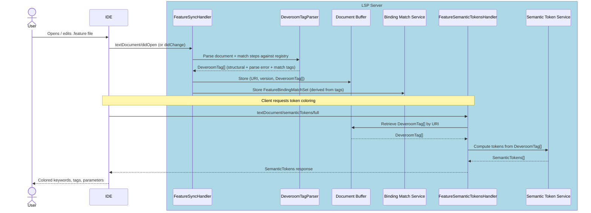

> **Note**: Although `textDocument/didChange` may carry only the incremental text delta, the Gherkin parser always re-parses the **entire file**. Gherkin AST nodes carry absolute line/column locations; inserting or deleting a line shifts the position of every subsequent node, making partial re-parse impractical.

> **As-built note**: the sync handler does not call a raw `GherkinParser` directly. Instead it invokes `DeveroomTagParser` (`GherkinDocumentTaggerService`), which wraps `DeveroomGherkinParser` (the Gherkin parse step) and in the **same AST walk** produces a `DeveroomTag[]` tree encoding all downstream-needed classification info: structural spans (keywords, tags, descriptions, comments, doc strings, data tables), parse error spans, and — when a binding registry is available — step match results (`DefinedStep`, `UndefinedStep`, `StepParameter`, `ScenarioOutlinePlaceholder`, hook references). The Document Buffer stores this tag tree rather than a raw AST; the `SemanticTokenService` reads the tag tree directly. A `FeatureBindingMatchSet` is derived from the tags and stored in the `BindingMatchService` for use by Go to Definition, diagnostics, and find-usages features.
>
> This combined-pass design avoids joining AST structural info with match results at render time, and mirrors the approach from the existing `Reqnroll.VisualStudio` extension.

---

### F2 · Binding Discovery

**Phase 2** — prerequisite for F3, F5, F6, F8, F14, F15, F16, F17, F18

#### End-user experience

This feature is infrastructure, not directly visible. The outcome is that the LSP server maintains an up-to-date registry of step binding patterns, their locations in C# files, and their parameter types. This registry drives all step-related features.

Discovery starts automatically when a workspace folder is opened. The registry is updated when a `.cs` step file is saved (via Roslyn, immediately) or when the project is built (via the Connector, after compilation).

#### IDE support matrix

| VS Code | Visual Studio | Rider |
|---------|---------------|-------|
| ✅ Generic | ✅ Generic | ✅ Generic |

Both discovery paths are managed by the LSP server, so no IDE-specific code is required.

#### LSP messages

| Direction | Method | Purpose |
|-----------|--------|---------|
| Client → Server | `textDocument/didOpen` / `didChange` (`.cs` files) | Trigger Roslyn re-discovery for changed file |
| Client → Server | `workspace/didChangeWatchedFiles` | Detect assembly changes (build complete) |
| Server (internal) | IPC to Connector | Launch reflection discovery, receive `BindingDiscoveryResult` |
| Server → Client | `textDocument/publishDiagnostics` | Push updated diagnostics after registry change |

> **Open question (Q9)**: How does the LSP server reliably detect that the solution has been rebuilt? Watching the output assembly path via `workspace/didChangeWatchedFiles` is the current assumption, but this needs verification per-IDE. See [Open Questions & Risk Register](LSP-IDE-Support-Open-Questions.md).

#### Sequence diagram

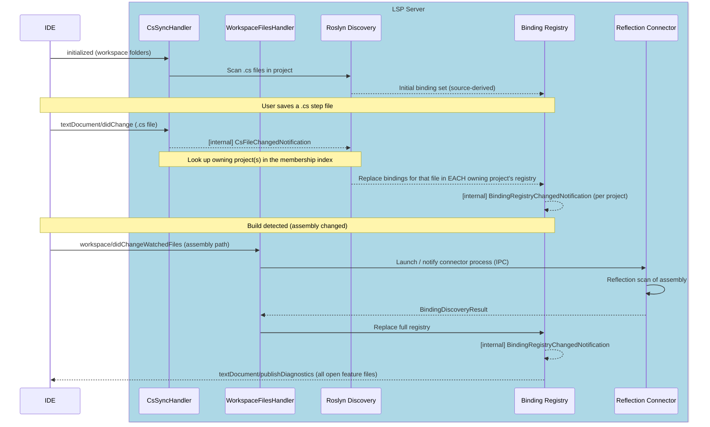

#### Implementation status

The Roslyn (source-level) path is **implemented**. The diagram above uses idealized component names; the as-built mapping is:

| Design element | As-built |
|---|---|
| `CsSyncHandler` receives `.cs` `didOpen`/`didChange` | `TextDocumentSyncHandler` (one sync handler for `.feature` + `.cs`, routed by extension) |
| Roslyn Discovery — scan / parse a `.cs` file | `StepDefinitionFileParser` (syntactic; discovers step definitions **and** hooks, with scopes) invoked via `ProjectBindingRegistry.ReplaceBindings(file)` |
| "Replace bindings for that file" | `ICSharpBindingDiscoveryService` → `ConnectorBindingRegistryProvider.ApplyRoslynFileUpdateAsync` (per-file replace layered on the current registry) |
| `BindingRegistryChangedNotification` | raised by the provider's `BindingRegistryChanged` event via `BindingRegistryProviderRouter`; consumed by `BindingRegistryChangedHandler`, which re-parses open feature files and refreshes semantic tokens |

**Merge / precedence**: the Roslyn patch is layered on top of the connector's current registry and intentionally does **not** advance the connector's last-good assembly hash. A real build (different assembly hash) therefore fully replaces the registry with the authoritative reflection result; with no rebuild, the connector run is a hash-match no-op and the source-level patch persists. This realizes the merge strategy described in [Architecture §7](LSP-IDE-Support-Architecture.md#7-binding-connector).

**Behavioural nuance**: a step renders as *unbound* (a `reqnroll.undefined_step` token / "step definition not found" diagnostic) only once the owning project has a **valid** (non-`Invalid`) registry — i.e. after any discovery has completed, whether the startup reflection run **or** the first Roslyn `.cs` open. Against an `Invalid` registry (no discovery yet) the tag parser skips step matching, leaving steps unclassified rather than unbound.

The reflection (post-build) trigger shown in the lower half of the diagram is also implemented: `WatchedFilesHandler` registers `workspace/didChangeWatchedFiles` watchers for `**/bin/**/*.dll` (and `**/reqnroll.json`) and calls `ConnectorBindingRegistryProvider.TriggerRefresh()` for the project whose output path matches. An initial run is likewise triggered on `reqnroll/projectLoaded`. Whether each IDE reliably *delivers* those watched-file events on build remains [Q9](LSP-IDE-Support-Open-Questions.md).

> **Planned change — index-driven, multi-project routing.** As built, `CSharpBindingDiscoveryService` routes a `.cs` edit to a **single** owning project via `ILspWorkspaceScopeManager.GetProjectForUri` (longest folder-prefix match). Under the [membership-index design](LSP-IDE-Support-Architecture.md#project-membership-the-path--projects-index) this becomes a lookup returning the **set** of owning projects, and the per-file Roslyn patch fans out to *each* of their registries (a linked `.cs` legitimately belongs to several projects, so one edit invalidates several registries). The same lookup **gates** the patch: a `.cs` that no project's index claims — e.g. one excluded from its `.csproj` but opened in the editor — contributes bindings to **no** registry, preventing phantom bindings that would otherwise be wiped on the next build. The folder-prefix match is retained only as the fallback for projects that have not (yet) sent a `reqnroll/projectFiles` baseline.

#### Known limitations

**Custom-derived binding attributes are not discovered by Roslyn (source-level) discovery.** The in-process Roslyn parser (`StepDefinitionFileParser`) is intentionally *syntactic only* — it parses a single `.cs` file into a syntax tree with no `Compilation` or semantic model — and recognizes bindings by matching the attribute's simple name against the known Reqnroll attribute names (`Given`/`When`/`Then`/`StepDefinition` and the hook attributes, allowing for namespace qualification and the `Attribute` suffix). A user-defined attribute that *derives* from a Reqnroll binding attribute (e.g. `class GivenWebAttribute : GivenAttribute`) is therefore **not** detected by the immediate-on-save Roslyn path, because resolving the inheritance chain would require a semantic model with the project's references.

Such bindings are still discovered by the out-of-process reflection **Connector** after a build, since reflection inspects the actual attribute type hierarchy. The practical effect is that a step bound via a custom-derived attribute will appear unmatched (warning squiggle) until the next build, after which it resolves normally.

We are **not** addressing this at this time. Closing the gap would mean feeding the Roslyn parser a project `Compilation` (Reqnroll + project references) and walking `INamedTypeSymbol.BaseType`, which is a larger change to how `CSharpBindingDiscoveryService` obtains source — it currently parses each `.cs` file in isolation. The limitation is captured by a skipped test in `StepDefinitionFileParserTests`.

---

### F3 · Gherkin File Diagnostics

**Phase 2** — covers both missing step warnings and parse errors

> **Open question (Q19)**: Should the server also support diagnostic pull (`textDocument/diagnostic` request, LSP 3.17+) in addition to the push model described here? See [Open Questions & Risk Register](LSP-IDE-Support-Open-Questions.md).

#### End-user experience

Two categories of diagnostic are displayed for `.feature` files:

- **Binding mismatches** (`DiagnosticSeverity.Warning`, yellow squiggle, `source: "reqnroll.binding"`): steps that have no matching binding are underlined. Hovering shows "Step definition not found."
- **Parse errors** (`DiagnosticSeverity.Error`, red squiggle, `source: "reqnroll.parser"`): structurally invalid Gherkin (e.g., missing `Feature:` header, invalid tag syntax) is underlined with a description.

Both categories are computed after every edit and pushed as a **single** `textDocument/publishDiagnostics` message. The LSP specification requires that one message delivers the complete diagnostic set for a URI; separate messages would clear previously delivered diagnostics of the other category. A `DiagnosticsAggregator` combines both sources before sending.

Diagnostics refresh after every `textDocument/didChange` and also whenever the Binding Registry changes (C# file save or build). On `textDocument/didClose`, an **empty** `textDocument/publishDiagnostics` is pushed for the closed URI to clear any squiggles the IDE retained.

> **Design rationale — color and squiggles are complementary, not redundant**: F1/F2 already color unbound steps (purple in Visual Studio). F3 diagnostics are still required because: (a) squiggles appear in the IDE Problems panel / Error List, enabling cross-file triage and keyboard navigation ("Next Warning") that color cannot provide; (b) color-only feedback is inaccessible to colorblind users. Using `Warning` rather than `Error` for binding mismatches distinguishes them visually from parse errors and accommodates step-first development workflows where a binding may not yet exist.

#### IDE support matrix

| VS Code | Visual Studio | Rider |
|---------|---------------|-------|
| ✅ Generic | ✅ Generic | ✅ Generic |

#### LSP messages

| Direction | Method | Purpose |
|-----------|--------|---------|
| Client → Server | `textDocument/didOpen` / `didChange` / `didSave` | Trigger diagnostic pipeline for this file |
| Server → Client | `textDocument/publishDiagnostics` | Push combined diagnostic set (one message per URI) |

#### Sequence diagram — feature file change

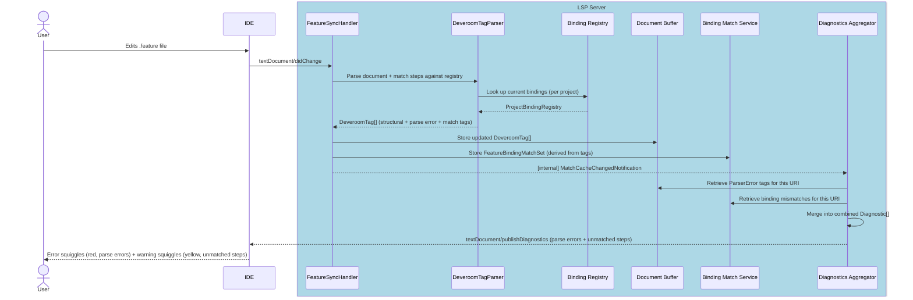

> **As-built note**: parsing and binding matching are **not separate pipeline stages**. `DeveroomTagParser` performs both in a single AST walk (see [F1 · as-built note](#f1--gherkin-syntax-highlighting)). Parse errors emerge as `DeveroomTag` items of type `ParserError` — not a separate `ParseErrors[]` — so the `DiagnosticsAggregator` retrieves them from the tag tree alongside `UndefinedStep` and `BindingError` tags. `MatchCacheChangedNotification` is published directly by the sync handler after storing the new tags and match set, skipping the intermediate `ASTChangedNotification` / `BindingMatchInternalHandler` stages.

#### Sequence diagram — binding registry change (C# file saved or build completed)

> **Diagnostic ownership note**: When the Binding Registry changes due to a `.cs` file edit or a build, the Reqnroll LSP server pushes updated `textDocument/publishDiagnostics` messages **only for `.feature` file URIs**. Diagnostics for `.cs` files (C# parse errors, type errors, etc.) are the exclusive domain of the native C# language server in each IDE; the Reqnroll LSP must not publish competing diagnostics for `.cs` URIs. Binding-level annotations on `.cs` files (e.g., unused step warnings) are delivered separately via Code Lens (F18) rather than diagnostics.

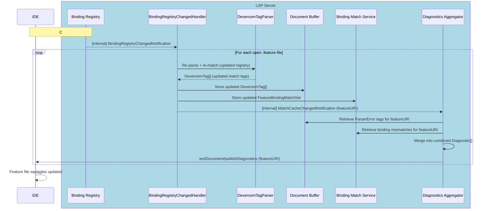

> **As-built note**: when the registry changes, `BindingRegistryChangedHandler` re-invokes `DeveroomTagParser` for each open feature file. Because `DeveroomTagParser` takes the snapshot text (not a cached AST) as input, the Gherkin text is re-parsed on every registry-change re-tag — a minor inefficiency versus a pure re-match on a cached AST. This is accepted because Gherkin parsing is fast and caching the intermediate `DeveroomGherkinDocument` separately from the tag tree would add complexity without a compelling user-visible benefit.

> **As-built note — implementation classes**: the "DA" participant in the sequence diagrams above covers two cooperating classes. `DiagnosticsAggregator` (`LSP.Core/Diagnostics/`) is a protocol-agnostic service that converts `ParserError` tags and `FeatureBindingMatchSet.Undefined` steps into `GherkinDiagnostic` records (no OmniSharp dependency). `DiagnosticsPublishHandler` (`LSP.Server/Handlers/InternalHandlers/`) is the `INotificationHandler<MatchCacheChangedNotification>` that retrieves tags and the match set, calls the aggregator, converts `GherkinDiagnostic.Range` to LSP `Position` values (same `ResolvePosition` algorithm as `SemanticTokenService`), and pushes via `ILanguageServerFacade.SendNotification("textDocument/publishDiagnostics", PublishDiagnosticsParams)` — the same pattern used by `SemanticTokensPushHandler`. `DiagnosticsPublishHandler` is auto-discovered by the `AddMediatR(typeof(Program))` scan; no explicit DI registration is needed. The `textDocument/didClose` empty-diagnostics push is handled inline in `TextDocumentSyncHandler.Handle(DidCloseTextDocumentParams)` rather than via a separate notification, since no fan-out is required.

---

### F4 · Gherkin Parse Error Display

**Phase 2** — implemented as part of the F3 diagnostics pipeline

#### End-user experience

Structural errors in `.feature` files (e.g., missing `Feature:` header, invalid tag syntax) are shown as red error squiggles with a description, distinct from the yellow warning squiggles of missing step bindings.

#### IDE support matrix

| VS Code | Visual Studio | Rider |
|---------|---------------|-------|
| ✅ Generic | ✅ Generic | ✅ Generic |

#### Implementation note

Parse errors are produced by `DeveroomTagParser` whenever a `.feature` file is parsed (`textDocument/didOpen` or `didChange`). Rather than a separate `ParseErrors[]` array, each parse error is stored as a `DeveroomTag` of type `ParserError` in the tag tree alongside structural and match tags. The `DiagnosticsAggregator` reads these `ParserError` tags from the Document Buffer and emits them as `DiagnosticSeverity.Error` items with `source: "reqnroll.parser"` to distinguish them from binding mismatch warnings. The complete combined `textDocument/publishDiagnostics` flow is described in [F3](#f3--gherkin-file-diagnostics).

---

### F5 · Go to Step Definition

**Phase 2**

#### End-user experience

Pressing **Go to Definition** (F12 / Ctrl+Click) on a step in a `.feature` file navigates to the matching `[Given]` / `[When]` / `[Then]` method in the C# binding class. If multiple bindings match (ambiguous), a picker is shown.

> **Open question (Q20)**: Should this feature use `textDocument/definition` or `textDocument/implementation`? In LSP semantics, a step text is closer to a specification (definition) while the binding method is its implementation. The correct choice affects how IDEs route the navigation gesture. See [Open Questions & Risk Register](LSP-IDE-Support-Open-Questions.md).

> **Open question (Q21)**: Should the server also support `textDocument/documentLink`? This would annotate step lines as Ctrl+hover hyperlinks — a complementary navigation path that requires no keystroke. See [Open Questions & Risk Register](LSP-IDE-Support-Open-Questions.md).

#### IDE support matrix

| VS Code | Visual Studio | Rider |
|---------|---------------|-------|
| ✅ Generic | ✅ Generic | 🔧 Plugin |

**Rider note**: Cross-language navigation from a `.feature` step into a `.cs` file requires the `ReqnrollFeatureDefinitionReferenceProvider` PSI bridge — Rider's native LSP client cannot perform this navigation without it. This was confirmed by the Thomas Heijtink PoC. See [Architecture §6.3](LSP-IDE-Support-Architecture.md#63-rider) for implementation details.

#### LSP messages

| Direction | Method | Purpose |
|-----------|--------|---------|
| Client → Server | `textDocument/definition` | Request location of step definition |
| Server → Client | `Location` / `Location[]` response | C# file URI + range |

#### Sequence diagram

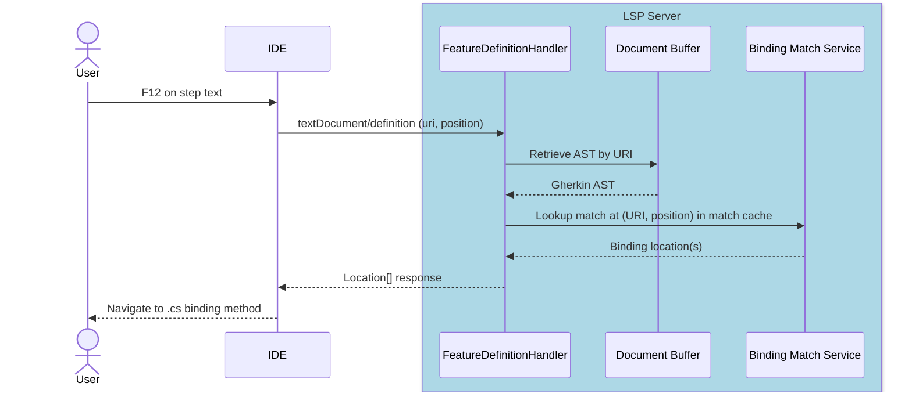

---

### F6 · Define Steps (Scaffolding)

**Phase 2**

#### End-user experience

When one or more steps have no matching binding, a code action "Define missing steps" appears (lightbulb / quick-fix). Activating it generates stub binding methods in a new or existing step definition file, with method signatures and parameter types inferred from the step text.

#### IDE support matrix

| VS Code | Visual Studio | Rider |
|---------|---------------|-------|
| ✅ Generic | ✅ Generic | ✅ Generic |

#### LSP messages

| Direction | Method | Purpose |
|-----------|--------|---------|
| Client → Server | `textDocument/codeAction` | Request available actions at cursor/selection |
| Server → Client | `CodeAction[]` response | List including "Define missing steps" |
| Client → Server | `codeAction/resolve` (optional) | Resolve edit lazily |
| Server → Client | `workspace/applyEdit` | Apply generated step file content |

> **Note**: When the client applies a `WorkspaceEdit` that creates or modifies a `.cs` file, the resulting `textDocument/didChange` triggers `CsSyncHandler`, which initiates Roslyn re-discovery and keeps the Binding Registry current.

#### Sequence diagram

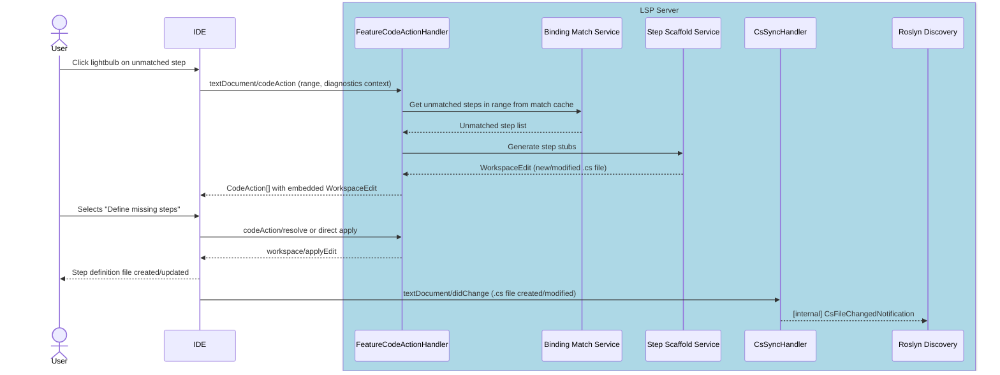

---

### F7 · Keyword Completion

**Phase 3**

#### End-user experience

Typing at the start of a line in a Gherkin scenario offers completions for keywords valid in the current context (`Given`, `When`, `Then`, `And`, `But`, `Scenario:`, `Feature:`, etc.). Completions are context-sensitive: `Examples:` only appears inside a Scenario Outline; `Background:` only at feature level.

> **Gherkin dialect note**: Completion items are sourced from the active Gherkin dialect configured in the project's `reqnroll.json`. If the project specifies `"language": "de"`, completions offer `Gegeben`, `Wenn`, `Dann` rather than `Given`, `When`, `Then`.

#### IDE support matrix

| VS Code | Visual Studio | Rider |
|---------|---------------|-------|
| ✅ Generic | ✅ Generic | ✅ Generic |

#### LSP messages

| Direction | Method | Purpose |
|-----------|--------|---------|
| Client → Server | `textDocument/completion` | Request completions at position |
| Server → Client | `CompletionList` response | Keyword completion items |
| Client → Server | `completionItem/resolve` | Resolve detail/documentation lazily |

#### Sequence diagram

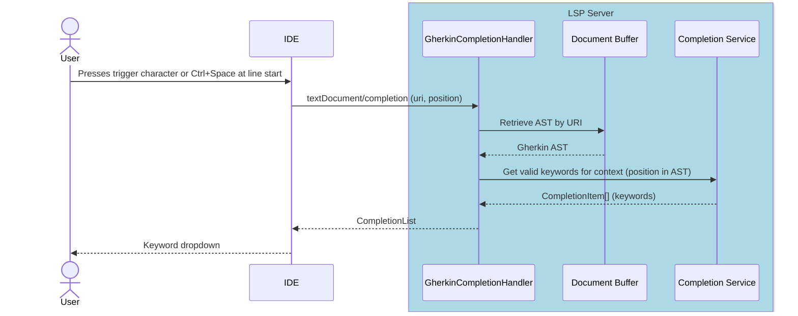

---

### F8 · Step Completion

**Phase 4**

#### End-user experience

When typing a step line after a keyword (`Given`, `When`, `Then`, etc.), the IDE offers completions matching existing step binding patterns. Completions include parameter placeholders styled appropriately and insert the full step text on selection.

> **Open question (Q14)**: How sophisticated should the step matching be? Is Fuzzy matching needed? See [Open Questions & Risk Register](LSP-IDE-Support-Open-Questions.md).

#### IDE support matrix

| VS Code | Visual Studio | Rider |
|---------|---------------|-------|
| ✅ Generic | ✅ Generic | ✅ Generic |

#### LSP messages

Same as F7 (`textDocument/completion`) but triggered after a step keyword; completion items are derived from the Binding Registry rather than the keyword list.

#### Sequence diagram

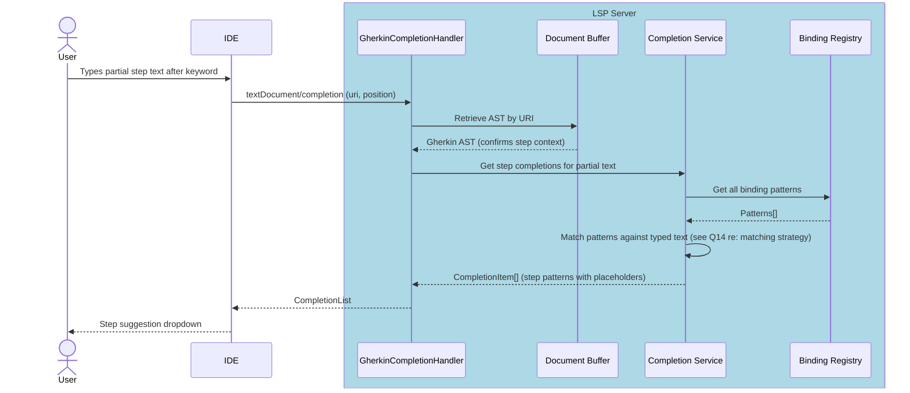

---

### F9 · Document Outline

**Phase 3**

#### End-user experience

The IDE's "Outline" or "Structure" panel shows the hierarchy of the feature file: Feature → Background / Rule → Scenario / Scenario Outline → Step. Clicking a node navigates to that location. Used for quick navigation in large feature files.

#### IDE support matrix

| VS Code | Visual Studio | Rider |
|---------|---------------|-------|
| ✅ Generic | ✅ Generic | ✅ Generic |

#### LSP messages

| Direction | Method | Purpose |
|-----------|--------|---------|
| Client → Server | `textDocument/documentSymbol` | Request symbol hierarchy |
| Server → Client | `DocumentSymbol[]` response | Nested symbol tree |

#### Sequence diagram

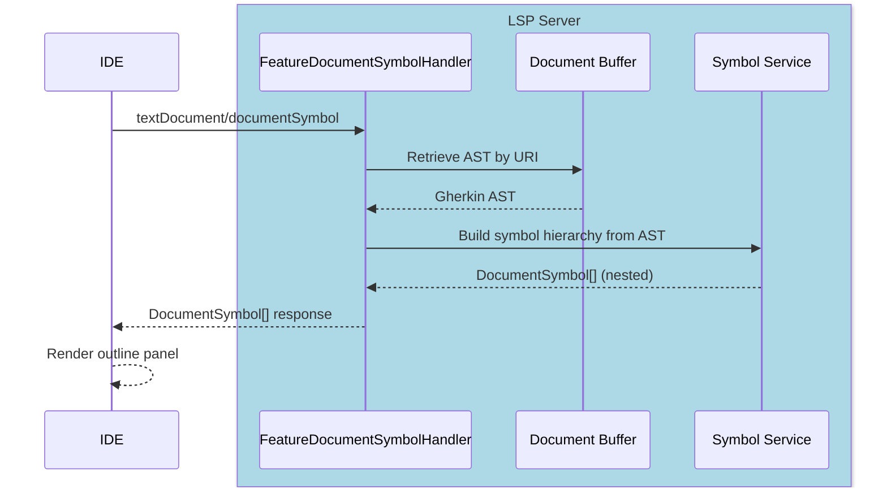

---

### F10 · Code Folding

**Phase 3**

#### End-user experience

Scenarios, Backgrounds, Rules, doc strings, and data tables can be collapsed in the editor gutter. Folding regions update as the document is edited.

#### IDE support matrix

| VS Code | Visual Studio | Rider |
|---------|---------------|-------|
| ✅ Generic | ✅ Generic | ✅ Generic |

#### LSP messages

| Direction | Method | Purpose |
|-----------|--------|---------|
| Client → Server | `textDocument/foldingRange` | Request foldable regions |
| Server → Client | `FoldingRange[]` response | Start/end line pairs |

#### Sequence diagram

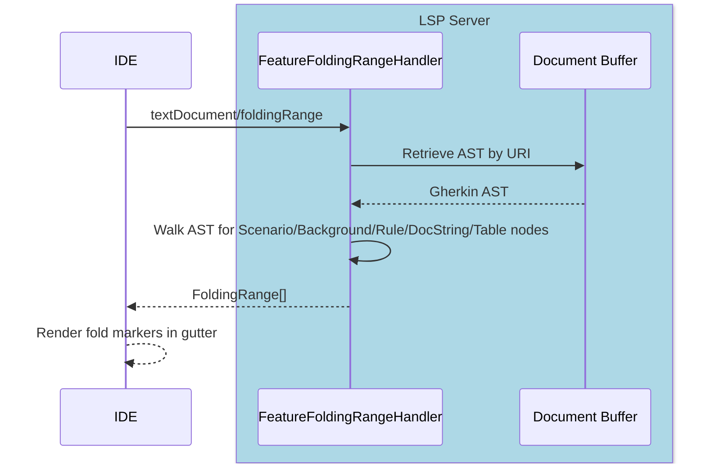

---

### F11 · Document Auto-formatting

**Phase 3**

#### End-user experience

**Format Document** (Shift+Alt+F or equivalent) re-indents the entire feature file: consistent indentation per nesting level, normalized spacing around keywords, blank lines between scenarios. Formatting rules are read from `.editorconfig` (indent size, line endings).

#### IDE support matrix

| VS Code | Visual Studio | Rider |
|---------|---------------|-------|
| ✅ Generic | ✅ Generic | ⚠️ Config |

**Rider note**: Rider has its own formatter framework and may partially handle formatting independently. Behavior should be tested to confirm `textDocument/formatting` takes priority.

#### LSP messages

| Direction | Method | Purpose |
|-----------|--------|---------|
| Client → Server | `textDocument/formatting` | Format whole document |
| Client → Server | `textDocument/rangeFormatting` | Format selection |
| Client → Server | `textDocument/onTypeFormatting` | Format as user types (e.g., on `\n`) |
| Server → Client | `TextEdit[]` response | Set of text edits |

> **Implementation note (Phase 3)**: For the initial release, the server may return a single `TextEdit` replacing the entire document content, rather than a minimal diff. This simplifies implementation at the cost of cursor position preservation; a minimal-diff implementation can follow.

#### Sequence diagram

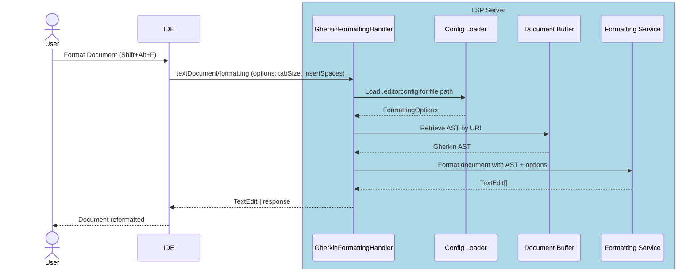

---

### F12 · Table Auto-formatting

**Phase 3**

#### End-user experience

When the user presses Tab or Enter inside a Gherkin data table (or Examples table), the columns are padded so pipes align. The table can also be aligned via Format Document (F11).

This is implemented as a subset of the formatting service, triggered by `textDocument/onTypeFormatting` on `|` and `\n` characters.

#### IDE support matrix

| VS Code | Visual Studio | Rider |
|---------|---------------|-------|
| ✅ Generic | ✅ Generic | ⚠️ Config |

**Rider note**: Same caveat as F11.

#### LSP messages

Same as F11. On-type trigger characters: `|`, `\n`.

#### Sequence diagram

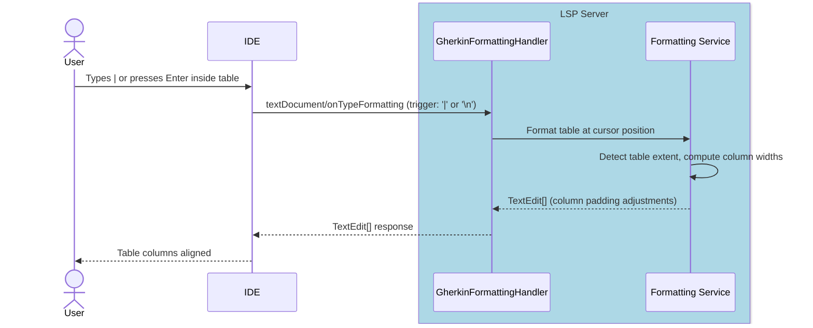

---

### F13 · Comment / Uncomment

**Phase 3**

#### End-user experience

A keyboard shortcut (Ctrl+/) toggles `#` comments on the selected line(s) in a `.feature` file.

LSP has no native comment/uncomment capability. This requires a custom command round-trip: the IDE client captures the keybinding and delegates to the server via `workspace/executeCommand`, which returns a `WorkspaceEdit`.

#### IDE support matrix

| VS Code | Visual Studio | Rider |
|---------|---------------|-------|
| 🔧 Plugin | 🔧 Plugin | 🔧 Plugin |

All three IDEs require a small amount of custom code to:
1. Intercept the comment keybinding and redirect it (preventing the IDE's default comment handler from firing for `.feature` files)
2. Send `workspace/executeCommand` with the current selection
3. Apply the returned `WorkspaceEdit`

#### LSP messages

| Direction | Method | Purpose |
|-----------|--------|---------|
| Client → Server | `workspace/executeCommand` (`reqnroll.toggleComment`) | Toggle comment on lines in range |
| Server → Client | `workspace/applyEdit` | Text insertions/deletions for `#` |

#### Sequence diagram

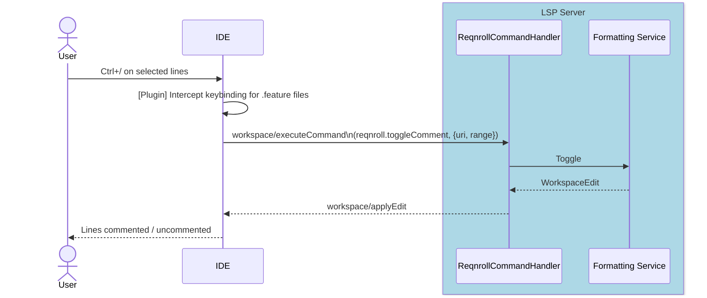

---

### F14 · Find Step Definition Usages

**Phase 4**

#### End-user experience

**Find All References** invoked on a C# step binding method (i.e., a method decorated with `[Given]`, `[When]`, or `[Then]`) finds all `.feature` file steps that match that binding and displays them in the IDE's references panel. This is the inverse of Go to Definition (F5).

#### IDE support matrix

| VS Code | Visual Studio | Rider |
|---------|---------------|-------|
| ⚠️ Config | ⚠️ Config | ⚠️ Config |

**Dispatch ambiguity note**: In a `.cs` file, both the native C# language server and the Reqnroll LSP server register for `textDocument/references`. The intent is that when the caret is positioned on a **binding attribute** (e.g., `[Given("step text")]`), the IDE dispatches the request to the Reqnroll server, returning matching `.feature` step locations. When the caret is on the **method signature or body**, the C# server handles it normally.

Whether IDEs reliably dispatch based on caret position within a file that has multiple registered servers is not guaranteed. If the dispatch is unreliable, the feature will be surfaced as a custom menu/context-menu command (requiring 🔧 Plugin work for each IDE) that explicitly invokes `workspace/executeCommand` rather than relying on `textDocument/references`.

#### LSP messages

| Direction | Method | Purpose |
|-----------|--------|---------|
| VS Extension → Server | `reqnroll/findStepUsages` (custom, owned pipe) | Three-state response: `{isBinding:false}` / `{isBinding:true,locations:[]}` / `{isBinding:true,locations:[...]}` |
| Client → Server | `textDocument/references` (at attribute position) | Two-state fallback (VS Code, Rider, spec tests): empty = no match or not a binding |
| Server → Client | `Location[]` / `FindStepUsagesResponse` | Step locations in `.feature` files |

#### Sequence diagram (Visual Studio — as-built)

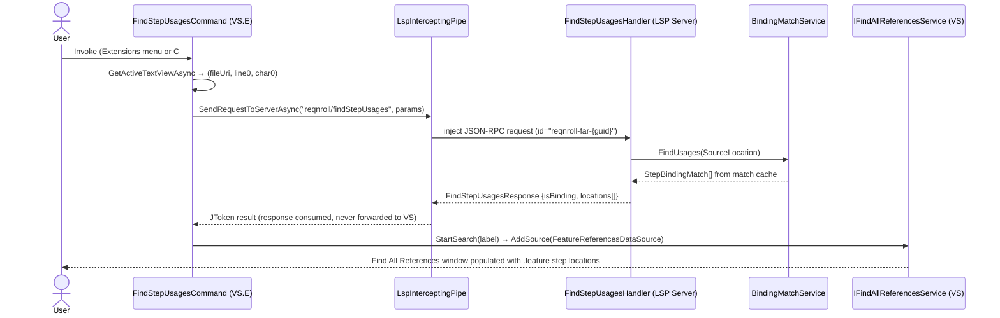

#### Implementation status

F14 is **implemented**. The as-built mapping is:

| Design element | As-built |
|---|---|
| `StepReferencesHandler` registered for `textDocument/references` | Registered via `options.OnRequest` (same static-registration pattern as semantic tokens) to avoid OmniSharp dynamic-registration ambiguity with the C# language server on `.cs` files (see Q13). Retained for VS Code / Rider / spec-test compatibility. |
| `FindStepUsagesHandler` registered for `reqnroll/findStepUsages` | Custom request handler ([FindStepUsagesHandler.cs](../src/LSP/Reqnroll.IdeSupport.LSP.Server/Handlers/ProtocolHandlers/FindStepUsagesHandler.cs)). Delivers the full three-state contract: `{isBinding:false}` = not a binding; `{isBinding:true, locations:[]}` = 0 usages; `{isBinding:true, locations:[...]}` = usages. Response type: `FindStepUsagesResponse` ([Protocol/FindStepUsagesResponse.cs](../src/LSP/Reqnroll.IdeSupport.LSP.Server/Protocol/FindStepUsagesResponse.cs)). Each location includes `stepText` (extracted from in-memory snapshot), `keyword`, `scenarioName`, `projectName`. **Protocol note:** returns `{isBinding:false}` rather than JSON null — OmniSharp's `OnRequest` framework sends an error response for null returns from custom-method handlers, so `IsBinding=false` is the "not a binding" sentinel. |
| Binding location lookup | `IBindingMatchService.FindUsages(SourceLocation)` — iterates all cached `FeatureBindingMatchSet` entries and returns every `StepBindingMatch` whose `BindingLocations` match the supplied file + line (column is ignored; line is 1-based) |
| Document ID on match results | `StepBindingMatch.FeatureDocumentId` (added for F14) carries the feature file's document URI, eliminating the need for a tuple return from `FindUsages` |
| LSP position → `SourceLocation` conversion | Handlers convert 0-based LSP line/character to 1-based `SourceLocation(file, line+1, char+1)` |
| `GherkinRange` → LSP `Range` | `GherkinRangeExtensions.ToLspRange()` (new `LSP.Server`-layer extension); pure offset-to-line geometry lives in `GherkinRange.ResolveOffset` (`LSP.Core`) |
| Workspace-wide scan on startup | `BindingRegistryChangedNotification.IsFullReplacement` flag (added for F14): `true` when fired by the Connector / reflection path, `false` for Roslyn incremental. A full replacement triggers `BindingRegistryChangedHandler.ScanAllFeatureFilesAsync`, which calls `IGherkinDocumentTaggerService.ScanClosedFileAsync` for every `.feature` file in the project folder not already held in the open-document buffer. **As-built limitation, with chosen resolution**: this folder glob *misses* linked feature files outside the project folder and *wrongly admits* feature files excluded from the `.csproj`. Per the [membership-index design](LSP-IDE-Support-Architecture.md#project-membership-the-path--projects-index), closed-file enumeration moves from the folder glob to the project's `reqnroll/projectFiles` baseline — scan exactly the feature files the project actually includes, links and all, and nothing it excludes. See [Q17](LSP-IDE-Support-Open-Questions.md). |
| Incremental update on Roslyn edit | `IsFullReplacement = false` → only currently open feature files are re-parsed; closed files retain their cached match sets |
| VS command — Surface 1 (Extensions menu) | `FindStepUsagesCommand` ([FindStepUsages/FindStepUsagesCommand.cs](../src/VisualStudio/Reqnroll.IdeSupport.VisualStudio.Extension/FindStepUsages/FindStepUsagesCommand.cs)) — `[VisualStudioContribution]` VS.Extensibility command; `GetActiveTextViewAsync` → `(fileUri, line0, char0)` → `FindStepUsagesService.FindUsagesAsync` → `FindStepUsagesRenderer.RenderAsync`. |
| VS command — Surface 2 (C# editor context menu) | Same command, second placement: `CommandPlacement.VsctParent(guidSHLMainMenu, IDG_VS_CODEWIN_NAVIGATETOLOCATION=0x02B1, priority=0x0100)`. Item appears next to "Find All References" in the code-window context menu. No `.vsct`, no VSSDK command table — targets the shell's built-in group directly. Requires experimental-instance reset after first deploy. |
| VS command — Surface 3 (Shift+F12 takeover) | **Deferred.** Would require an `IOleCommandTarget` editor command filter (MEF) intercepting GUID `{1496A755-94DE-11D0-8C3F-00C04FC2AAE2}` ID 97. Not implemented. |
| Owned-pipe RPC | `LspInterceptingPipe.SendRequestToServerAsync` injects a JSON-RPC request with id prefix `reqnroll-far-{guid}`. `TryCompleteCorrelatedResponse` consumes the matching response (never forwarded to VS) and completes the awaiting TCS. The response bypasses the LSP inspector log — the `FindStepUsagesService` file logger is the only diagnostic window. |
| Results rendering | `FindStepUsagesRenderer` switches to UI thread (`JoinableTaskFactory`), locates `IFindAllReferencesService` via `SVsFindAllReferences`, calls `StartSearch(label)` → `window.Manager.AddSource(FeatureReferencesDataSource)`. `FeatureReferencesDataSource` pushes all `FeatureReferenceTableEntry` items in `Subscribe`. |
| DI injection | `FindStepUsagesState` singleton registered in `ExtensionEntrypoint.InitializeServices`. `ReqnrollLanguageClient` populates it on server-init / clears on dispose. `FindStepUsagesCommand` injects `(FindStepUsagesState, TraceSource)` only — both guaranteed resolvable from the VS.Extensibility DI container. (Injecting `ReqnrollLanguageClient` directly caused silent construction failure because contribution classes are not resolvable as injection targets.) |

> **As-built note — VS "Find All References" does not integrate automatically.** VS does not dispatch `textDocument/references` to secondary LSP servers for `.cs` files; the C# language server intercepts unconditionally. Q13 is **resolved as "dispatch is unreliable"**. The custom VS.Extensibility command (`FindStepUsagesCommand`) instead injects `reqnroll/findStepUsages` directly over the owned `LspInterceptingPipe`. VS-validated end-to-end on the Experimental Instance (Surfaces 1 and 2, 2026-06-09).

---

### F15 · Find Unused Step Definitions

**Phase 4**

#### End-user experience

A command "Find Unused Step Definitions" scans the Binding Registry against the match cache and reports any binding methods in C# that have zero matched steps across all `.feature` files in the workspace. Results appear in the IDE's output or search panel.

This is a workspace-wide operation; it is implemented as a custom command handled server-side.

> **Cross-project semantics (membership index).** A binding `.cs` linked into several projects appears in *each* of their registries; a feature file may belong to several projects. "Unused" must therefore be evaluated against the [membership index](LSP-IDE-Support-Architecture.md#project-membership-the-path--projects-index), not folder layout: a binding is unused only if it has zero matched steps in **every** project that includes it (an *intersection* — symmetrically, F14 *unions* a binding's usages across all including projects). A folder-scoped analysis would falsely report a binding that is linked into project B and used by a feature in B as "unused" merely because project A — where the file physically lives — has no matching feature. Because false "unused" results invite deletion of live code, the analysis must only consider files the index actually attributes to a project, and must never let a binding contributed by the editor-open Roslyn path (in a project that does not own the file) suppress an "unused" result.

#### IDE support matrix

| VS Code | Visual Studio | Rider |
|---------|---------------|-------|
| 🔧 Plugin | 🔧 Plugin | 🔧 Plugin |

All IDEs require a small custom command handler to invoke `workspace/executeCommand` and display the results. The analysis itself is in the server.

#### LSP messages

| Direction | Method | Purpose |
|-----------|--------|---------|
| Client → Server | `workspace/executeCommand` (`reqnroll.findUnusedStepDefinitions`) | Trigger analysis |
| Server → Client | `window/showDocument` or custom notification | Surface results to user |

#### Sequence diagram

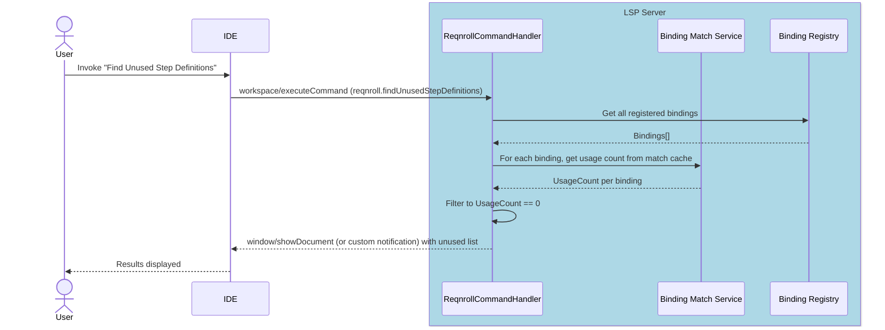

---

### F16 · Step Rename Refactoring

**Phase 4**

#### End-user experience

Renaming a step text (from either the `.feature` file step line or the C# `[Given("...")]` attribute string) updates all occurrences across the workspace: the attribute string in the binding class and every matching step in every `.feature` file.

#### IDE support matrix

| VS Code | Visual Studio | Rider |
|---------|---------------|-------|
| ✅ Generic | ✅ Generic | ✅ Generic |

#### LSP messages

| Direction | Method | Purpose |
|-----------|--------|---------|
| Client → Server | `textDocument/prepareRename` | Validate rename is possible at position |
| Client → Server | `textDocument/rename` | Execute rename with new text |
| Server → Client | `WorkspaceEdit` response | All edits across all files |

#### Sequence diagram

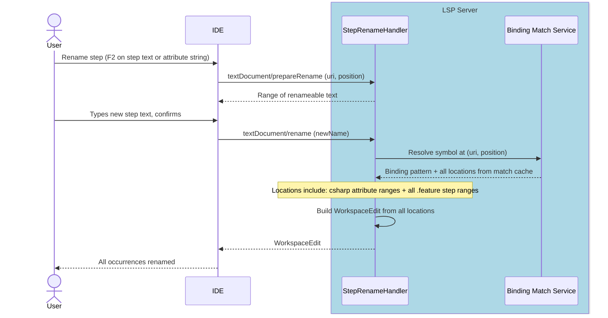

---

### F17 · Hook Navigation

**Phase 3**

#### End-user experience

**Go to Hooks** shows the list of hook bindings that are in scope at the current cursor position in a `.feature` file, filtered by the tags and `[Scope]` expressions that apply there:

- From the `Feature:` line: shows `[BeforeTestRun]` / `[AfterTestRun]` and `[BeforeFeature]` / `[AfterFeature]` hooks
- From a `Scenario:` or `Scenario Outline:` line: additionally shows `[BeforeScenario]` / `[AfterScenario]` hooks
- From a step line: additionally shows `[BeforeStep]` / `[AfterStep]` and `[BeforeStepBlock]` / `[AfterStepBlock]` hooks

All results are filtered by the tags in scope at the cursor position matched against the `tags:` and `Scope[]` expressions of each candidate hook binding. Selecting an entry navigates to the C# hook method.

#### IDE support matrix

| VS Code | Visual Studio | Rider |
|---------|---------------|-------|
| 🔧 Plugin | 🔧 Plugin | 🔧 Plugin |

"Go to Hooks" does not map onto any standard IDE command (unlike Go to Definition, which has a universal F12 keybinding). Each IDE client requires custom plugin code to expose the feature.

Using `textDocument/definition` for this feature is not viable: F5 already uses that message to navigate to the step binding on step lines, so the server would have no way to distinguish "find step definition" from "find hooks" when the cursor is on a step line. Step-level hooks (`[BeforeStep]`/`[AfterStep]`) would be unreachable. Instead, the plugin sends a dedicated custom request `reqnroll/goToHooks`, which the server handles independently of the standard definition pipeline.

**Rider note**: Unlike F5 (which routes through `ReqnrollFeatureDefinitionReferenceProvider`), hook navigation uses the separate `reqnroll/goToHooks` message and requires its own PSI bridge handler. See [Architecture §6.3](LSP-IDE-Support-Architecture.md#63-rider).

#### Visual Studio — surface and UX details

The command is placed in the built-in `IDG_VS_CODEWIN_NAVIGATETOLOCATION` group of the code-editor context menu (the same group that hosts "Go To Definition" and "Find All References"). A `VisibleWhen` constraint restricts visibility to editors with the `reqnroll-gherkin` content type, so the item does not appear in C# or other file editors.

**Single result** — navigates directly to the hook method (no dialog).

**Multiple results** — shows a VS-themed modal dialog (`NavigationPickerDialog`, a `DialogWindow` subclass) with a vertical `ListBox` listing all candidates. Each entry is formatted as `[HookType] MethodName (filename:line)`. Selecting an entry and clicking **Go** (or double-clicking) navigates to that hook; closing or pressing Escape cancels.

The picker logic is encapsulated in a shared `NavigationPickerHelper` (static helper in the VS extension). The same helper is designed for reuse when F5 "Go to Step Definition" encounters multiple ambiguous bindings and needs to present a choice.

#### LSP messages

| Direction | Method | Purpose |
|-----------|--------|---------|
| Client → Server | `reqnroll/goToHooks` (uri, position) | Request hook locations for context |
| Server → Client | `GoToHooksResponse` (`hooks[]`) | C# hook method locations + metadata |

#### Sequence diagram

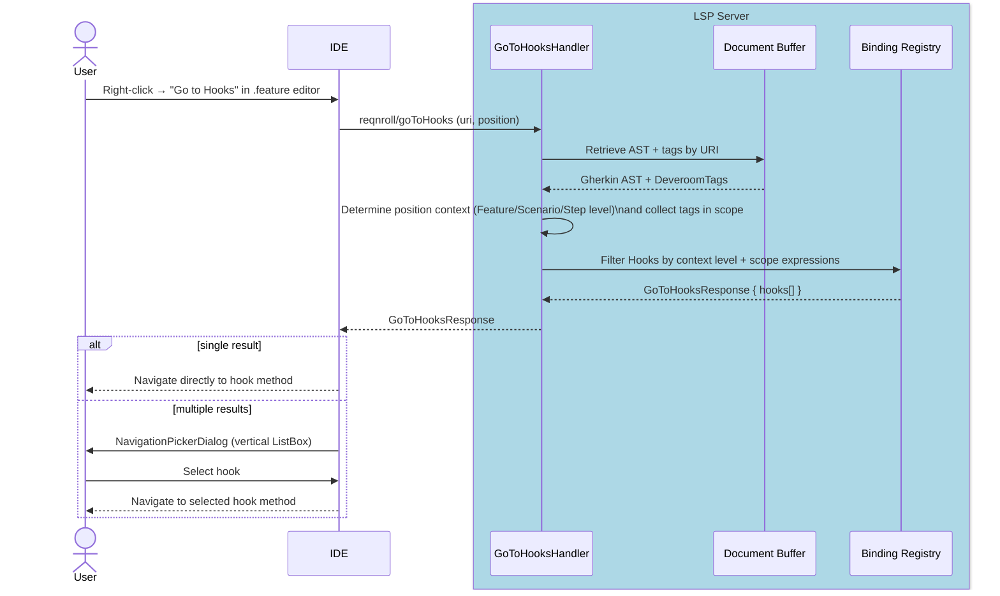

---

### F18 · Code Lens (Step Usage Counts)

**Phase 4**

#### End-user experience

C# step binding methods display an inline annotation above the method's binding attribute showing how many `.feature` steps currently match (e.g., "3 usages"). Clicking the annotation opens the references panel showing those step locations.

#### IDE support matrix

| VS Code | Visual Studio | Rider |
|---------|---------------|-------|
| ✅ Generic | 🔧 Plugin (VSSDK) | ⚠️ Config |

**Visual Studio note**: `textDocument/codeLens` is not supported by VS.Extensibility as of VS 17.x. The VSSDK plugin acts as a bridge: it sends the standard `textDocument/codeLens` request to the LSP server, receives the `CodeLens[]` response, and then relays the usage counts into the VSSDK `IVsCodeLensDataPointProvider` API so VS renders them natively. The LSP server requires no special awareness of this bridging. See [Q10](LSP-IDE-Support-Open-Questions.md) for the VS.Extensibility roadmap question.

**Rider note**: Code Lens via LSP is supported but requires verification of how project-wide refresh is triggered when the Binding Registry changes.

#### LSP messages

| Direction | Method | Purpose |
|-----------|--------|---------|
| Client → Server | `textDocument/codeLens` | Request code lens items for `.cs` document |
| Client → Server | `codeLens/resolve` | Resolve lens command detail lazily |
| Server → Client | `CodeLens[]` response | Count annotations with command link |

#### Sequence diagram

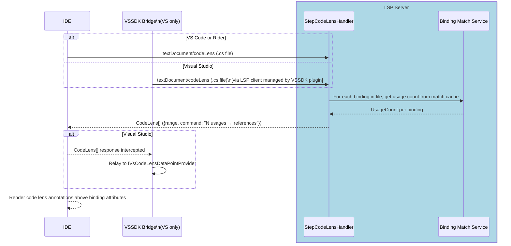

---

### F19 · New Project / Item Wizards

**Phase 2** (Visual Studio only; other IDEs: snippets / live templates)

#### End-user experience

"New Project" offers a Reqnroll project template with test framework selection (NUnit, xUnit, MSTest). "Add New Item" offers a blank `.feature` file template and a step definitions class template.

#### IDE support matrix

| VS Code | Visual Studio | Rider |
|---------|---------------|-------|
| ❌ N/A (snippets instead) | 🔧 Plugin (VSSDK) | ❌ N/A (live templates instead) |

VS Code ships a snippet for scaffolding a feature file. Rider uses Live Templates. Only Visual Studio requires a VSSDK Wizard implementation.

#### LSP messages

None — wizards are entirely IDE-side. No LSP involvement.

#### Notes

- Uses `IVsProjectWizard` / `IWizard` VSSDK interfaces
- Wizard UI is WPF; shared with the existing Reqnroll.VisualStudio extension where possible
- VS.Extensibility does not expose a wizard API; VSSDK is the only option here

---

### F20 · Installation & Upgrade Experience

**Phase 3**

#### End-user experience

When the extension is installed for the first time, the user is greeted with a **welcome experience** (e.g., a getting-started page linking to documentation, the marketplace listing, and a quick tour of features). When the extension is **upgraded** to a new version, the user is shown a **"What's New"** experience summarizing notable changes since their previous version. These experiences make the Preview extension's value discoverable and signal active maintenance — important during the transition period while the existing `Reqnroll.VisualStudio` extension is still available.

For Visual Studio, the existing extension's installation and upgrade UX (welcome / what's-new pages and any first-run setup) is **ported** rather than rebuilt — the existing WPF UI and the version-detection logic that distinguishes a fresh install from an upgrade are reused.

#### IDE support matrix

| VS Code | Visual Studio | Rider |
|---------|---------------|-------|
| ⚠️ Config (walkthrough / release notes) | 🔧 Plugin (ported from existing extension) | ⚠️ Config (plugin "What's New") |

- **Visual Studio**: Port the existing extension's welcome / what's-new experience and first-run/upgrade detection. WPF UI shared with the existing `Reqnroll.VisualStudio` extension where possible.
- **VS Code**: Use the native [Walkthroughs](https://code.visualstudio.com/api/references/contribution-points#contributes.walkthroughs) contribution point for the getting-started experience and the marketplace's built-in release-notes (`CHANGELOG.md`) surface for upgrades — no custom UI required.
- **Rider**: Use the IntelliJ Platform plugin "What's New" / change-notes mechanism declared in `plugin.xml`.

#### LSP messages

None directly — installation and upgrade UX is entirely IDE-side. However, the **first-activation** and **version-change** moments are the natural producers of the `ExtensionInstalled` and `ExtensionUpgraded` telemetry events (see [Architecture §9 Telemetry](LSP-IDE-Support-Architecture.md#telemetry)). Because these events fire before or independently of the LSP server, the telemetry-architecture choice (Q11) and the client-reference question (Q8) directly affect how they are captured.

#### Notes

- Detecting install-vs-upgrade requires persisting the last-run version per IDE (e.g., extension storage / settings). The existing VS extension already implements this; reuse its approach.
- Each IDE client is responsible for its own install/upgrade UX; there is no shared cross-IDE implementation, though the telemetry event names are common.
- This feature is the primary in-product driver of the `ExtensionInstalled` / `ExtensionUpgraded` / `ExtensionDaysOfUsage` events listed in [Architecture §9 Telemetry](LSP-IDE-Support-Architecture.md#telemetry).

---

## Appendix B · Deferred / Future Features

The following features were identified during planning (see [discussion #1077](https://github.com/orgs/reqnroll/discussions/1077)) as valuable but out of scope for the initial phases. They are recorded here to inform architectural decisions — implementations should avoid foreclosing these options.

### Ambiguity Diagnostics

When a step in a `.feature` file matches more than one binding (ambiguous match), the step is flagged with a diagnostic and the code action menu offers navigation to each matching binding. This extends the Binding Match Service to return a `MatchResult` with multiple bindings rather than a single one.

### Regex Validation in Step Attributes

When editing a `[Given("...")]` attribute string in C#, the regex pattern is validated in real time. Malformed patterns are shown as error squiggles in the `.cs` file. Requires the LSP server to understand binding attribute context within C# files and the ability of the IDE client to combine built-in C# diagnostics with those provided by the Reqnroll LSP.

### Scope Expression Validation

`[Scope(Tag = "...")]` expressions are validated via the Tag Expression parser. Invalid tag expressions are highlighted with warning squiggle (via LSP Diagnostics; same caveats apply from above).

### Hook Matching Indicators

Visual indicators (e.g., a gutter icon or CodeLens annotation) in `.feature` files showing which scenarios or steps have hooks attached, providing a quick way to discover pre/post-conditions without navigating to C# code and provide a way to surface navigation links to those hooks.

### Debug Support for Feature Files

Breakpoints set on `.feature` file step lines would pause test execution at the corresponding step. Step-into would navigate to the bound C# method. This requires implementation of the Debug Adapter Protocol (DAP), a separate protocol from LSP, likely in coordination with the Reqnroll test runner.
