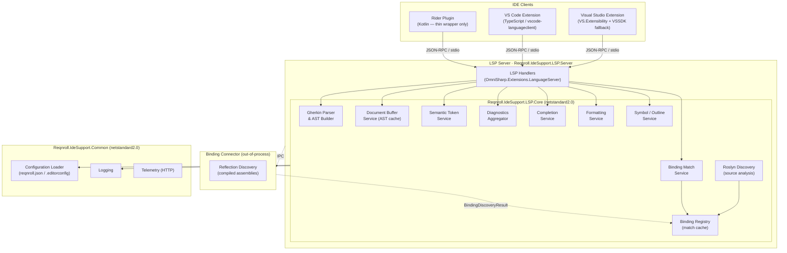

# Reqnroll LSP-Based IDE Support — Overview

> **Status:** Draft for team review  
> **Audience:** Core team decision-makers  
> **Related discussion:** [orgs/reqnroll/discussions/1077](https://github.com/orgs/reqnroll/discussions/1077)

**Related documents**

| Document | Contents |
|----------|----------|
| [Architecture & Implementation Reference](LSP-IDE-Support-Architecture.md) | Module design, component inventory, server internals, IDE clients, cross-cutting concerns |
| [Feature Designs](LSP-IDE-Support-Feature-Designs.md) | Per-feature design, sequence diagrams, as-built notes (Appendix A / B) |
| [Open Questions & Risk Register](LSP-IDE-Support-Open-Questions.md) | Active open questions, risk register |

---

## Table of Contents

1. [Overview](#1-overview)
2. [Goals and Non-Goals](#2-goals-and-non-goals)
3. [High-Level Architecture](#3-high-level-architecture)
4. [Phased Roadmap](#4-phased-roadmap)
5. [Release Strategy and Migration Plan](#5-release-strategy-and-migration-plan)

---

## 1. Overview

Reqnroll currently provides Gherkin editing support via a monolithic Visual Studio extension built on the legacy VS SDK. This document describes an architecture for a new, LSP-based implementation that will:

- Share one LSP server across Visual Studio, VS Code, and JetBrains Rider
- Be test-driven from the start, reusing code and specifications from the existing VS extension where applicable
- Target Reqnroll only (not SpecFlow or other Cucumber implementations)
- Use the `OmniSharp.Extensions.LanguageServer` NuGet package as the LSP protocol library
- Prefer generic LSP capabilities; document explicitly where IDE-specific plugin code is unavoidable

Much of this document is derived from findings from the [`Reqnroll.Plugin.VisualStudio_Prototypes`](https://github.com/clrudolphi/Reqnroll.Plugin.VisualStudio_Prototypes) (by Chris Rudolphi) and [`Reqnroll.LSP.Plugin`](https://github.com/ThomasHeijtink/Reqnroll.Plugin) PoC (by Thomas Heijtink) repositories.

---

## 2. Goals and Non-Goals

### Goals

- Feature parity with the existing `Reqnroll.VisualStudio` extension
- Support for Visual Studio 2022/2026, VS Code, and JetBrains Rider from a single LSP server
- Test-driven development with clear per-phase verification gates, including **measured**
  performance against defined latency targets, not just functional correctness — see
  [Architecture §9 Performance Verification](LSP-IDE-Support-Architecture.md#performance-verification)
  for the adopted approach and its as-built benchmarking harness
- Release as a "Preview" extension alongside the existing extension during transition

### Non-Goals

- VB.NET template support (dropped)
- F# binding support (step definitions written in F#)
- SpecFlow or plain Cucumber compatibility
- Migration of the existing Reqnroll.VisualStudio VSIX (it continues unchanged until the new one reaches parity)
- Validation of step binding attributes (aspirational, not in scope)
- Ambiguity diagnostics (aspirational)

---

## 3. High-Level Architecture

For the detailed internals of each component — the parsing/discovery/matching pipeline, the workspace model, the IDE client implementations, and the Binding Connector — see the [Architecture & Implementation Reference](LSP-IDE-Support-Architecture.md).

---

## 4. Phased Roadmap

| Phase | Features | Verification Goal |
|-------|----------|------------------|
| **1 · Basic Syntax Coloring** | F1 (Semantic Tokens) | Architecture validated: LSP server startup, client wiring (all 3 IDEs), `--client` flag, static vs. dynamic registration, CI pipeline |
| **2 · Minimum Viable** | F2 (Binding Discovery), F3+F4 (Diagnostics), F5 (Go to Definition), F6 (Define Steps), F19 (Wizards) | Core value loop: developer can write feature files, get feedback on unmatched steps, navigate to or create bindings; VS wizard enables quick project setup |
| **3 · Editor Quality** | F7 (Keyword Completion), F9 (Outline), F10 (Folding), F11 (Formatting), F12 (Table Format), F13 (Comment/Uncomment), F17 (Hook Navigation), F20 (Install/Upgrade UX) | Extension is a credible replacement for daily use |
| **4 · Advanced Navigation** | F8 (Step Completion), F14 (Find Usages), F15 (Find Unused), F16 (Rename), F18 (Code Lens) | Feature parity with existing VS extension; Preview designation can be lifted |

---

## 5. Release Strategy and Migration Plan

**Release naming**: Extensions follow the naming convention **"Reqnroll Extension for {IDE} (Preview)"**:
- Visual Studio Marketplace: **Reqnroll Extension for Visual Studio (Preview)**
- VS Code Marketplace: **Reqnroll Extension for VS Code (Preview)**
- JetBrains Marketplace: **Reqnroll Extension for Rider (Preview)**

Each uses a distinct marketplace identifier, coexisting with the existing `Reqnroll.VisualStudio` extension during transition. Users install both independently; there is no automatic migration.

**Coexistence**: The existing `Reqnroll.VisualStudio` extension continues unchanged throughout the Preview period. Both extensions can be installed simultaneously in Visual Studio without conflict (they use different GUIDs and do not share any in-process components).

**Transition trigger**: The Preview designation is lifted and the new extension is promoted as the recommended extension when:
- Phase 4 parity is achieved (all F1–F20 features passing)
- The E2E test suite passes against the supported IDE versions
- The new extension has been in Preview use by the core team for at least one release cycle

**Deprecation of the existing extension**: After promotion, `Reqnroll.VisualStudio` is marked deprecated in the Visual Studio Marketplace. A marketplace description update and a welcome notification in the existing extension direct users to install the new one. The existing extension continues to receive critical bug fixes for one additional release cycle, then enters maintenance-only mode.

**Settings compatibility**: Existing `reqnroll.json` files require no changes — the new extension reads the same configuration schema. Any workspace settings specific to the old extension (e.g., paths, feature flags) are not migrated automatically; users reconfigure via IDE workspace settings for the new extension.

**VS Code and Rider**: These IDEs have no prior Reqnroll extension to deprecate. The new extension is published as the initial Reqnroll extension for those IDEs from Phase 1 onward, under the Preview label.
